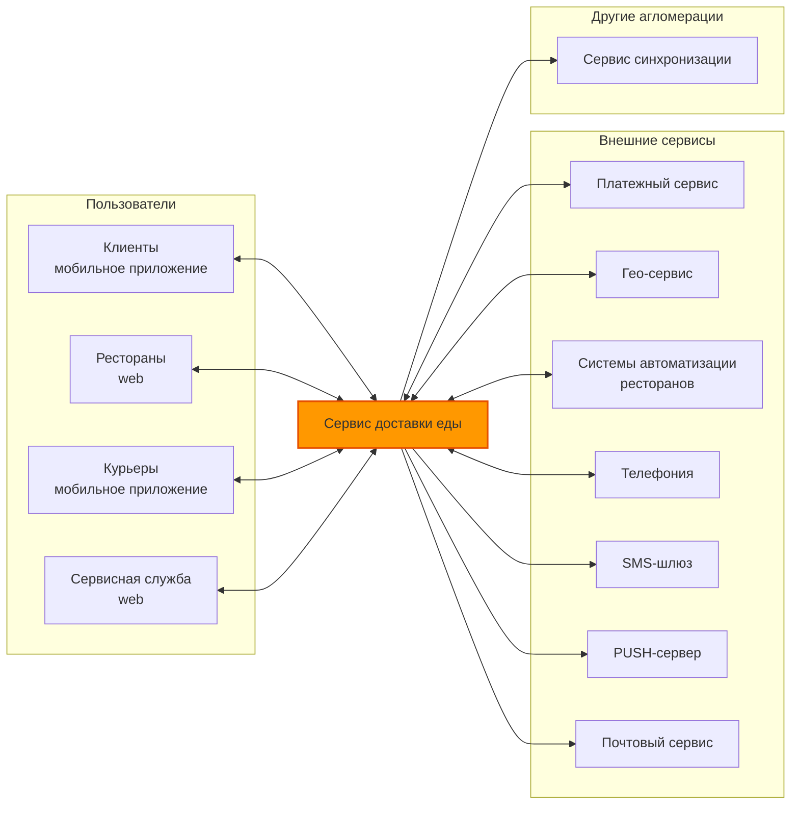
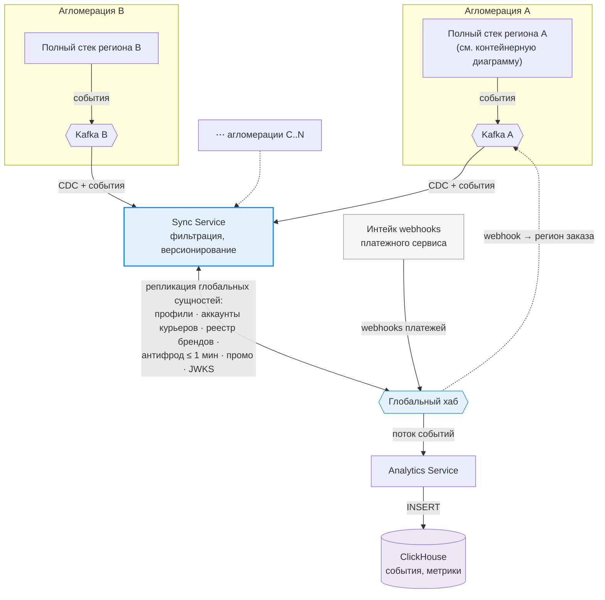
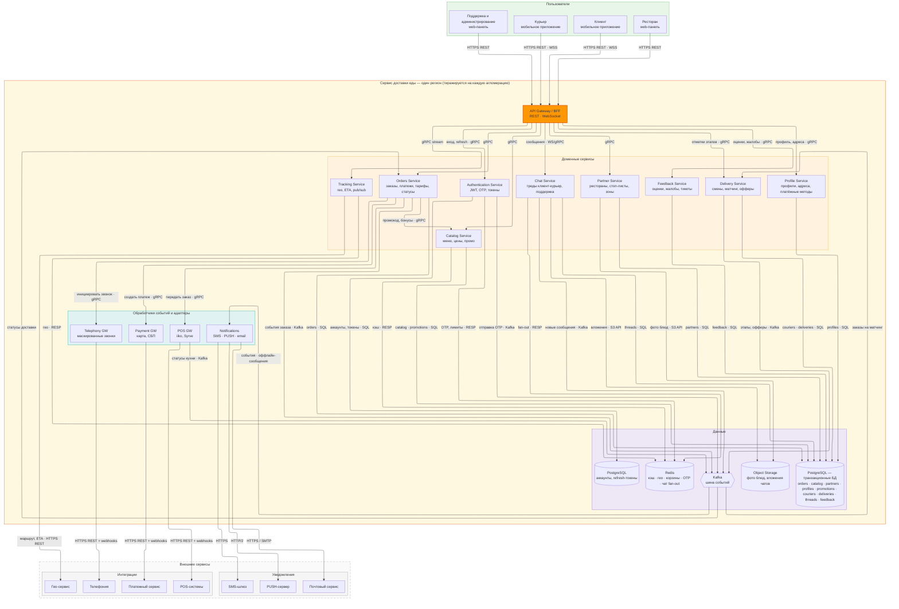

# ДЗ 2. Проектирование взаимодействия сервисов — решение

> Условие: [../Задание.md](../Задание.md) · Таблица протоколов: [../Таблица протоколов.md](../Таблица%20протоколов.md)
> Схемы в [diagrams/](diagrams/).

## Доставка еды

### Контекст системы

Сервис доставки еды это система (платформа), которая предназначенная для:

- выбора и заказа готовых продуктов (блюд) и полуфабрикатов пользователями в авторизированных магазинах или ресторанах
- размещения продуктов (блюд) и полуфабрикатов магазинами или ресторанами, а также взаимодействия с собственными системами автоматизации ресторанов
- организации работы с курьерской службой (доставка)
- администрирования (аналитика, отчеты, управление авторизацией пользователей, магазинов и курьеров)
- финансовый модуль для взаимодействия с банками/платежными системами (в данной работе оставляем за скобками)
  > Прием наличных курьерами (эквайринг у курьеров, инкассация, сверка наличных при закрытии смены и т.п.) тоже не рассматриваем в рамках текущей архитектуры

### Основные пользователи и акторы с указанием ключевых сценариев использования

Пользователи сервиса доставки еды:

- клиенты (мобильное приложение)
  - выбор продуктов
  - оформление заказа и оплата заказа
  - просмотр состояния заказа и истории заказов
  - оценка продуктов/магазинов/ресторанов и отзывы
  - чат со службой поддержки
  - анонимная телефония
- магазины и рестораны (через браузер)
  - наполнение витрины заказов
  - прием платежей от клиентов (через платежную систему/банк)
  - взаимодействие с курьерской службой/курьерами
- курьеры (мобильное приложение)
  - выставление статуса (работаю/не работаю), географического района и т.п.
  - просмотр и подтверждение заказов на доставку
  - отображение дополнительной информации
  - анонимная телефония
- служба администрирования и поддержки (через браузер)
  - аналитика и статистика
  - отчеты
  - данные об отзывах и жалобах
  - чаты с пользователями, курьерами и магазинами/ресторанами
  - анонимная телефония

### Масштаб

Есть два варианта: разворачивать одну единую систему на всю страну или по одной на каждую крупную агломерацию.
Предполагаем, что с учетом социального устройства (семей) и возрастного состава, пользователем нашей системы будет каждый десятый, т.е. 10%, активных в день (DAU) 5%.
Заказы готовых блюд могут концетрироваться в трех временных интервалах: завтрак, обед и ужин. Заказы полуфабрикатов, как правило: утром или вечером. Таким образом в масштабах страны нагрузка равномерно распределяется с ходом часовых поясов и стоит закладываться на размер самой большой агломерации х5 (делаем предположение что сдвиг часовых поясов относительно самой большой агломерации допускает накладывание пиков в других агломерациях по сценарию "утро-обед-вечер"). В пределах агломерации будут ярко выраженные пики активности, т.к. один часовой пояс.
Предполагаем, что в самой большой агломерации от трети до половины магазионов, кафе и ресторанов могут быть нашими клиентами: от 20k до 30k desktop-клиентов для магазионов, кафе и ресторанов.
Предполагаем, что курьеров, зарегистрированных в нашем приложении должно быть меньше чем клиентов в 10 раз, один курьер в среднем выполняет 25 заказов (по данным поисковика 10-40). Не все курьеры работают каждые день и если работают, то не обязательно весь день. Таким образом активных курьеров в 20 раз меньше чем ежедневных заказов.
Предполагаем, что каждый интервал "утро-обед-вечер" длится 3 часа и нагрузка в это время относительно равномерна.
Усредненное количество блюд в каждом магазине, кафе и ресторане предполагаем равным 30.

**Вся страна**:

- 16M пользователей, 8M DAU
- магазионов, кафе и ресторанов до 300k (агломераций порядка 15, но остальные ощутимо меньше)
- курьеров всего 800k
- предполагаем распределение заказов "утро-обед-вечер" 4M-4M-4M, таким образом активных курьеров 480k (12M/25)
- RPS (для покупателей и курьеров) 4M/(3 часа х 3600 секунд) = примерно 400
- Пик 5x: дневной паттерн в самой большой агломерации + соседние агломерации со сдвигом по времени, примерно 2000 RPS

**Агломерация**:

- 2M пользователей, 1M DAU
- магазионов, кафе и ресторанов до 30k
- курьеров всего 100k
- предполагаем распределение "утро-обед-вечер" 0.5M-0.5M-0.5M, таким образом активных курьеров 60k (1.5M/25)
  > Примечание: 60k курьеров в сутки при сменах ~8–12 часов означает одновременно на линии 20–30k.
  > Примечание: курьер может везти сразу несколько заказов в одном направлении.
- RPS (для покупателей и курьеров) 0.5M/(3 часа х 3600 секунд) = примерно 50
- Пик 2x: дневной паттерн, примерно 100 RPS

**Итого**:
Выглядит так, что ощутимо выгоднее строить одну систему на агломерацию и придусмотреть синхронизацию данных между ними, чем одну большую в масштабах страны.
Данные о ресторанах для клиента уместно показывать в пределах заданного радиуса, например 10 км - быстрее и дешевле доставка.
> Границы агломераций, как правило, не пересекаются - проблемы заказа на границе регионов нет.

Плюсы за такое решение:

- простота и дешевизна развертывания на регион
- легко вводить постепенно по агломерациям
- легко масштабировать
- возможны индивидуальные особенности, связанные с разными регионами
  > Простота организации своих промо-акций и бонусных программ для каждого региона
- георезервирование
  > В т.ч. можно предусмотреть переброс нагрузки на соседние агломерации при пиках/перегрузке или авариях
- не требуется CDN
  > До 30k заведений × десятки позиций — это миллионы картинок, будут лежать в региональном object storage. Каталог регионален — картинки региональны, кросс-регионального трафика нет.
- в каждом регионе можно интегрироваться со своим, региональным оператором связи, а не гонять трафик через шлюзы в масштабах страны

Минусы:

- необходим мехнизм синхронизации данных между региональными системами
- суммарно нужно больше "железа"

## 1. Декомпозиция

### Context view

#### Телефония

Маскированные звонки «клиент ↔ курьер» и «клиент ↔ ресторан» без раскрытия реальных номеров, статусы и запись звонков. Сервис инициирует вызовы через API провайдера и получает обратно статусы звонков/вебхуки.

#### Платежный сервис

Приём онлайн-платежей (банковские карты, СБП), проведение и возврат транзакций, получение статусов оплаты.

#### Гео-сервис

Геокодирование адресов, расчёт расстояний и времени доставки, отображение карт, трекинг координат курьеров.

#### Системы автоматизации ресторанов

Интеграция с POS/KDS (Kitchen Display System) - системами ресторанов: автоматическая передача заказов на кухню, обратная синхронизация меню, цен и статусов приготовления.

#### SMS-шлюз, PUSH-сервер и Почтовый сервис

SMS, Push-уведомления и Email-рассылки в мобильные приложения клиентов и курьеров: смена статуса заказа, назначение доставки, промо-сообщения.

#### Сервис синхронизации

Другие агломерации — такие же стеки.
Зачем: заказ, кухня, гео и локальная витрина живут в одном регионе (границы почти не пересекаются). Но пользователь и курьер могут появиться в другом городе, бренд сети общий, антифрод и ключи JWT должны совпадать везде. Также переброс нагрузки при аварии — без общей идентичности не сделать (это задел на будущее).
Что не синхронизируем: заказы, трекинг, статусы кухни, региональный каталог и локальные промо. Их нет смысла передавать между регионами — это дешевле и проще держать на месте. Картинки тоже региональные, отдельный object storage не нужен.

| Данные | Владелец (кто пишет) | Куда реплицируется | Свежесть |
| --- | --- | --- | --- |
| Заказы, гео, статусы кухни | регион | | |
| Каталог, стоп-листы, цены | регион | | |
| Локальные промо/бонусы | регион | | |
| Фото блюд (object storage) | регион | | |
| Профили пользователей | «домашний» регион | все регионы (read-only) | минуты |
| Аккаунты курьеров | регион регистрации | все регионы | часы |
| Бренды/юрлица ресторанов/сетей | единый реестр | все регионы | часы |
| Антифрод, чёрные списки | центр | все регионы | ≤ 1 мин |
| Глобальные промо/бонусы | центр | все регионы | минуты |
| Токены/сессии | — | stateless JWT, синк только публичных ключей (JWKS) | — |
| Аналитика, ML-данные | все → центр | one-way поток в ClickHouse | асинхронно |
| Платёжные транзакции и т.п. | не рассматриваем | | |

### C4

## 2. Протоколы

_REST / gRPC / GraphQL / events — где и почему._

## 3. Схема взаимодействия

_PNG/PlantUML с указанием протоколов (в diagrams/)._

## 4. API-контракты

_3–4 ключевых API (Swagger/OpenAPI или описание)._

## 5. Асинхронность

_Где применяется и почему._

## 6. Паттерны

_Saga, CQRS и т.д. — обоснование._
