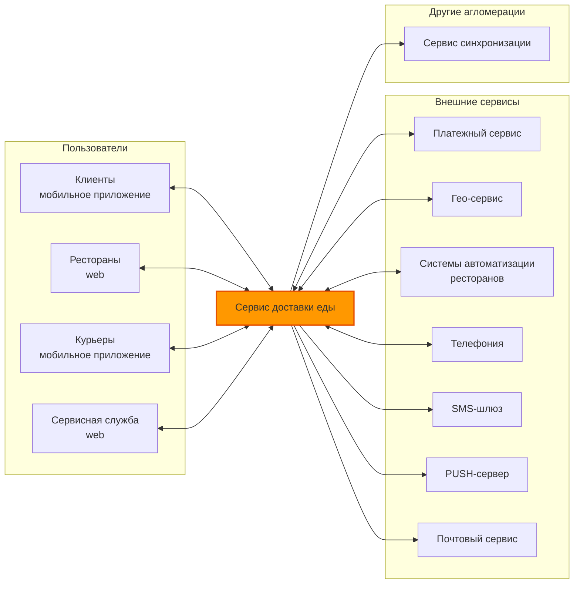
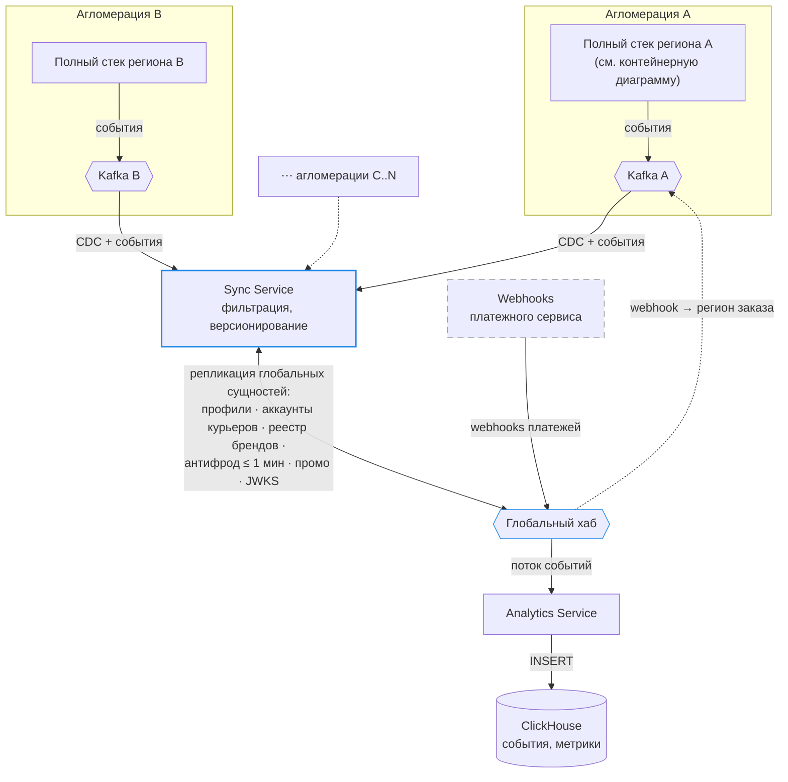
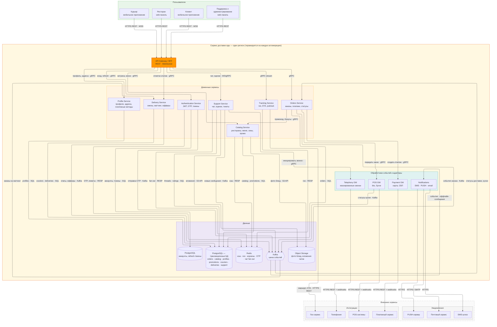
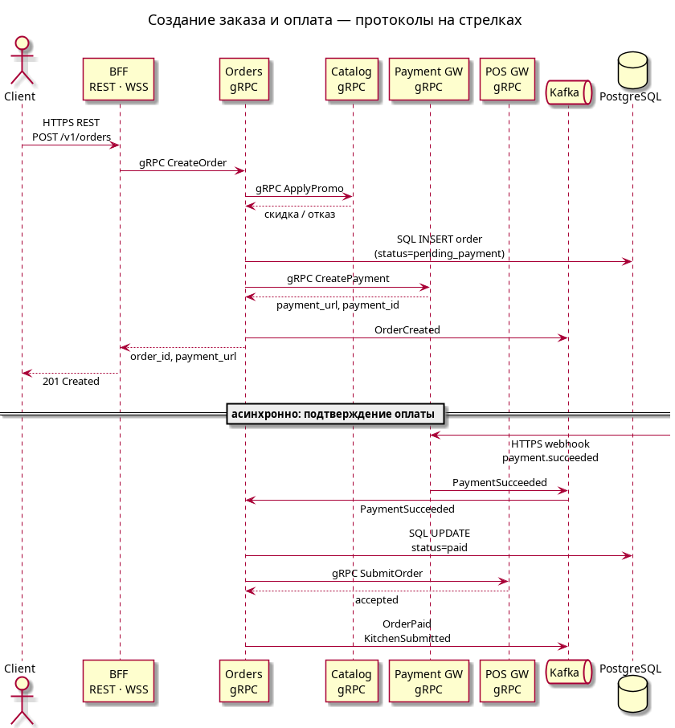
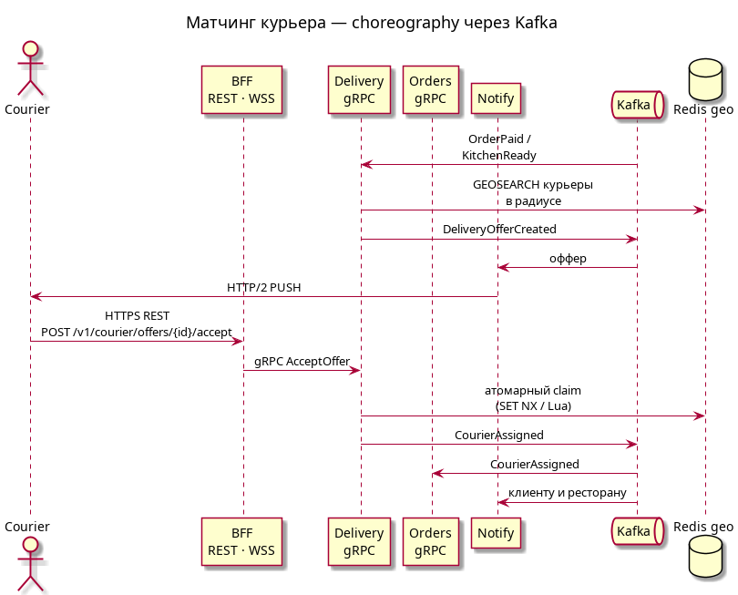
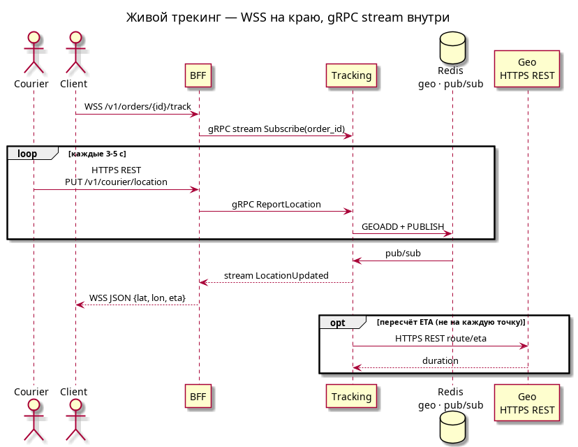
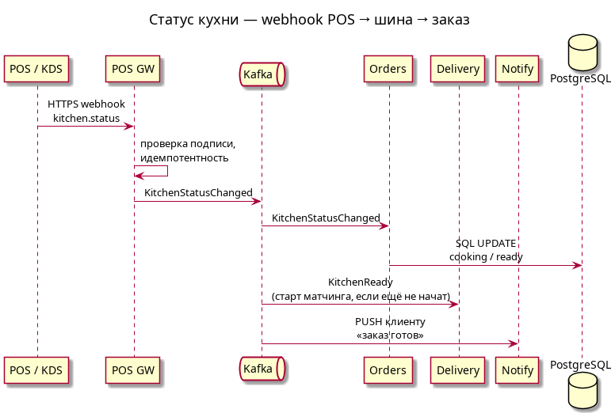

# ДЗ 2. Проектирование взаимодействия сервисов — решение

> Условие: [../Задание.md](../Задание.md) · Таблица протоколов: [../Таблица протоколов.md](../Таблица%20протоколов.md)
> Схемы в [diagrams/](diagrams/).

## Доставка еды

### Контекст системы

Сервис доставки еды это система (платформа), которая предназначенная для:

- выбора и заказа готовых продуктов (блюд) и полуфабрикатов пользователями в авторизированных магазинах или ресторанах
- размещения продуктов (блюд) и полуфабрикатов магазинами или ресторанами, а также взаимодействия с собственными системами автоматизации ресторанов
- организации работы с курьерской службой (доставка)
- администрирования (аналитика, отчеты, управление авторизацией пользователей, магазинов и курьеров)
- финансовый модуль для взаимодействия с банками/платежными системами (в данной работе оставляем за скобками)
  > Прием наличных курьерами (эквайринг у курьеров, инкассация, сверка наличных при закрытии смены и т.п.) тоже не рассматриваем в рамках текущей архитектуры

### Основные пользователи и акторы с указанием ключевых сценариев использования

Пользователи сервиса доставки еды:

- клиенты (мобильное приложение)
  - выбор продуктов
  - оформление заказа и оплата заказа
  - просмотр состояния заказа и истории заказов
  - оценка продуктов/магазинов/ресторанов и отзывы
  - чат со службой поддержки
  - анонимная телефония
- магазины и рестораны (через браузер)
  - наполнение витрины заказов
  - прием платежей от клиентов (через платежную систему/банк)
  - взаимодействие с курьерской службой/курьерами
- курьеры (мобильное приложение)
  - выставление статуса (работаю/не работаю), географического района и т.п.
  - просмотр и подтверждение заказов на доставку
  - отображение дополнительной информации
  - анонимная телефония
- служба администрирования и поддержки (через браузер)
  - аналитика и статистика
  - отчеты
  - данные об отзывах и жалобах
  - чаты с пользователями, курьерами и магазинами/ресторанами
  - анонимная телефония

### Масштаб

**Есть два варианта:** разворачивать одну единую систему на всю страну или по одной на каждую крупную агломерацию.
Предполагаем, что с учетом социального устройства (семей) и возрастного состава, пользователем нашей системы будет каждый десятый, т.е. 10%, активных в день (DAU) 5%.  
Заказы готовых блюд могут концетрироваться в трех временных интервалах: завтрак, обед и ужин. Заказы полуфабрикатов, как правило: утром или вечером. Таким образом в масштабах страны нагрузка равномерно распределяется с ходом часовых поясов и стоит закладываться на размер самой большой агломерации х5 (делаем предположение что сдвиг часовых поясов относительно самой большой агломерации допускает накладывание пиков в других агломерациях по сценарию "утро-обед-вечер"). В пределах агломерации будут ярко выраженные пики активности, т.к. один часовой пояс.  
Предполагаем, что в самой большой агломерации от трети до половины магазионов, кафе и ресторанов могут быть нашими клиентами: от 20k до 30k desktop-клиентов для магазионов, кафе и ресторанов.  
Предполагаем, что курьеров, зарегистрированных в нашем приложении должно быть меньше чем клиентов в 10 раз, один курьер в среднем выполняет 25 заказов (по данным поисковика 10-40). Не все курьеры работают каждые день и если работают, то не обязательно весь день. Таким образом активных курьеров в 20 раз меньше чем ежедневных заказов.  
Предполагаем, что каждый интервал "утро-обед-вечер" длится 3 часа и нагрузка в это время относительно равномерна.
Усредненное количество блюд в каждом магазине, кафе и ресторане предполагаем равным 30.

**Вся страна**:

- 16M пользователей, 8M DAU
- магазинов, кафе и ресторанов до 300k (агломераций порядка 15, но остальные ощутимо меньше)
- курьеров всего 800k
- предполагаем распределение заказов "утро-обед-вечер" 4M-4M-4M, таким образом активных курьеров 480k (12M/25)
- RPS (для покупателей и курьеров) 4M/(3 часа х 3600 секунд) = примерно 400
- Пик 5x: дневной паттерн в самой большой агломерации + соседние агломерации со сдвигом по времени, примерно 2000 RPS

**Агломерация**:

- 2M пользователей, 1M DAU
- магазинов, кафе и ресторанов до 30k
- курьеров всего 100k
- предполагаем распределение "утро-обед-вечер" 0.5M-0.5M-0.5M, таким образом активных курьеров 60k (1.5M/25)
  > 1. 60k курьеров в сутки при сменах ~8–12 часов означает одновременно на линии 20–30k.  
  > 2. Курьер может везти сразу несколько заказов в одном направлении.
- RPS (для покупателей и курьеров) 0.5M/(3 часа х 3600 секунд) = примерно 50
- Пик 2x: дневной паттерн, примерно 100 RPS

**Итого**:  
Выглядит так, что ощутимо выгоднее строить одну систему на агломерацию и предусмотреть синхронизацию данных между ними (т.е. N региональных систем), чем одну большую в масштабах страны.  
Данные о ресторанах для клиента уместно показывать в пределах заданного радиуса, например 10 км - быстрее и дешевле доставка.
> Границы агломераций, как правило, не пересекаются (геометрически агломерации находятся внутри регионов) - проблемы заказа на границе регионов нет.

Плюсы за такое решение:

- простота и дешевизна развертывания на регион
- легко вводить постепенно по агломерациям
- легко масштабировать
- возможны индивидуальные особенности, связанные с разными регионами
  > Простота организации своих промо-акций и бонусных программ для каждого региона
- георезервирование
  > В т.ч. можно предусмотреть переброс нагрузки на соседние агломерации при пиках/перегрузке или авариях
- не требуется CDN
  > До 30k заведений × десятки позиций - это миллионы картинок, будут лежать в региональном object storage. Каталог свой в каждой агломерации (регионе), кросс-регионального трафика картинок не требуется.
- в каждом регионе можно интегрироваться со своим, региональным оператором связи, а не гонять трафик через шлюзы в масштабах страны

Минусы:

- необходим мехнизм синхронизации данных между региональными системами
- суммарно нужно больше "железа" (но по предварительной прикидке оно проще)

## 1. Декомпозиция

### 1.1 Context view



### 1.2 Телефония

Маскированные звонки «клиент ↔ курьер» и «клиент ↔ ресторан» без раскрытия реальных номеров, статусы и запись звонков. Сервис инициирует вызовы через API провайдера и получает обратно статусы звонков/вебхуки.

### 1.3 Платежный сервис

Приём онлайн-платежей (банковские карты, СБП), проведение и возврат транзакций, получение статусов оплаты.

### 1.4 Гео-сервис

Геокодирование адресов, расчёт расстояний и времени доставки, отображение карт, трекинг координат курьеров.

### 1.5 Системы автоматизации ресторанов

Интеграция с POS/KDS (Kitchen Display System) - системами ресторанов: автоматическая передача заказов на кухню, обратная синхронизация меню, цен и статусов приготовления.

### 1.6 SMS-шлюз, PUSH-сервер и Почтовый сервис

SMS, Push-уведомления и Email-рассылки в мобильные приложения клиентов и курьеров: смена статуса заказа, назначение доставки, промо-сообщения.

### 1.7 Сервис синхронизации

Другие агломерации - такие же стеки.
Зачем: заказ, кухня, гео и локальная витрина живут в одном регионе (границы почти не пересекаются), но пользователь и курьер могут появиться в другом городе, бренд сети общий, антифрод и ключи JWT должны совпадать везде. Также переброс нагрузки при аварии - без общей идентичности не сделать (это задел на будущее).
Что не синхронизируем: заказы, трекинг, статусы кухни, региональный каталог и локальные промо. Их нет смысла передавать между регионами - это дешевле и проще держать на месте. Картинки тоже региональные, отдельный object storage не нужен.



> Webhook платежного сервиса это опциональная сущность для поддержки единой точки входа банков, как альтернатива региональным (своим для каждой агломерации), чтобы не создавать много PaymentGW.

| Данные | Владелец (кто пишет) | Куда реплицируется | Свежесть |
| --- | --- | --- | --- |
| Заказы, гео, статусы кухни | регион | | |
| Каталог, стоп-листы, цены | регион | | |
| Локальные промо/бонусы | регион | | |
| Фото блюд (object storage) | регион | | |
| Профили пользователей | «домашний» регион | все регионы (read-only) | минуты |
| Аккаунты курьеров | регион регистрации | все регионы | часы |
| Бренды/юрлица ресторанов/сетей | единый реестр | все регионы | часы |
| Антифрод, чёрные списки | центр | все регионы | ≤ 1 мин |
| Глобальные промо/бонусы | центр | все регионы | минуты |
| Токены/сессии | - | stateless JWT, только публичные ключи (JWKS) | - |
| Аналитика, ML-данные | все → центр | one-way поток в ClickHouse | асинхронно |
| Платёжные транзакции и т.п. | не рассматриваем | | |

### C4



#### Authentication Service

Аутентификация клиентов, ресторанов и курьеров, OTP, выпуск и отзыв JWT, обновление токенов.
> OTP - one-time password, одноразовый код  
> JWT - JSON Web Token, подписанный токен, которым клиент доказывает, что он уже вошёл.

#### Profile Service

Источник информации о клиентах (покупателях): адреса доставки, привязанные платёжные методы, «домашний» регион пользователя, любимые блюда или продукты.

#### Catalog Service

Рестораны и зоны доставки, меню, цены, стоп-листы, промокоды — один владелец витрины, без отдельного Partner Service. `is_open`, `stop_list` и цена позиции живут здесь, не в заказе. Фото блюд — в object storage. Панель ресторана пишет меню и стоп-листы сюда же. На checkout отдаёт `ApplyPromo` и снимок позиций (`offer_id` → `price_minor`).

#### Orders Service

Жизненный цикл заказа и оркестрация checkout: проверка витрины, фиксация состава и сумм, создание платежа, смена статуса. Не считает тариф доставки, не матчит курьера, не звонит и не пишет в POS по своей инициативе из клиентского HTTP — после оплаты это события и адаптеры.

#### Delivery Service

Смены курьеров, геопоиск, офферы, назначение, отметки этапов (забрал / у клиента). Владеет тарифом доставки: на checkout BFF/Orders синхронно вызывает `QuoteFee` (дистанция, пик, тип смены). После `OrderPaid` / `KitchenReady` — хореография офферов.

#### Tracking Service

Точки курьера, Redis GEO, ETA, рассылка подписчикам. Не хранит заказ и не назначает курьера; читает `order_id` и пишет координаты.

#### Support Service

Треды клиент–курьер и клиент–поддержка, оценки, жалобы, тикеты, маскированные звонки через Telephony GW. Чат и фидбек в одном сервисе: один объект «обращение по заказу», без отдельной БД отзывов. Маскированные звонки инициирует Support через Telephony GW.

> Изначально предполагалось два сервиса: chat (для общения с пользователями, курьерами и ресторанами/магазинами) и feedback (для обратной связи и оценок/рейтингов), но так как нагрузка получилась низкая (~100 RPS заказов на агломерацию) решено объединить их.

## 2. Протоколы

На C4 протоколы указаны на стрелках.
> BFF - Backend for Frontend  
> WSS - WebSocket поверх TLS  
> CDC - Change Data Capture, способ узнать, что в базе уже изменилось, не спрашивая приложение и не делая SELECT по всем таблицам. В PG через WAL.

| Граница | Протокол | Почему |
| --- | --- | --- |
| Клиенты → BFF | HTTPS REST + WSS | Мобильные и web-клиенты, TLS, кэшируемые GET каталога, OpenAPI. WSS - трекинг и чат, без long polling. |
| BFF → сервисы | gRPC | Типизированный контракт, codegen, один HTTP/2-коннект на вызов веера из BFF. На ~100-400 RPS заказов это не про пропускную способность, а про контракт и эволюцию API. |
| BFF → Tracking | gRPC stream | Подписка клиента на заказ живёт минутами; стрим дешевле, чем опрос. |
| BFF → Support | WSS снаружи, gRPC внутри | Сокет держит BFF (переподключение, auth). Support не знает про мобильный сокет. |
| Сервисы → адаптеры (Pay/POS/Tel) | gRPC | Внутренний контракт. Снаружи у адаптера - то, что умеет партнёр. |
| Адаптеры → платёжка, POS, телефония, гео | HTTPS REST + webhooks | Так устроены iiko/Syrve, эквайринг, маскированные звонки, картографические API. Свой gRPC туда не протащить. |
| Сервисы → шина | Kafka (события) | Заказ затрагивает Delivery, Notify, POS. Не держим HTTP, пока курьер принимает оффер или кухня готовит. |
| Notify → SMS / PUSH / почта | HTTPS / HTTP/2 / SMTP | Собственные протоколы шлюзов. FCM (пуш на Android, Google) или APNs (Apple Push Notification service) - HTTP/2. |
| Сервисы → данные | SQL, RESP, S3 API | Собственные протоколы хранилищ, не «REST к своей БД». |
| Регион ↔ хаб | CDC + события Kafka | См. сервис синхронизации. Не синхронный REST между агломерациями. |

> Пик «~100 RPS на агломерацию» в разделе «Масштаб» - это оценка заказов. Просмотр витрины и трекинг курьеров могут дать другой порядок (наверное, что-то около х10).

## 3. Схема взаимодействия

| Сценарий | Файл |
| --- | --- |
| Создание заказа и оплата | [sequence-create-order.puml](diagrams/sequence-create-order.puml) · [PNG](diagrams/sequence-create-order.png) |
| Вызов курьера | [sequence-delivery-match.puml](diagrams/sequence-delivery-match.puml) · [PNG](diagrams/sequence-delivery-match.png) |
| Живой трекинг | [sequence-tracking.puml](diagrams/sequence-tracking.puml) · [PNG](diagrams/sequence-tracking.png) |
| Статус кухни (webhook POS) | [sequence-kitchen-webhook.puml](diagrams/sequence-kitchen-webhook.puml) · [PNG](diagrams/sequence-kitchen-webhook.png) |

### Создание заказа и оплата

Клиент получает `201` сразу после создания платежа. Подтверждение оплаты, кухня и вызов курьера - после webhook, не в том же HTTP-запросе.



### Выбор курьера

Delivery service сам реагирует на `OrderPaid` / `KitchenReady`. Кто первый принял заказ - тот повёз. Orders узнаёт о назначении из Kafka, а не синхронным вызовом из Delivery.



### Трекинг и статус кухни

Клиент держит WSS. Курьер шлёт точку REST-ом раз в 3–5 с. BFF переводит это в gRPC; веер подписчикам - Redis pub/sub + gRPC stream. ETA у гео-сервиса считаем не на каждую точку.

Webhook кухни: POS → POS GW (подпись, идемпотентность) → Kafka → Orders, Delivery, Notify.





## 4. API-контракты

Четыре контракта на границах, которые реально стыкуют контуры: витрина, заказ, оффер курьеру, входящий платёж. Внутри - тот же смысл в gRPC/protobuf; снаружи BFF отдаёт REST.

### 4.1. Витрина - `GET /v1/restaurants`

Кэшируемый GET.

```yaml
openapi: 3.0.3
info:
  title: Food Delivery BFF
  version: 1.0.0
paths:
  /v1/restaurants:
    get:
      summary: Рестораны в радиусе доставки
      parameters:
        - in: query
          name: lat
          required: true
          schema: { type: number, format: double }
        - in: query
          name: lon
          required: true
          schema: { type: number, format: double }
        - in: query
          name: radius_m
          schema: { type: integer, default: 10000 }
      responses:
        "200":
          description: Список заведений
          content:
            application/json:
              schema:
                type: object
                properties:
                  items:
                    type: array
                    items:
                      type: object
                      required: [id, name, eta_min, is_open]
                      properties:
                        id: { type: string, format: uuid }
                        name: { type: string }
                        eta_min: { type: integer }
                        is_open: { type: boolean }
                        stop_list: { type: boolean }
  /v1/restaurants/{id}/menu:
    get:
      summary: Меню ресторана
      parameters:
        - in: path
          name: id
          required: true
          schema: { type: string, format: uuid }
      responses:
        "200":
          description: Категории и блюда
          content:
            application/json:
              schema:
                type: object
                properties:
                  restaurant_id: { type: string, format: uuid }
                  currency: { type: string, example: RUB }
                  categories:
                    type: array
                    items:
                      type: object
                      properties:
                        name: { type: string }
                        items:
                          type: array
                          items:
                            type: object
                            required: [id, name, price_minor, available]
                            properties:
                              id: { type: string, format: uuid }
                              name: { type: string }
                              price_minor: { type: integer }
                              available: { type: boolean }
```

BFF → Catalog: `GetNearbyRestaurants`, `GetMenu` (gRPC). Кэш Redis с ключом `menu:{restaurant_id}:{version}`.

### 4.2. Заказ - `POST /v1/orders`

Синхронный ответ - «заказ принят, оплатите». Кухня и курьер в этот ответ не входят.

```yaml
  /v1/orders:
    post:
      summary: Создать заказ
      security:
        - bearerAuth: []
      requestBody:
        required: true
        content:
          application/json:
            schema:
              type: object
              required: [restaurant_id, address_id, items]
              properties:
                restaurant_id: { type: string, format: uuid }
                address_id: { type: string, format: uuid }
                promo_code: { type: string }
                idempotency_key: { type: string, format: uuid }
                items:
                  type: array
                  minItems: 1
                  items:
                    type: object
                    required: [offer_id, qty]
                    properties:
                      offer_id: { type: string, format: uuid }
                      qty: { type: integer, minimum: 1 }
      responses:
        "201":
          description: Заказ создан, ожидает оплату
          content:
            application/json:
              schema:
                type: object
                required: [order_id, status, payment]
                properties:
                  order_id: { type: string, format: uuid }
                  status: { type: string, enum: [pending_payment] }
                  payment:
                    type: object
                    properties:
                      payment_id: { type: string }
                      confirmation_url: { type: string, format: uri }
        "409":
          description: Промокод / стоп-лист / повтор idempotency_key
        "422":
          description: Ресторан закрыт или адрес вне зоны
```

Внутренний контракт (тот же сценарий):

```protobuf
service Orders {
  rpc CreateOrder (CreateOrderRequest) returns (CreateOrderResponse);
}

message CreateOrderRequest {
  string user_id = 1;
  string restaurant_id = 2;
  string address_id = 3;
  string promo_code = 4;
  string idempotency_key = 5;
  repeated OrderItem items = 6;
}

message CreateOrderResponse {
  string order_id = 1;
  string status = 2;
  string payment_id = 3;
  string confirmation_url = 4;
}
```

### 4.3. Оффер курьера - `POST /v1/courier/offers/{id}/accept`

Гонка курьеров. Ответ сразу: принят или уже занят. Назначение другим сервисам уходит событием `CourierAssigned`.

```yaml
  /v1/courier/offers/{id}/accept:
    post:
      summary: Принять оффер на доставку
      security:
        - bearerAuth: []
      parameters:
        - in: path
          name: id
          required: true
          schema: { type: string, format: uuid }
      responses:
        "200":
          description: Оффер закреплён за курьером
          content:
            application/json:
              schema:
                type: object
                required: [delivery_id, order_id, status]
                properties:
                  delivery_id: { type: string, format: uuid }
                  order_id: { type: string, format: uuid }
                  status: { type: string, enum: [assigned] }
                  pickup:
                    type: object
                    properties:
                      lat: { type: number }
                      lon: { type: number }
        "409":
          description: Оффер уже принят другим курьером или отозван
```

### 4.4. Webhook оплаты - `POST /v1/internal/payments/webhook`

Не публичный API приложения. Payment GW принимает колбэк провайдера, проверяет подпись, публикует `PaymentSucceeded` / `PaymentFailed`.

```yaml
  /v1/internal/payments/webhook:
    post:
      summary: Статус платежа от провайдера
      parameters:
        - in: header
          name: X-Signature
          required: true
          schema: { type: string }
      requestBody:
        required: true
        content:
          application/json:
            schema:
              type: object
              required: [event_id, payment_id, status]
              properties:
                event_id: { type: string }
                payment_id: { type: string }
                order_id: { type: string, format: uuid }
                status: { type: string, enum: [succeeded, failed, refunded] }
                amount_minor: { type: integer }
      responses:
        "200":
          description: Принято (повтор с тем же event_id — тоже 200)
        "401":
          description: Подпись не сошлась
```

Аналогичный контракт у POS GW: `POST /v1/internal/pos/webhook` с `event_id`, `external_order_id`, `status: accepted | cooking | ready | rejected`.

Трекинг для клиента - не REST-ресурс, а WSS `GET /v1/orders/{id}/track` → JSON-кадры `{ lat, lon, eta_min, ts }`. Внутри BFF: `rpc Subscribe(SubscribeRequest) returns (stream LocationUpdate)`.

## 5. Асинхронность

Синхронно оставляем только то, без чего нельзя ответить клиенту в том же запросе. Всё, что ждёт человека, кухню или внешнего провайдера - в события и колбэки.

| Место | Механизм | Почему не синхронно |
| --- | --- | --- |
| Подтверждение оплаты | webhook → Kafka | 3-D Secure / СБП занимают секунды–минуты. HTTP создания заказа к этому моменту уже закрыт. |
| Передача на кухню и статусы POS | gRPC SubmitOrder + webhook/Kafka | POS может быть недоступен; ретраи и повторная доставка статуса не должны блокировать клиента. |
| Вызов курьера | Kafka + PUSH + accept | Оффер висит десятки секунд. Держать POST /orders открытым нельзя. |
| SMS / PUSH / email | Kafka → Notify | Шлюзы медленные и с квотами. Отказ SMS не должен откатывать заказ. |
| OTP при входе | Kafka → Notify | Auth отвечает «код отправлен»; доставка - отдельно. |
| Трекинг | WSS + Redis pub/sub + gRPC stream | 20–30k курьеров на линии × точка каждые 3–5 с - это тысячи RPS. Писать каждую точку в PostgreSQL (INSERT или UPDATE) не имеет смысла, лучше координата курьера в REDIS с TTL. |
| Чат Support, если получатель офлайн | Kafka → Notify | Сообщение сохранено в PG (тред обращения); PUSH — необязательная часть: попытались разбудить телефон, если нет, то пользователь увидит когда зайдет в чат. |
| Синхронизация регионов | CDC + хаб | Профиль в другом городе не обязан появиться в ту же миллисекунду. Антифрод - исключение (≤ 1 мин). |
| Аналитика | one-way поток в центр | Не в критическом пути заказа. |

Идемпотентность на входе в асинхронный контур: `idempotency_key` на создание заказа, `event_id` на webhooks, атомарная процедура приема оффера в Redis (`SET NX` / Lua). Повтор webhook с тем же `event_id` - тот же `200`, без второго `SubmitOrder`.

Что не делаем асинхронно: проверка промокода и стоп-листа в момент checkout (клиент должен сразу увидеть отказ), accept оффера (курьер должен сразу узнать, что заказ его).

## 6. Паттерны

### API Gateway / BFF

Одна точка входа для четырёх клиентов. Терминирует TLS, JWT, REST↔gRPC, WSS↔стрим. Клиенты не ходят в Orders/Delivery напрямую. Без шлюза клиенту пришлось бы знать семь адресов наших сервисов и gRPC.

Выполняет следующие действия:

- снимает TLS и проверяет JSON Web Token (JWT)
- снаружи REST/WSS (то, что умеет телефон и браузер)
- внутри gRPC и стримы (то, что умеют сервисы)

### Saga (гибрид)

Заказ задействует Orders, Catalog, Delivery и банк + POS. Общую SQL-транзакцию для всех не сделать: платёжный сервис и POS вне нашей ответственности. Вместо 2PC (two-phase commit) применяем SAGA (цепочка атомарных шагов). Используем и оркестрацию и хореографию.

До ответа клиенту — оркестрация. Orders сам ведёт сценарий и знает порядок:

- проверить промо (Catalog)
- записать заказ
- создать платёж (PayGW)
- вернуть 201 и ссылку на оплату

Если промо не прошло — клиент сразу видит ошибку. Тут нужен дирижёр, и это Orders.

После оплаты — хореография. Никто никого синхронно не дёргает. Сервисы слушают Kafka и сами реагируют:

- пришла оплата → заказ уходит на кухню
- кухня готова → Delivery ищет курьера
- курьер принял → Orders меняет статус, Notify шлёт пуш

Компенсации (тоже событиями, не 2PC):

| Сбой | Компенсация |
| --- | --- |
| Оплата не прошла | Заказа как бизнес-факта больше нет, промокод снова свободен |
| Кухня (магазин) отказала | отмена заказа, возврат денег через PayGW |
| Нет курьера за N минут | повторный вызов / эскалация; при таймауте — отмена и возврат |
| Курьер отменил доставку после accept | новый оффер, заказ не отменяем сразу |

### CQRS

Классический CQRS: одна модель/БД для команд (POST заказа), другая — для чтения (витрина, лента). На ~100 RPS заказов вторая PostgreSQL не нужна — обычная PG тянет и запись, и витрину.

В тексте «лёгкий CQRS»: не две базы команд/запросов, а разный способ читать и писать там, где модели правда разные.

- **Каталог.** Истина в PG (меню, цена, стоп-лист). Клиенты читают из Redis, чтобы не бить PG просмотром витрины. Это кэш, не отдельная read-модель. Если кэш протух — можно перечитать из PG.
- **Трекинг.** Сюда CQRS подходит сильнее. Курьер пишет точку в Redis GEO; клиент читает поток координат. PostgreSQL не участвует: тысячи точек в минуту не нужны как строки заказа, другой SLA (потерять одну точку терпимо, потерять заказ — нет).
