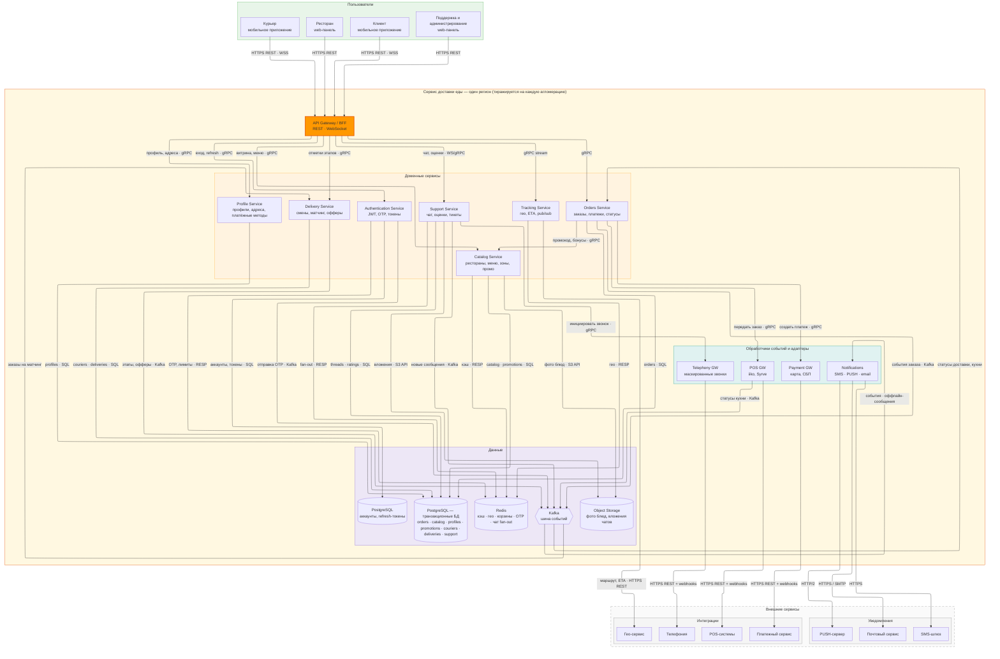

```mermaid
%%{init: {"flowchart": {"defaultRenderer": "elk"}}}%%
flowchart TB
    subgraph U["Пользователи"]
        CLIENT["Клиент<br/>мобильное приложение"]
        COURIER["Курьер<br/>мобильное приложение"]
        REST["Ресторан<br/>web-панель"]
        OPS["Поддержка и администрирование<br/>web-панель"]
    end

    subgraph STACK[" "]
    direction TB

    subgraph CORE["Сервис доставки еды — один регион (тиражируется на каждую агломерацию)"]

        BFF["API Gateway / BFF<br/>REST · WebSocket"]

        subgraph DOMAIN["Доменные сервисы"]
            AUTH["Authentication Service<br/>JWT, OTP, токены"]
            PROFILE["Profile Service<br/>профили, адреса, платёжные методы"]
            CATALOG["Catalog Service<br/>рестораны, меню, зоны, промо"]
            ORDERS["Orders Service<br/>заказы, платежи, статусы"]
            DELIVERY["Delivery Service<br/>смены, матчинг, офферы"]
            TRACKING["Tracking Service<br/>гео, ETA, pub/sub"]
            SUPPORT["Support Service<br/>чат, оценки, тикеты"]
        end

        subgraph DATA["Данные"]
            PG[("PostgreSQL — транзакционные БД<br/>orders · catalog · profiles · promotions · couriers · deliveries · support")]
            AUTHDB[("PostgreSQL<br/>аккаунты, refresh-токены")]
            REDIS[("Redis<br/>кэш · гео · корзины · OTP · чат fan-out")]
            S3[("Object Storage<br/>фото блюд, вложения чатов")]
            KAFKA{{"Kafka<br/>шина событий"}}
        end

        subgraph ADAPT["Обработчики событий и адаптеры"]
            NOTIFY["Notifications<br/>SMS · PUSH · email"]
            PAYGW["Payment GW<br/>карта, СБП"]
            POSGW["POS GW<br/>iiko, Syrve"]
            TELGW["Telephony GW<br/>маскированные звонки"]
        end
    end

    subgraph EXT["Внешние сервисы"]
        direction LR
        subgraph EXT_INT["Интеграции"]
            PAY["Платежный сервис"]
            GEO["Гео-сервис"]
            POS["POS-системы"]
            TEL["Телефония"]
        end
        subgraph EXT_NOTIF["Уведомления"]
            SMS["SMS-шлюз"]
            PUSH["PUSH-сервер"]
            MAIL["Почтовый сервис"]
        end
    end
    end

    %% Пользователи → точка входа
    CLIENT -->|"HTTPS REST · WSS"| BFF
    COURIER -->|"HTTPS REST · WSS"| BFF
    REST -->|"HTTPS REST"| BFF
    OPS -->|"HTTPS REST"| BFF

    %% Точка входа → домены
    BFF -->|"вход, refresh · gRPC"| AUTH
    BFF -->|"профиль, адреса · gRPC"| PROFILE
    BFF -->|"витрина, меню · gRPC"| CATALOG
    BFF -->|"gRPC"| ORDERS
    BFF -->|"чат, оценки · WS/gRPC"| SUPPORT
    BFF -->|"отметки этапов · gRPC"| DELIVERY
    BFF -->|"gRPC stream"| TRACKING

    %% Домены → данные
    ORDERS -->|"orders · SQL"| PG
    CATALOG -->|"catalog · promotions · SQL"| PG
    CATALOG -->|"кэш · RESP"| REDIS
    CATALOG -->|"фото блюд · S3 API"| S3
    PROFILE -->|"profiles · SQL"| PG
    DELIVERY -->|"couriers · deliveries · SQL"| PG
    SUPPORT -->|"threads · ratings · SQL"| PG
    SUPPORT -->|"fan-out · RESP"| REDIS
    SUPPORT -->|"вложения · S3 API"| S3
    AUTH -->|"аккаунты, токены · SQL"| AUTHDB
    AUTH -->|"OTP, лимиты · RESP"| REDIS
    TRACKING -->|"гео · RESP"| REDIS

    %% Шина: издатели (только сверху вниз)
    ORDERS -->|"события заказа · Kafka"| KAFKA
    DELIVERY -->|"этапы, офферы · Kafka"| KAFKA
    SUPPORT -->|"новые сообщения · Kafka"| KAFKA
    AUTH -->|"отправка OTP · Kafka"| KAFKA
    POSGW -->|"статусы кухни · Kafka"| KAFKA

    %% Шина: потребители
    KAFKA -->|"заказы на матчинг"| DELIVERY
    KAFKA -->|"статусы доставки, кухни"| ORDERS
    KAFKA -->|"события · оффлайн-сообщения"| NOTIFY

    %% Домены → адаптеры
    ORDERS -->|"создать платеж · gRPC"| PAYGW
    ORDERS -->|"передать заказ · gRPC"| POSGW
    SUPPORT -->|"инициировать звонок · gRPC"| TELGW
    ORDERS -->|"промокод, бонусы · gRPC"| CATALOG

    %% Адаптеры → внешние сервисы
    PAYGW -->|"HTTPS REST + webhooks"| PAY
    TRACKING -->|"маршрут, ETA · HTTPS REST"| GEO
    POSGW -->|"HTTPS REST + webhooks"| POS
    TELGW -->|"HTTPS REST + webhooks"| TEL
    NOTIFY -->|"HTTPS"| SMS
    NOTIFY -->|"HTTP/2"| PUSH
    NOTIFY -->|"HTTPS / SMTP"| MAIL

    style STACK fill:transparent,stroke:none
    style CORE fill:#fff8e1,stroke:#e65100
    style BFF fill:#ff9800,stroke:#e65100,stroke-width:2px
    style U fill:#e8f5e9,stroke:#66bb6a
    style DOMAIN fill:#fff3e0,stroke:#ffb74d
    style DATA fill:#ede7f6,stroke:#9575cd
    style ADAPT fill:#e0f2f1,stroke:#26a69a
    style EXT fill:#fafafa,stroke:#9e9e9e,stroke-dasharray: 8 6
    style EXT_INT fill:#f5f5f5,stroke:#9e9e9e
    style EXT_NOTIF fill:#f5f5f5,stroke:#9e9e9e
```
