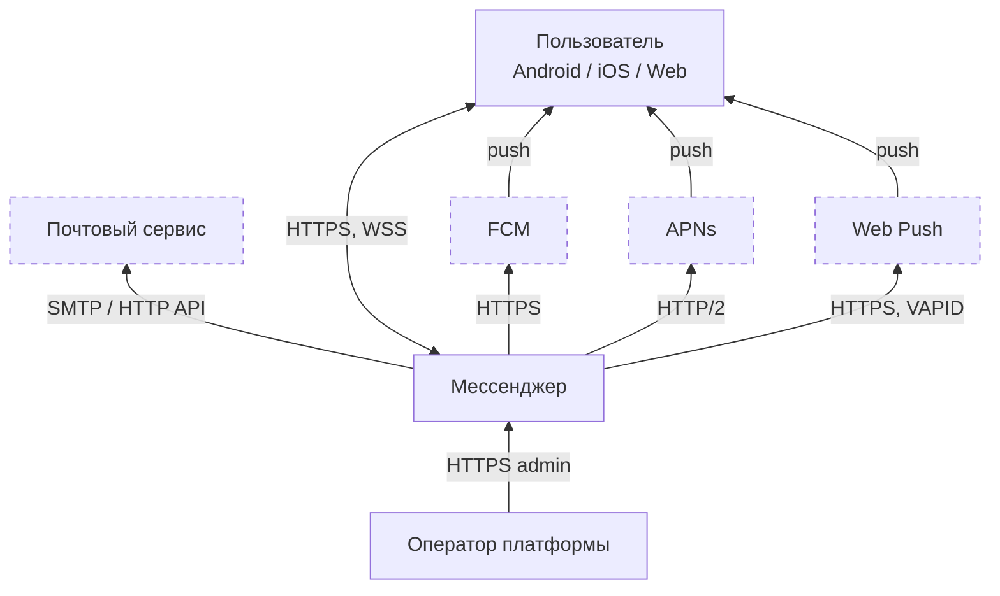
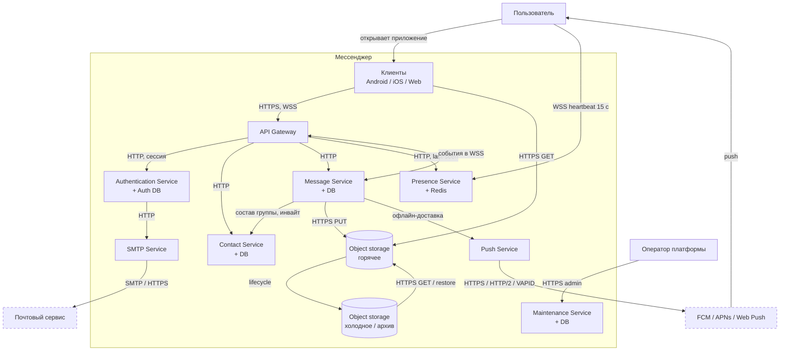

# ДЗ 6. Проектная работа - решение

> Условие: [../Задание.md](../Задание.md).  
> Схемы - в [diagrams/](diagrams/).

## Мессенджер с групповыми чатами

**Мессенджер** - сервис для обмена текстовыми сообщениями, картинками, фото- и видео-файлами между пользователями, через локальную сеть или интернет.  
> Далее по тексту будет принята следующая терминология:  
> **Сообщение** - любые данные, атомарно передаваемые между пользователями в поддерживаемых форматах, например, текстовое, видео, PNG и т.п.
> **Диалог** - обмен информацией между двумя пользователями (с поддержкой истории и других сервисов). Введено для того чтобы как-то различать маршруты точка-точка и точка-многоточка (групповая рассылка).

Предполагается разработка приложений для мобильных ОС (Android, iOS) и web-страницы.

Система относительно большая, рассчитанная на средних размеров страну (регион), скорее всего несколько часовых поясов.  
Оценка масштаба:

| Показатель | Значение | Примечание |
| ---------- | -------- | ---------- |
| Зарегистрированных пользователей | 50_000_000 | |
| DAU | 5_000_000 | 10 % от зарегистрированных |
| MAU | 40_000_000 | |
| Исходящих сообщений от пользователя в сутки | 15 | Текст, медиа |
| Всего исходящих сообщений в сутки | 15 * 5_000_000 = 75_000_000 | Текст, медиа |
| Доля медиа | 10%, средний объект 400 КБ | Фото/короткие файлы |
| Пик исходящих сообщений | ×5 к среднему | Час пик будет размазан если часовых поясов несколько |
| Средний RPS | 75_000_000/86_400 ≈ 870 | |
| Пиковый RPS | 870 * 5 = 4_350 | |
| Объем медиа в сутки | 75_000_000 * 0.1 * 400 kB = 3 TB | |
| Объем медиа в год | 3 TB * 365 ≈ 1.1 PB | Без учета дедупликации и уборки мусора | 

## 1. Требования

### 1.1 Функциональные требования

#### Аутентификация и авторизация

| ID | Описание | Примечание |
| -- | -------- | ---------- |
| A1 | Аутентификация пользователей | Должна поддерживаться аутентификация пользователей по email |
| A2 | Сессии | Должна поддерживаться возможность работы с нескольких авторизированных устройств одновременно |
| A3 | Доступ к группам | Доступ к групповым чатам должен осуществляться только по приглашению администратора группы |
| A4 | Чтение групповых сообщений | Просмотр участников и сообщений группы должен быть доступен только для пользователей-участников группы |

#### Сообщения

| ID | Описание | Примечание |
| -- | -------- | ---------- |
| M1 | Отправка сообщений | Должна поддерживаться возможность отправки сообщений пользователям в списке контактов и группам |
| M2 | История сообщений | Должен поддерживаться просмотр ранее отправленных сообщений в диалоге и группе |
| M3 | Реакция на сообщения | Должна поддерживаться возможность реакции пользователя на сообщения других пользователей в чате |
| M4 | Редактирование текстовых сообщений | Должна поддерживаться возможность редактирования ранее отправленных пользователем текстовых сообщений |
| M5 | Удаление сообщений | Должна поддерживаться возможность удаления ранее отправленных пользователем сообщений |
| M6 | Статусы сообщений | Каждое сообщение должно иметь статус (отправлено, доставлено до сервера, доставлено пользователю (-ям), прочитано) |
| M7 | Ответ на сообщение | Должна поддерживаться возможность ответа на одно выбранное сообщение (reply) |
| M8 | Пересылка сообщения | Должна поддерживаться возможность пересылки выбранных сообщений из чата другим пользователям |

#### Сервисные функции

| ID | Описание | Примечание |
| -- | -------- | ---------- |
| S1 | Администрирование | Должна поддерживаться возможность настройки и обслуживания сервисов и баз данных мессенджера |
| S2 | Мониторинг | Должна поддерживаться возможность мониторинга технического состояния сервисов и баз данных мессенджера |
| S3 | PUSH-уведомления | Должна поддерживаться отправка PUSH-уведомлений пользователм о различных событиях |
| S4 | Сервис присутствия пользователей | Отображение информации о текущем статусе пользователя |

#### Пользователи

| ID | Описание | Примечание |
| -- | -------- | ---------- |
| U1 | Добавление пользователей | Должна поддерживаться возможность добавления пользователей в список контактов |
| U2 | Поиск пользователей | Должна поддерживаться возможность поиска пользователей |
| U3 | Блокировка пользователей | Должна поддерживаться возможность блокировки пользователей |
| U4 | Mute | Должна поддерживаться возможность отключения уведомлений для заданных событий |

### 1.2 Нефункциональные требования

| ID | Описание | Примечание |
| -- | -------- | ---------- |
| nF1 | Гарантированная ёмкость send: ≥ 5 000 RPS | |
| nF2 | Медиа: ~3 TB/сутки входящих объектов | |
| nF3 | Надежность 99.9 % | простой не более 8,76 часа в год |
| nF4 | Heartbeat каждые 15 с | Websocket ping, не HTTP |
| nF5 | Сервис присутствия устаревает через 120 с | |
| nF6 | Все серверные метки времени в UTC | UI - локальное время на  стороне пользователя |
| nF7 | Максимальный размер текстового сообщения 4096 символов | |
| nF8 | Максимальный размер группы 256 участников | |
| nF9 | Максимальный размер файла 100 MB | |
| nF10 | Максимальный размер книги контактов 5_000 | |
| nF11 | Максимальное количество устройств у пользователя 10 | |

### 1.3 Риски и ограничения

- одна страна (регион) не учтены риски местных ограничений, требований по локализации и "преземлению" трафика
- зависимость от FCM (пуш на Android, Google) или APNs (Apple Push Notification service)
- большие объемы медиа
- компрометация серверов/баз данных и другие вопросы связанные с информационной безопасностью

### 1.4 Backlog

- защита данных (индивидуальная и групповая переписка) при передаче, обработке и хранении на устройствах пользователя или серверах, в т.ч. стратегии обновления ключей при истечении лимита времени или добавлении новых пользователей
- стратегии резервного копирования, в т.ч. с учетом версионирования
- аудио и видео звонки (индивидуальные и групповые)
- мультигруппы
- "исчезающие" сообщения
- боты
- пересмотр архитектуры через год

## 2. Концептуальная архитектура

### 2.1 Context view

| Связь | Протокол | Данные | Примечание |
| ----- | -------- | ------ | ---------- |
| Пользователь → Мессенджер | HTTPS | Логин, REST: профиль, контакты, поиск, инвайты, загрузка медиа | Запросы с ответом и идемпотентностью; TLS обязателен. Сессии с нескольких устройств - обычные HTTP-запросы с токеном |
| Пользователь ↔ Мессенджер | WSS (WebSocket поверх TLS) | Сообщения, статусы, реакции, presence, WS ping каждые 15 с | Долгий канал для push-in-app и heartbeat. Не HTTP-polling: иначе получатся десятки тысяч RPS на 1 млн online |
| Оператор → Мессенджер | HTTPS (отдельный ingress) | Админка и мониторинг | Тот же TLS, другая точка входа и IAM, чтобы админка не торчала на пользовательском API |
| Мессенджер → Почтовый сервис | SMTP или HTTPS API | Письма подтверждения email / восстановления | Вход по email. SMTP (свой MTA); HTTPS. |
| Мессенджер → FCM | HTTPS (REST JSON) | Офлайн-push для Android | FCM HTTP v1: POST https://fcm.googleapis.com/.../messages:send, OAuth. Версия HTTP не фиксирована, достаточно обычного HTTPS |
| Мессенджер → APNs | HTTP/2 (+ TLS 1.2+) | Офлайн-push для iOS | Контракт Apple: только HTTP/2, streams, POST /3/device/{token}. HTTP/1.1 не принимают. Это тоже TLS :443, но версия протокола обязательна |
| Мессенджер → Web Push | HTTPS + VAPID | Офлайн-push в браузер | RFC 8030/8292: POST на endpoint браузера, идентификация сервера ключами VAPID. Без живого WSS вкладка сама не узнает о сообщении |
| FCM / APNs / Web Push → устройство | протокол вендора | Системное уведомление | Последняя миля вне nF3 и вне нашего SLA. На устройстве это не «наш» HTTPS |

### C4

| Связь | Подпись на схеме | Протокол целиком |
| ----- | ---------------- | ---------------- |
| Клиенты → Gateway | HTTPS+WSS | HTTPS + WSS; WS ping 15 с только до Gateway |
| Оператор → Maintenance | HTTPS | HTTPS, отдельный вход в систему (ingress) |
| Gateway → Auth / Contact / Message / Presence | HTTP | внутренний HTTP; в Presence — last-seen, не каждый ping |
| Gateway ↔ Message | WSS | события рассылки в уже открытые сокеты |
| Message → Contact | HTTP | состав группы, инвайт |
| Message → object storage | PUT | HTTPS PUT (S3 API) |
| Клиенты → object storage | GET | HTTPS GET |
| горячее → холодное | lifecycle | политика бакета, не поток Message |
| холодное → горячее | GET | HTTPS GET / restore |
| Message → Push | HTTP | офлайн-доставка |
| Auth → SMTP | HTTP | внутренний адаптер |
| SMTP → почта | SMTP | SMTP или HTTPS API провайдера |
| Push → вендоры | HTTPS | FCM: HTTPS REST; APNs: HTTP/2; Web Push: HTTPS + VAPID |
| Вендоры → пользователь | push | протокол вендора |

### 2.3 Описание компонентов

#### 2.3.1 API Gateway

Единая точка входа для всех клиентских запросов. Принимает клиентский HTTPS и WSS, проверяет сессию через **Authentication Service**, маршрутизирует в сервисы. Долгие сокеты и heartbeat (каждые 15 с) заканчиваются здесь. Админский HTTPS идёт в Maintenance отдельно.

#### 2.3.2 Authentication Service + Auth DB

Сервис аутентификации пользователей со своей отдельной базой данных. Поддерживает до 10 сессий на каждого пользователя. Вход по email, письма через **SMTP Service**.

#### 2.3.3 Presence Service + Redis

Сервис присутствия хранит online/offline устройств в Redis по факту WSS heartbeat с Gateway. Нет ping 120 с - статус устаревает. Сам на устройства ничего не рассылает.

#### 2.3.4 Message Service + DB + Object storage + Холодное хранилище

Принимает, хранит и отвечает за рассылку сообщений (диалог и группа ≤256): история, статусы, реакции, edit/delete/reply/пересылка. Текст и метаданные — в своей БД, файлы до 100 МБ — в object storage.

#### 2.3.5 Contact Service + DB

Каталог пользователей, книга контактов (до 5000), блокировки, поиск; метаданные групп и членство, инвайты только от админа группы.

#### 2.3.6 Push Service

Сервис взаимодействия со службами Apple и Google для отправки PUSH-уведомлений. Также поддерживает отправку уведомлений для web. Обработка mute.

#### 2.3.7 Maintenance Service + DB

Сервис поддержки функций администрирования и мониторинга. Админ-API и аудит; метрики — отдельный контур.

#### 2.3.8 SMTP Service

Внутренний адаптер для взаимодействия с почтовыми серверами.

### 2.4 Обоснование архитектурного стиля

Стиль: клиент–сервер за API Gateway плюс несколько независимо масштабируемых сервисов (не модульный монолит и не «микросервисы на каждый метод»).  
Нагрузка неоднородна, один процесс её не масштабирует одинаково:

| Сервис | Требования/ограничения | Как масштабируем |
| ------ | ---------------------- | ---------------- |
| Gateway | до ~1 млн WSS, ping 15 с | горизонтально, sticky-сессии |
| Message | ≥ 5 000 RPS send + рассылка в группы ≤256 | шарды по chat_id |
| Object storage | ~3 ТБ/сутки | отдельный бакет, горячее/холодное |
| Presence | last-seen, не каждый ping | Redis, запись реже keepalive |
| Push | офлайн, вендоры | свой пул воркеров |

Монолит с общей БД на этом профиле смешает 1 млн сокетов, 1.1 ПБ медиа и историю сообщений в одном контуре отказа. Система из 15–20 сервисов при 5_000 RPS send не окупается: лишние связи/протоколы обмена, сложнее.

### 2.5 ADR

### 2.6 Пользователи и внешние интеграции

**Пользователи**

| Актор | Маршрут | Зачем |
| ----- | ------- | ----- |
| Пользователь | Android / iOS / Web → API Gateway (HTTPS, WSS) | Сообщения, история, контакты, группы, presence, медиа. До 10 устройств. Администратор группы - роль того же актора: инвайты, не отдельная система |
| Оператор платформы | HTTPS на отдельный ingress → Maintenance | Конфиг, пользователи, аудит. Метрики |

Пользователь не ходит в Presence, Redis и object storage «как в сервисы»: приложение открывает Gateway; ping 15 с заканчивается на Gateway; в Presence уходит сжатый last-seen. Файлы клиент качает GET из object storage по ключу/URL от Message.

**Внешние системы**

| Система | Кто вызывает | Протокол | Зачем | Риск |
| ------- | ------------ | -------- | ----- | ---- |
| Почтовый сервис | SMTP Service (из Auth) | SMTP или HTTPS API | Письма A1: регистрация, восстановление | недоставка письма ≠ падение чата |
| FCM | Push Service | HTTPS REST | Офлайн-push Android (S3) | вне нашего SLA |
| APNs | Push Service | HTTP/2 | Офлайн-push iOS (S3) | обязателен HTTP/2 |
| Web Push | Push Service | HTTPS + VAPID | Офлайн-push браузера (S3) | вкладка закрыта, свёрнут браузер или ноутбук уснул (нет WSS) |

## 3. Сайзинг

_RPS, хранилище, bandwidth, ресурсы и стоимость._

## 4. Хранение данных

_Выбор БД с обоснованием, шардирование, кэширование._

## 5. Взаимодействие

_Схема взаимодействия и API-контракты._
