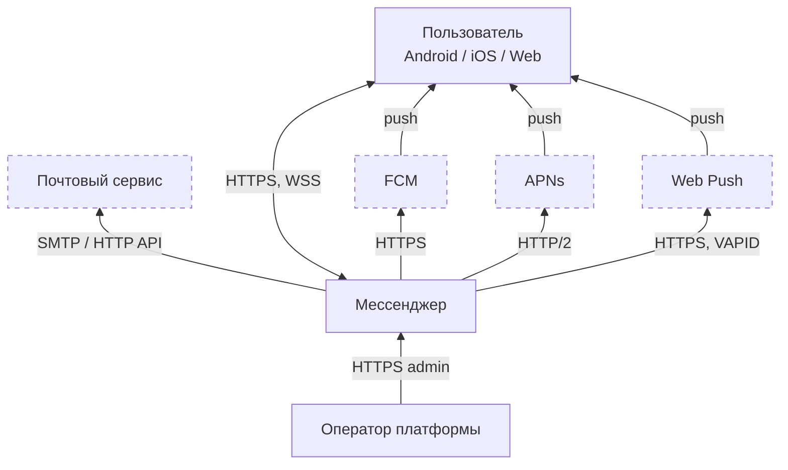
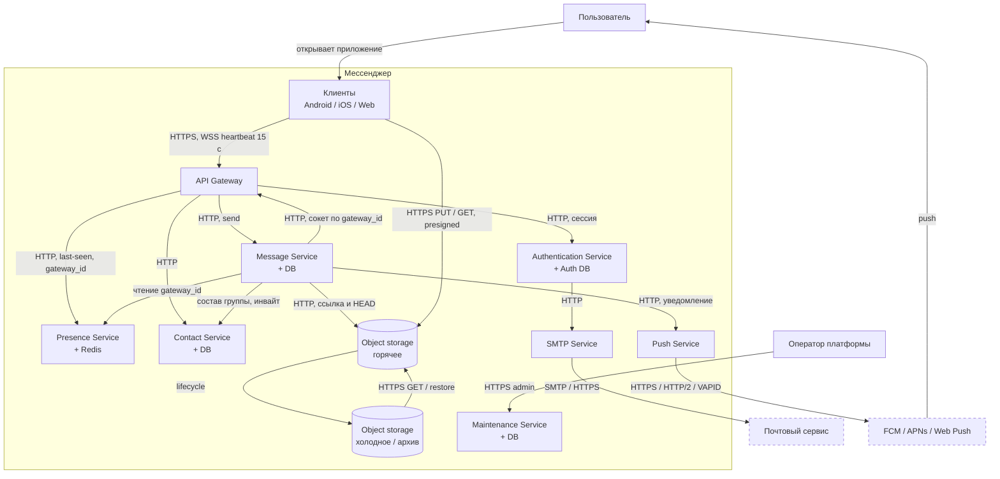
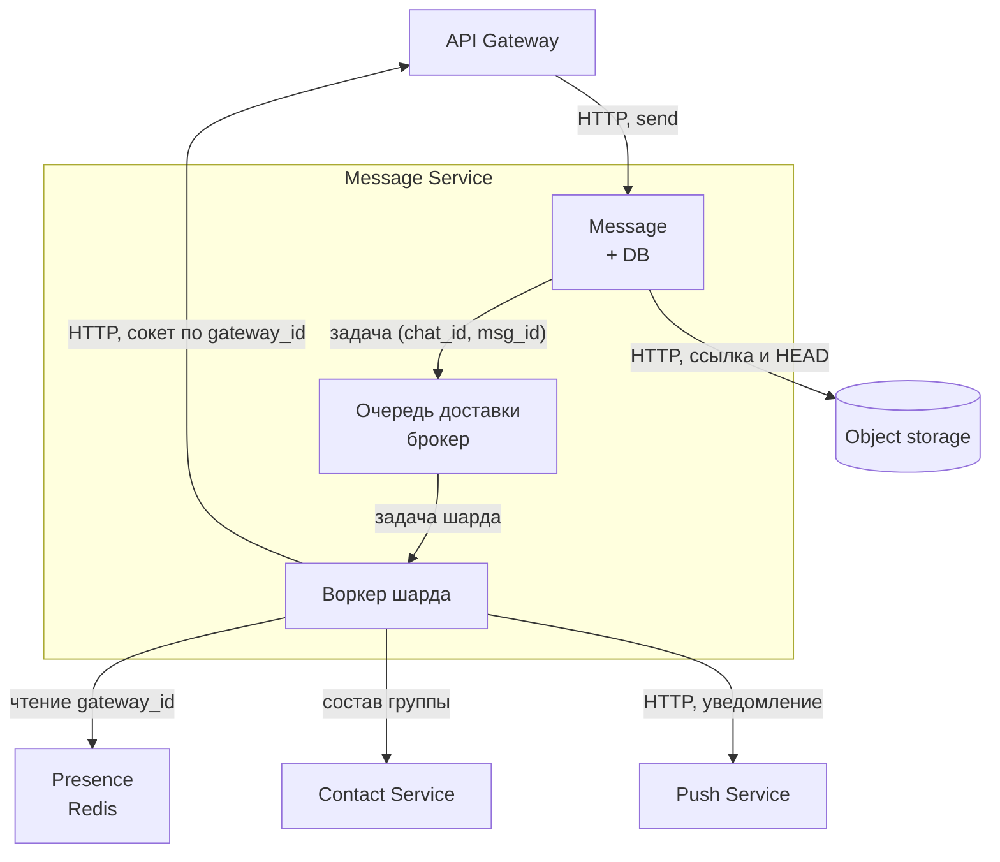
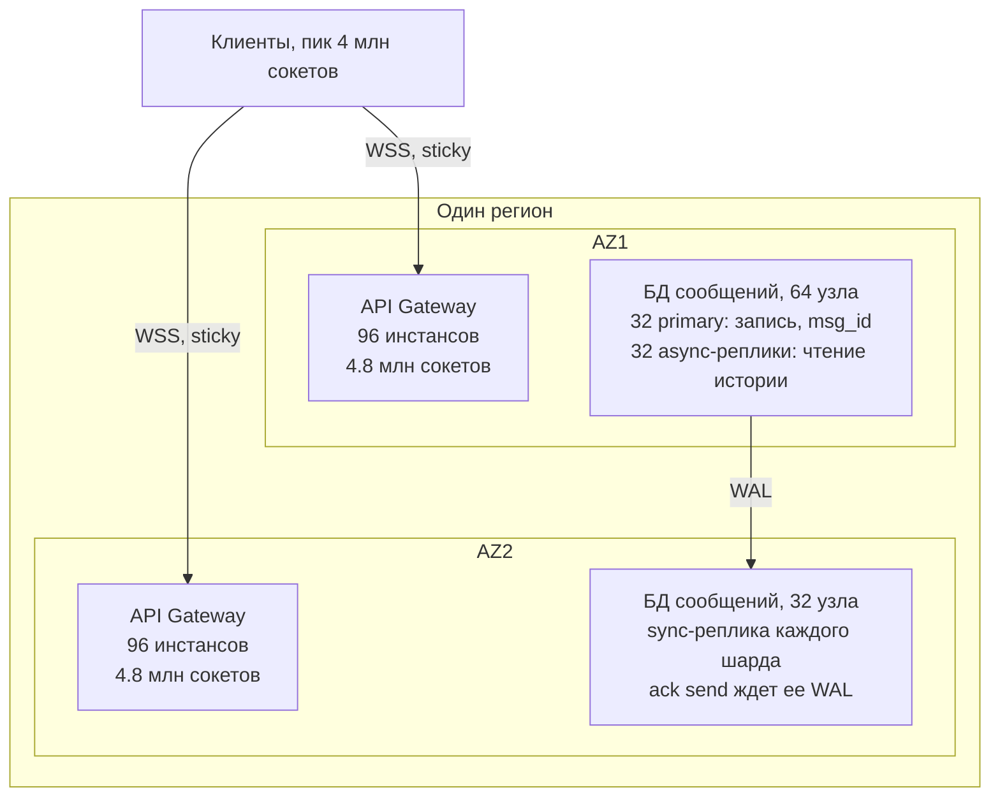

# ДЗ 6. Проектная работа - решение

> Условие: [../Задание.md](../Задание.md).  
> Схемы - в [diagrams/](diagrams/).

## Мессенджер с групповыми чатами

**Мессенджер** - сервис для обмена текстовыми сообщениями, картинками, фото- и видео-файлами между пользователями, через локальную сеть или интернет.  
> Далее по тексту будет принята следующая терминология:  
> **Сообщение** - любые данные, атомарно передаваемые между пользователями в поддерживаемых форматах, например, текстовое, видео, PNG и т.п.  
> **Диалог** - обмен информацией между двумя пользователями (с поддержкой истории и других сервисов). Введено для того чтобы как-то различать маршруты точка-точка и точка-многоточка (групповая рассылка).

Предполагается разработка приложений для мобильных ОС (Android, iOS) и web-страницы.

Система относительно большая, рассчитанная на средних размеров страну (регион), скорее всего несколько часовых поясов.  
Оценка масштаба (больше информации в разделе "сайзинг"):

| Показатель | Значение | Примечание |
| ---------- | -------- | ---------- |
| Зарегистрированных пользователей | 100_000_000 | |
| DAU | 20_000_000 | 20 % от зарегистрированных |
| MAU | 40_000_000 | Для мессенджеров типичное значение отношения DAU/MAU (его еще называют коэффициентом «липкости», stickiness ratio) обычно лежит в диапазоне 40–60% |
| Исходящих сообщений от пользователя в сутки | 15 | Текст, медиа |
| Всего исходящих сообщений в сутки | 15 * 20_000_000 = 300_000_000 | Текст, медиа |
| Доля медиа | 10%, средний объект 400 КБ | Фото/файлы |
| Пик исходящих сообщений | ×5 к среднему | Час пик будет размазан если часовых поясов несколько |
| Пик одновременных соединений | 4_000_000 | 20 % DAU, это примерно 3_300_000 * 1.2 устройства с активным сокетом (см. п. 3.1 A12) |
| Средний RPS | 300_000_000 / 86_400 ≈ 3_500 (3_472) | |
| Пиковый RPS | 3_500 * 5 = 17_500 | х5 от среднего RPS |
| Объем медиа в сутки | 300_000_000 * 0.1 * 400 kB = 12 ТБ | |
| Объем медиа в год | 12 TB * 365 ≈ 4.5 (4.38) ПБ | Без учета дедупликации и уборки мусора |

## 1. Требования

### 1.1 Функциональные требования

#### Аутентификация и авторизация

| ID | Описание | Примечание |
| -- | -------- | ---------- |
| Au1 | Аутентификация пользователей | Должна поддерживаться аутентификация пользователей по email |
| Au2 | Сессии | Должна поддерживаться возможность работы с нескольких авторизированных устройств одновременно |
| Au3 | Доступ к группам | Доступ к групповым чатам должен осуществляться только по приглашению администратора группы |
| Au4 | Чтение групповых сообщений | Просмотр участников и сообщений группы должен быть доступен только для пользователей-участников группы |

#### Сообщения

| ID | Описание | Примечание |
| -- | -------- | ---------- |
| M1 | Отправка сообщений | Должна поддерживаться возможность отправки сообщений пользователям в списке контактов и группам |
| M2 | История сообщений | Должен поддерживаться просмотр ранее отправленных сообщений в диалоге и группе |
| M3 | Реакция на сообщения | Должна поддерживаться возможность реакции пользователя на сообщения других пользователей в чате |
| M4 | Редактирование текстовых сообщений | Должна поддерживаться возможность редактирования ранее отправленных пользователем текстовых сообщений |
| M5 | Удаление сообщений | Должна поддерживаться возможность удаления ранее отправленных пользователем сообщений |
| M6 | Статусы сообщений | Каждое сообщение должно иметь статус (отправлено, доставлено до сервера, доставлено пользователю (-ям), прочитано). Дополнительно см. п. 2.5 ADR |
| M7 | Ответ на сообщение | Должна поддерживаться возможность ответа на одно выбранное сообщение (reply) |
| M8 | Пересылка сообщения | Должна поддерживаться возможность пересылки выбранных сообщений из чата другим пользователям |

#### Сервисные функции

| ID | Описание | Примечание |
| -- | -------- | ---------- |
| S1 | Администрирование | Должна поддерживаться возможность настройки и обслуживания сервисов и баз данных мессенджера |
| S2 | Мониторинг | Должна поддерживаться возможность мониторинга технического состояния сервисов и баз данных мессенджера |
| S3 | PUSH-уведомления | Должна поддерживаться отправка PUSH-уведомлений пользователям о различных событиях |
| S4 | Доставка на устройства | Каждое устройство адресата получает сообщение ровно одним путем - в сокет, если он открыт, иначе push |
| S5 | Сервис присутствия пользователей | Отображение информации о текущем статусе пользователя |

#### Пользователи

| ID | Описание | Примечание |
| -- | -------- | ---------- |
| U1 | Добавление пользователей | Должна поддерживаться возможность добавления пользователей в список контактов |
| U2 | Поиск пользователей | Должна поддерживаться возможность поиска пользователей |
| U3 | Блокировка пользователей | Должна поддерживаться возможность блокировки пользователей |
| U4 | Mute | Должна поддерживаться возможность отключения уведомлений для заданных событий |

### 1.2 Нефункциональные требования

| ID | Описание | Примечание |
| -- | -------- | ---------- |
| nF1 | Гарантированная емкость send: ≥ 20_000 RPS | Закрываем пиковую RPS 17_500 |
| nF2 | Медиа: ~12 TB/сутки входящих объектов | |
| nF3 | Надежность 99.9 % | простой не более 8,76 часа в год |
| nF4 | Heartbeat каждые 15 с | Websocket ping, не HTTP |
| nF5 | Сервис присутствия устаревает через 120 с | |
| nF6 | Все серверные метки времени в UTC | UI - локальное время на  стороне пользователя |
| nF7 | Максимальный размер текстового сообщения 4096 символов | |
| nF8 | Максимальный размер группы 256 участников | |
| nF9 | Максимальный размер файла 100 MB | |
| nF10 | Максимальный размер книги контактов 5_000 | |
| nF11 | Максимальное количество устройств у пользователя 10 | Сокет WSS есть у каждого устройства с открытым приложением, остальные устройства без сокета получают push. Свой last_msg_id для групп устройство хранит само и с него догоняет историю. Курсор прочтения на сервере один на пару (user_id, chat_id), не на каждое из 10 устройств (см. п. 2.5.2 ADR). |
| nF12 | Срок хранения | Текст 1 год в первичной БД. Медиа 30 суток в горячем классе, дальше холодный до конца этого года. Дедупликация не входит. Процедура резервного копирования - в backlog |

### 1.3 Риски и ограничения

- одна страна (регион) не учтены риски местных ограничений, требований по локализации и "преземлению" трафика
- зависимость от FCM (пуш на Android, Google) или APNs (Apple Push Notification service)
- большие объемы медиа
- компрометация серверов/баз данных и другие вопросы связанные с информационной безопасностью

### 1.4 Backlog

- защита данных (индивидуальная и групповая переписка) при передаче, обработке и хранении на устройствах пользователя или серверах, в т.ч. стратегии обновления ключей при истечении лимита времени или добавлении новых пользователей
- стратегии резервного копирования, в т.ч. с учетом версионирования
- аудио и видео звонки (индивидуальные и групповые)
- мультигруппы
- "исчезающие" сообщения
- боты
- пересмотр архитектуры через год

## 2. Концептуальная архитектура

### 2.1 Context view


```mermaid
flowchart BT
  user["Пользователь<br/>Android / iOS / Web"]
  ops["Оператор платформы"]
  msg["Мессенджер"]
  mail["Почтовый сервис"]
  fcm["FCM"]
  apns["APNs"]
  wpush["Web Push"]

  ops -->|"HTTPS admin"| msg
  msg <-->|"HTTPS, WSS"| user
  msg -->|"SMTP / HTTP API"| mail
  msg -->|"HTTPS"| fcm
  msg -->|"HTTP/2"| apns
  msg -->|"HTTPS, VAPID"| wpush
  fcm -->|"push"| user
  apns -->|"push"| user
  wpush -->|"push"| user

  classDef external stroke-dasharray: 5 5
  class mail,fcm,apns,wpush external
```

| Связь | Протокол | Данные | Примечание |
| ----- | -------- | ------ | ---------- |
| Пользователь → Мессенджер | HTTPS | Логин, REST: профиль, контакты, поиск, инвайты, загрузка медиа (ссылка на файл) | Запросы с ответом и идемпотентностью; TLS обязателен. Сессии с нескольких устройств - обычные HTTP-запросы с токеном. При загрузке медиа клиент получает presigned URL и кладет объект в бакет сам |
| Пользователь ↔ Мессенджер | WSS (WebSocket поверх TLS) | Сообщения, статусы, реакции, presence, WS ping каждые 15 с | Долгий канал для push-in-app и heartbeat. Не HTTP-polling: иначе получатся ≈ 267 000 RPS на 4_000_000 сокетов WSS в пике онлайн (4_000_000 / 15 c) |
| Оператор → Мессенджер | HTTPS (отдельный ingress) | Админка и мониторинг | Тот же TLS, другая точка входа и IAM, чтобы админка не торчала на пользовательском API |
| Мессенджер → Почтовый сервис | SMTP или HTTPS API | Письма подтверждения email / восстановления | Вход по email. SMTP (свой MTA); HTTPS. |
| Мессенджер → FCM | HTTPS (REST JSON) | Офлайн-push для Android | FCM HTTP v1: POST https://fcm.googleapis.com/.../messages:send, OAuth. Версия HTTP не фиксирована, достаточно обычного HTTPS |
| Мессенджер → APNs | HTTP/2 (+ TLS 1.2+) | Офлайн-push для iOS | Контракт Apple: только HTTP/2, streams, POST /3/device/{token}. HTTP/1.1 не принимают. Это тоже TLS :443, но версия протокола обязательна |
| Мессенджер → Web Push | HTTPS + VAPID | Офлайн-push в браузер | RFC 8030/8292: POST на endpoint браузера, идентификация сервера ключами VAPID. Без живого WSS вкладка сама не узнает о сообщении |
| FCM / APNs / Web Push → устройство | протокол вендора | Системное уведомление | Последняя миля вне nF3 и вне нашего SLA. На устройстве это не «наш» HTTPS |

> Бакет - это контейнер в object storage (S3-совместимое хранилище) с горячим и холодным классом. Внутри него объекты: один файл — один ключ. «Положить в бакет» значит записать байты туда, а не в PostgreSQL и не через процесс Message.

### 2.2 C4

#### 2.2.1 Структурная схема (C4)


```mermaid
flowchart TB
  user["Пользователь"]
  ops["Оператор платформы"]

  subgraph sys["Мессенджер"]
    clients["Клиенты<br/>Android / iOS / Web"]
    gw["API Gateway"]
    auth["Authentication Service<br/>+ Auth DB"]
    presence["Presence Service<br/>+ Redis"]
    contact["Contact Service<br/>+ DB"]
    msgSvc["Message Service<br/>+ DB"]
    obj[("Object storage<br/>горячее")]
    cold[("Object storage<br/>холодное / архив")]
    push["Push Service"]
    smtp["SMTP Service"]
    maint["Maintenance Service<br/>+ DB"]
  end

  mail["Почтовый сервис"]
  vendors["FCM / APNs / Web Push"]

  user -->|"открывает приложение"| clients
  clients -->|"HTTPS, WSS heartbeat 15 с"| gw
  ops -->|"HTTPS admin"| maint

  gw -->|"HTTP, сессия"| auth
  gw -->|"HTTP"| contact
  gw -->|"HTTP, send"| msgSvc
  gw -->|"HTTP, last-seen, gateway_id"| presence

  msgSvc -->|"HTTP, сокет по gateway_id"| gw
  msgSvc -->|"чтение gateway_id"| presence
  msgSvc -->|"состав группы, инвайт"| contact
  msgSvc -->|"HTTP, ссылка и HEAD"| obj
  clients -->|"HTTPS PUT / GET, presigned"| obj
  obj -->|"lifecycle"| cold
  cold -->|"HTTPS GET / restore"| obj
  msgSvc -->|"HTTP, уведомление"| push

  auth -->|"HTTP"| smtp
  smtp -->|"SMTP / HTTPS"| mail
  push -->|"HTTPS / HTTP/2 / VAPID"| vendors
  vendors -->|"push"| user

  classDef external stroke-dasharray: 5 5
  class mail,vendors external
```

> Базы данных на C4 отдельными сущностями не нарисованы из соображений читаемости, диаграмма становится тяжело читаемой. Для информации о БД см. раздел 4.
> Message service вынесен отдельной диаграммой чтобы не "перегружать" C4 (см. п. 2.3.4).

| Связь | Подпись на схеме | Протокол целиком |
| ----- | ---------------- | ---------------- |
| Клиенты → Gateway | HTTPS+WSS | HTTPS + WSS; WS ping 15 с только до Gateway |
| Оператор → Maintenance | HTTPS | HTTPS, отдельный вход в систему (ingress) |
| Gateway → Auth / Contact / Message | HTTP | внутренний HTTP. В Message это send, не рассылка |
| Gateway → Presence | HTTP | last-seen и gateway_id, не каждый ping. Пишется на рукопожатии и не чаще раза в 60 с |
| Message → Gateway | HTTP | воркер внутри Message Service пишет в инстанс из gateway_id. Это не клиентский WSS |
| Message → Presence | чтение | gateway_id получателя |
| Message → Contact | HTTP | состав группы, инвайт |
| Message → object storage | ссылка и HEAD | HTTPS. Message выдает presigned URL на PUT и GET и проверяет объект через HEAD. Байты через Message не проходят |
| Клиенты → object storage | PUT, GET | HTTPS по presigned URL. PUT не больше 100 МБ (nF9), ссылка временная |
| горячее → холодное | lifecycle | политика бакета, не поток Message |
| холодное → горячее | GET | HTTPS GET / restore |
| Message → Push | HTTP, уведомление | внутренний HTTP. Воркер шарда вызывает Push Service для каждого устройства получателя, у которого нет открытого WSS или для которого Redis не отдал gateway_id |
| Auth → SMTP | HTTP | внутренний адаптер |
| SMTP → почта | SMTP | SMTP или HTTPS API провайдера |
| Push → вендоры | HTTPS | FCM: HTTPS REST; APNs: HTTP/2; Web Push: HTTPS + VAPID |
| Вендоры → пользователь | push | протокол вендора |

> **Уточнение по "временной ссылке".**  
> Предлагается такой вариант: PUT - 60 минут, чтобы файл 100 МБ успел уйти даже с медленного канала; GET - 15 минут, новую ссылку клиент берет, когда снова открывает файл (ссылка - доступ к объекту, кто ее скопировал, тот файл прочитает).

### 2.3 Описание компонентов

#### 2.3.1 API Gateway

Единая точка входа для всех клиентских запросов. Принимает клиентский HTTPS и WSS, проверяет сессию через **Authentication Service**, маршрутизирует в сервисы. Долгие сокеты и heartbeat (каждые 15 с) заканчиваются здесь. Админский HTTPS идет в Maintenance отдельно.

#### 2.3.2 Authentication Service + Auth DB

Сервис аутентификации пользователей со своей отдельной базой данных. Поддерживает до 10 сессий на каждого пользователя. Вход по email, письма через **SMTP Service**.

#### 2.3.3 Presence Service + Redis

Сервис присутствия хранит online/offline устройств в Redis по факту WSS heartbeat с Gateway. В том же ключе, что last-seen, лежит gateway_id инстанса, на котором открыт сокет. Нет ping 120 с - статус устаревает. Сам сервис на устройства ничего не рассылает.  
Пользователь считается "онлайн", если существует хотя бы один ключ его устройств. Для маршрутизации воркер Message Service (см. п. 2.3.4) читает все подключенные устройства получателя, то есть список gateway_id, а не один.

#### 2.3.4 Message Service + DB + Object storage + Холодное хранилище

Сервис принимает, хранит и отвечает за рассылку сообщений (диалог и группа ≤256): история, статусы, реакции, edit/delete/reply/пересылка. Текст и метаданные - в своей БД. На файл до 100 МБ выдает presigned URL: медиа клиент кладет в object storage сам, Message проверяет объект через HEAD.  
Воркер отправляет событие во все живые сокеты получателей и в остальные живые сокеты отправителя; push своему отправителю не шлется.


```mermaid
flowchart TB
  gw["API Gateway"]
  presence["Presence<br/>Redis"]
  contact["Contact Service"]
  push["Push Service"]
  obj[("Object storage")]

  subgraph message["Message Service"]
    msgDb["Message<br/>+ DB"]
    broker["Очередь доставки<br/>брокер"]
    worker["Воркер шарда"]
  end

  gw -->|"HTTP, send"| msgDb
  msgDb -->|"задача (chat_id, msg_id)"| broker
  broker -->|"задача шарда"| worker
  worker -->|"HTTP, сокет по gateway_id"| gw
  worker -->|"чтение gateway_id"| presence
  worker -->|"состав группы"| contact
  worker -->|"HTTP, уведомление"| push
  msgDb -->|"HTTP, ссылка и HEAD"| obj
```

#### 2.3.5 Contact Service + DB

Каталог пользователей, книга контактов (до 5000), блокировки, поиск; метаданные групп и членство, инвайты только от админа группы.

#### 2.3.6 Push Service

Сервис взаимодействия со службами Apple и Google для отправки PUSH-уведомлений. Также поддерживает отправку уведомлений для web. Обработка mute.

#### 2.3.7 Maintenance Service + DB

Сервис поддержки функций администрирования и мониторинга. Админ-API и аудит; метрики - отдельный контур.

#### 2.3.8 SMTP Service

Внутренний адаптер для взаимодействия с почтовыми серверами.

### 2.4 Обоснование архитектурного стиля

Стиль: клиент–сервер за API Gateway плюс несколько независимо масштабируемых сервисов (не модульный монолит и не «микросервисы на каждый метод»).  
Нагрузка неоднородна, один процесс не масштабирует ее одинаково:

| Сервис | Требования/ограничения | Как масштабируем |
| ------ | ---------------------- | ---------------- |
| Gateway | до ~4 млн WSS (20% от DAU), ping 15 с | горизонтально, sticky-сессии |
| Message | ≥ 20_000 RPS send + рассылка в группы ≤256 | шарды по chat_id |
| Object storage | ~12 ТБ/сутки | отдельный бакет, горячее/холодное |
| Presence | last-seen, не каждый ping | Redis, запись реже keepalive |
| Push | офлайн, вендоры | свой пул воркеров |

Монолит с общей БД на этом профиле смешает 4 млн сокетов, 4.5 ПБ медиафайлов и историю сообщений в одном сервисе. Система из 15–20 сервисов при 20_000 RPS send не окупается: лишние связи/протоколы обмена, сложнее.

### 2.5 ADR (Architecture Decision Record)

#### 2.5.1 Realtime-канал: WebSocket на API Gateway

- **Контекст:** пиковая нагрузка составляет около 4_000_000 (20% от DAU, 20_000_000 * 0.2 = 4_000_000) одновременно открытых соединений. Heartbeat - каждые 15 с (nF4). Статус присутствия устаревает через 120 с (nF5). Канал нужен для входящих сообщений, статусов, реакций и presence.

| Вариант | Оценка |
| --- | --- |
| HTTP long-polling | 4_000_000 / 15 с ≈ 267_000 (266 667) запросов/с только на keepalive, каждый со своим разбором HTTP. На пике это больше нагрузки, чем send (nF1 = 20_000 RPS) |
| SSE (Server-Sent Events) | Удобен для сервер-клиент, отдельный канал все равно нужен для send и ping |
| Прямой TCP/собственный протокол | Меньше накладных расходов, но свой клиент, балансировка и TLS на трех платформах |
| WSS до Gateway | Один долгий сокет на устройство: ping, входящие события и исходящий send идут в нем. HTTP остается для логина, профиля, контактов и выдачи URL медиа |

- **Решение:** клиент держит WSS на API Gateway. Балансировщик привязывает соединение к инстансу (sticky). Ping 15 с заканчивается на Gateway и в Presence, Message и БД не пишется. Входящие события Gateway получает от Message и пишет в уже открытый сокет.
- **Следствия:** Gateway масштабируется числом сокетов, не RPS send.

#### 2.5.2 Одна запись сообщения на чат (курсор), файл - в object storage

- **Контекст:** 300_000_000 исходящих сообщений в сутки, пик send 17_500 RPS, потолок группы 256 (nF8), файл до 100 МБ (nF9), медиа ≈ 12 ТБ/сутки и ≈ 4.38 ПБ/год. История читается с любого из ≤ 10 устройств.

| Вариант | Оценка |
| --- | --- |
| Копия сообщения на каждого получателя | Запись раздувается в число участников. При средней группе 32 участника и доле групповых 20 % это около ×7 к записи (0.8 × 1 + 0.2 × 32 = 7.2) |
| Файл в той же БД, что и текст | 12 ТБ/сутки и объекты по 100 МБ попадают в WAL, реплики и бэкапы БД сообщений |
| Одна строка на `chat_id` + объект в бакете | Текст и метаданные пишутся один раз. Клиент кладет файл в object storage по presigned PUT, в строке остаются ключ, размер и хеш. Шард выбирается по `hash(chat_id)`, поэтому история одного чата не размазана по узлам |

- **Решение:** Message хранит сообщение один раз в шарде чата. Клиент кладет и забирает файл по presigned URL, байты через Message не проходят. Перед записью строки Message проверяет объект через HEAD. Горячий бакет - 30 суток (nF12), дальше lifecycle уносит объект в холодный класс; Message этот перенос не делает. Прочтение диалога хранится на сообщении (доставлено / прочитано). Прочтение группы - курсор `(user_id, chat_id, last_read_msg_id)`, без строки на каждого участника и каждое сообщение.
- **Следствия:** диск БД сообщений считается от 300 млн строк в сутки, а не от fan-out. Емкость шарда упирается в горячие чаты: всплеск одного чата до 256 живых получателей остается на одном шарде, средний fan-out им не является. Потолок 256 ограничивает одиночную рассылку. Удаление и правка - обновление одной строки и, для файла, отдельная политика объекта.

> **Курсор** - это способ хранить «прочитано» в группе одной отметкой на человека, а не отдельным статусом у каждого сообщения.  
> В диалоге получатель один, поэтому флаги «доставлено» и «прочитано» лежат прямо на строке сообщения. В группе участников до 256, и та же схема дала бы строку на каждую пару «участник × сообщение».  
> Курсор — одна строка на пару (chat_id, user_id) с одним числом last_read_msg_id: «этот человек дочитал чат до этого сообщения». msg_id в чате растет по порядку, поэтому все с номером не больше курсора считается прочитанным.  
> Группа из 32 человек и 1 000 сообщений:
>
> | Как хранить | Сколько строк |
> | ----------- | ------------- |
> | Статус на каждого участника и каждое сообщение | 32 × 1_000 = 32_000 |
> | Курсор | 32 |
>
> Новое сообщение новых строк не добавляет. Когда человек дочитывает, обновляется одно число в его курсоре.

> **Fan-out** — это размножение (веерная рассылка) одного события на многих получателей.

**Таким образом:**  
Диалог: отправлено, доставлено до сервера, доставлено собеседнику, прочитано.  
«Доставлено до сервера» — ack после записи на primary и WAL sync-реплики;  
«доставлено» и «прочитано» лежат на строке сообщения.  
Группа: на строке только «доставлено до сервера».  
«Прочитано» — курсор (user_id, chat_id, last_read_msg_id).  
Статуса «доставлено этому участнику» у группы нет: на 256 человек это строка на каждого получателя.

#### 2.5.3 Presence: редкий last-seen в Redis

- **Контекст:** 267_000 ping/с при 4 млн сокетов. Сервис присутствия показывает online/offline и не рассылает события сам. Данные старше 120 с устаревают.

| Вариант | Оценка |
| --- | --- |
| Писать каждый ping в Presence | 267_000 записей/с, из них почти все не меняют статус |
| Хранить presence в БД сообщений | Короткоживущие ключи с TTL 120 с смешиваются с историей, которую храним год |
| Redis, запись не чаще раза в 60 с | Gateway коалесцирует ping и обновляет last-seen. Ключ на устройство, TTL 120 с: одна пропущенная запись еще не переводит пользователя в offline |

- **Решение:** Redis хранит статус устройств, которые сейчас на связи. Предположим, что 256 байт - круглая верхняя оценка на ключ, тогда объем данных - около 1 ГБ на 4 млн ключей (4_000_000 * 256 = 1_024_000_000 байт), поэтому кластер берется ради двух зон (резервирование), а не ради объема. Офлайн-доставка в этот контур не входит: ее делает Push Service.
- **Следствия:** отказ Redis гасит индикатор присутствия и не блокирует send и историю. После гибели Gateway ключи доживают до TTL и гаснут сами.

#### 2.5.4 БД сообщений: PostgreSQL с шардированием по chat_id

- **Контекст:** 300_000_000 сообщений в сутки, с гарантированной емкостью send (nF1) - 52_000 записей/с (20_000 вставок и 32_000 обновлений статуса диалога), 109.5 ТБ за год хранения (см. п. 3.3), пик чтения истории 60_000 RPS (см. п. 3.1 A10). Один узел такой объем не держит, данные в любом варианте делятся по узлам. Выбор БД определяют не объем и не RPS, а три гарантии, на которые опираются остальные решения:
  1. `msg_id` растет строго по порядку внутри чата. На этом стоит курсор прочтения (`last_read_msg_id`) и загрузка истории устройством;
  2. повтор send с тем же `client_msg_id` не создает вторую строку (уникальность `(chat_id, sender_id, client_msg_id)`);
  3. ack «доставлено до сервера» означает, что сообщение записано в двух зонах (AZ1 и AZ2).

  Плюс к этому: правка, удаление, реакции и статусы диалога меняют уже записанную строку, а история читается страницами по `(chat_id, msg_id)`.

| Вариант | Оценка |
| --- | --- |
| Один кластер PostgreSQL без шардирования | 52_000 записей/с и 109.5 ТБ на одном primary: выше бюджета узла (A9) в 26 раз, восстановление реплики такого размера занимает сутки |
| Широкая колонка (Cassandra / ScyllaDB), ключ партиции `chat_id` | Сильные стороны: запись и объем масштабируются добавлением узлов, перебалансировка встроена, страница истории - чтение одной партиции, срок хранения закрывает TTL. Слабые - как раз три гарантии. Транзакции нет, поэтому порядковый `msg_id` чата и уникальность `client_msg_id` требуют LWT (Paxos, несколько обменов между узлами на каждую запись) либо отказа от порядкового номера в пользу времени, и тогда курсор зависит от часов узлов. Удаление оставляет tombstone, чат с частыми удалениями читается медленнее. Отдельный движок рядом с PostgreSQL у Auth и Contact |
| Распределенный SQL (CockroachDB / YDB) | Транзакции и уникальность есть, шардирование и перебалансировка автоматические. Но кворуму нужны три зоны, а в проекте их две (раздел 3). Каждая запись проходит консенсус. Опыта эксплуатации меньше, чем у PostgreSQL |
| PostgreSQL, 32 независимых кластера, `hash(chat_id) % 32` | Все три гарантии дает один узел штатными средствами: счетчик чата и INSERT в одной транзакции, уникальный индекс, синхронная реплика в другой зоне. Правка и статусы - обычный UPDATE. На шард приходится ≈ 1_600 записей/с и ≈ 3.4 ТБ - спокойный режим для одного primary. Цена: шардирование ручное - маршрутизация в Message Service, перенос данных при росте, 96 узлов в эксплуатации; частые UPDATE требуют настройки autovacuum |

> «Широкая колонка» (wide-column store) — это класс распределенных БД, к которому относятся Cassandra, ScyllaDB, HBase и Bigtable.

- **Решение:** сообщения хранятся в PostgreSQL, 32 независимых кластера (primary, sync-реплика в другой зоне, async-реплика для чтения), шард выбирается по `hash(chat_id) % 32`. Запрос «история чата» и запись в чат всегда попадают на один шард, запросов между шардами нет: список чатов и состав групп держит Contact DB. Широкая колонка выиграла бы по записи и по простоте роста, но три гарантии пришлось бы собирать в приложении. При потолке группы 256 (nF8) и ≈ 1_600 записей/с на шард ее главное преимущество здесь не используется.
- **Следствия:**
  - Message Service хранит карту шардов и сам маршрутизирует запрос по `chat_id`;
  - рост - это 64 шарда и перенос половины диапазона хеша каждого шарда (раздел 4.2), операция плановая и ручная;
  - 32_000 UPDATE/с статусов оставляют старые версии строк: нужен autovacuum под эту нагрузку, а длинный прогон (см. п. 9.1 LT1) проверяет, что таблица не раздувается;
  - бюджет A9 (2_000 записей/с на primary) - допущение, его подтверждает или опровергает тестирование (см. п. 9.1 LT2);
  - решение пересматривается, если запись уходит за 64_000/с, потолок группы поднимается выше 256 или появляется третья зона: тогда широкая колонка и распределенный SQL оцениваются заново (backlog, «пересмотр архитектуры через год»).

### 2.6 Пользователи и внешние интеграции

#### Пользователи мессенджера

| Актор | Маршрут | Зачем |
| ----- | ------- | ----- |
| Пользователь | Android / iOS / Web → API Gateway (HTTPS, WSS) | Сообщения, история, контакты, группы, presence, медиа. До 10 устройств. Администратор - дополнительно инвайты (приглашения в группу) |
| Оператор платформы | HTTPS на отдельный ingress → Maintenance | Конфиг, пользователи, аудит. Метрики |

Пользователь не ходит в Presence и Redis «как в сервисы»: приложение открывает Gateway; WSS ping 15 с заканчивается на Gateway; в Presence уходят last-seen и gateway_id. Файл клиент кладет и читает по presigned URL напрямую в object storage. В Message уходят только ссылка, ключ, размер и хеш.

#### Внешние системы

| Система | Кто вызывает | Протокол | Зачем | Риск |
| ------- | ------------ | -------- | ----- | ---- |
| Почтовый сервис | SMTP Service (из Auth) | SMTP или HTTPS API | Письма A1: регистрация, восстановление | недоставка письма ≠ падение чата |
| FCM | Push Service | HTTPS REST | Офлайн-push Android (S3) | вне нашего SLA |
| APNs | Push Service | HTTP/2 | Офлайн-push iOS (S3) | обязателен HTTP/2 |
| Web Push | Push Service | HTTPS + VAPID | Офлайн-push браузера (S3) | вкладка закрыта, свернут браузер или ноутбук уснул (нет WSS) |

## 3. Сайзинг

Доминируют не 3_500 (3_472) RPS send, а три вещи:

- fan-out получателей
- исходящий трафик медиа
- год хранения объектов

Ниже send доведен до порога nF1 (20_000 RPS). Две зоны доступности (два сервиса мессенджера в целом) в одном регионе; потеря одной зоны не снижает пиковую емкость сокетов и чтение истории.

> **Зона доступности** — отдельная площадка дата-центра со своим питанием и сетью. Регион один, зоны две. Сервисы стоят в обеих, чтобы отказ одной не останавливал систему.

### 3.1 Допущения

Исходные цифры (DAU, 15 сообщений, ×5, 10 % медиа, 400 КБ, 12 ТБ/сутки) - из введения.

| ID | Допущение |
| --- | --- |
| A1 | Пик одновременных соединений (сокетов WSS) = 20 % DAU = 4_000_000. Несколько часовых поясов уже учтены множителем ×5 к среднему send |
| A2 | Каждое устройство с открытым приложением держит WSS; в пике на online-пользователя приходится 1.2 таких устройства (A12). Фоновое устройство получает push |
| A3 | 80 % сообщений - диалог, 20 % - группа |
| A4 | Средний размер группы G = 32. Потолок nF8 = 256 - предел одной рассылки, не среднее |
| A5 | В пике живой сокет есть у 25 % адресатов |
| A6 | В БД на сообщение приходится 1 КБ: строка, индексы, служебные поля. Средний текст много меньше лимита 4096 символов |
| A7 | Время хранения записи текста - 1 год в первичной БД. Медиа: 30 суток горячие, остаток года - холодные. Дедупликация и сборка мусора не заложены |
| A8 | На один медиаобъект в среднем 4.4 скачивания: диалог ×1.5, группа - половина из 32 участников |
| A9 | Шард сообщений в расчете держит 2_000 записей/с и 5_000 чтений/с на primary. Движок БД выбирается в разделе 4, бюджет тот же |
| A10 | Чтение истории: среднее ≈ 8_000 RPS, пик (открытие приложения) = 60_000 RPS. Пик - около 15 чтений/с на 1_000 сокетов |
| A11 | Средний размер книги контактов: 150 записей |
| A12 | 1.2 активных устройства (с активным WSS) в среднем на online-пользователя |
| A13 | У пользователя в среднем 1.3 устройства с push-токеном — всего, включая те, на которых сейчас открыт WSS |

Исходя из того, что: 80 % - диалоги, 20 % группы (32 участника в среднем) см. A3 и A4, коэффициент получателей на одно отправленное сообщение:

```text  
A_fan = 0.8 × 1 + 0.2 × 32 = 7.2
```

### 3.2 RPS

**Вход send** (уже посчитан во введении):

```text
RPS_avg  = 300_000_000 / 86_400 ≈ 3_500 (3_472)
RPS_peak = 3_500 × 5 = 17_500   # как во введении: от округленного среднего
RPS_cap  = 20_000               # nF1, запас ≈ 14 % к пику 17_500
```

**Соединения и ping** - нагрузка Gateway:

```text
C_peak   = 0.2 × 20_000_000 = 4_000_000
Ping_RPS = 4_000_000 / 15 ≈ 267_000
Presence = 4_000_000 / 60 ≈ 66_700 записей/с в Redis
```

**Получатели** Одно сообщение порождает `A_fan` адресатов (см. п. 3.1). В пике расчетного send:

```text
R = RPS × A_fan  # адресатов/с, A_fan = 7.2 (см. п. 3.1 A13)
WSS = R × 0.25 × 1.2 + RPS × 0.2 = R × 0.3 + RPS_send × 0.2  # получатели с сокетом × 1.2 устройства, плюс копии на другие устройства отправителя (у него в среднем 1.2 − 1 = 0.2 «других» сокета)
nF1 = RPS_cap × 7.2 (A_fan, см. п. 3.1) × 0.3 + RPS_cap × 0.2
Push = R × (1.3 - 0.25 × 1.2) = R × 1.0   # push считается как остаток от всех устройств адресата (A13 минус устройства с сокетом)

R_peak = 17_500 × 7.2 = 126_000 адресатов/с
WSS_peak = 126_000 × 0.3 + 17_500 × 0.2 = 37_800 + 3_500 = 41_300 WSS/с  # в открытые сокеты
WSS_nF1 = 144_000 × 0.3 + 20_000 × 0.2 = 47_200 WSS/с
Push_peak = 126_000 × 1 = 126_000 push/с
Push_nF1 = 144_000 × 1 = 144_000 push/с
```

> Push стоит в очереди и не удлиняет прием send: вендоры вне nF3. При этом стоит оговорить, что для push приведена оценка сверху: mute (U4) ее уменьшает.

**Запись в БД сообщений** - одна строка на сообщение плюс статусы диалога, без строки на каждого участника группы:

```text
W_msg    = 20_000 вставок/с
W_status = 20_000 × 0.8 × 2 = 32_000 обновлений статуса диалога/с
W_sum    = 52_000 записей/с
```

Курсоры прочтения групп сидят на чтении истории, а не на fan-out.

**Чтение:** пик 60_000 RPS истории, среднее ≈ 8_000 RPS. Логин, контакты и поиск на этом фоне малы: десятки–сотни RPS. Поиск по 100 млн профилей вынесен отдельно и в бюджет send не входит.

**Шарды:**

```text
N_shards = ceil(52_000 / 2_000) = 26  →  берем 32
```

На шард приходится ≈ 1_600 записей/с и, на пике чтения, 60_000 / 32 ≈ 1_900 RPS. Чтение закрывают реплики. 26 шардов упираются в потолок A9 (2_000 записей/с на primary). 32 - ближайшая степень двойки: потолок около 64_000 записей/с, выше суммы 52_000.

### 3.3 Хранилище

**Текст и метаданные, 1 год, с индексами:**

```text
300_000_000 × 1 КБ = 300 ГБ/сутки
300 × 365 = 109.5 ТБ логически
109.5 × 3 реплики ≈ 329 ТБ диска на кластер
```

На шард 109.5 ТБ / 32 ≈ 3.42 ТБ. С WAL и запасом - диск **6 ТБ** на узел (итого с учетом реплик 96 дисков).

**Медиа, без дедупликации:**

```text
сутки     = 12 ТБ
год       = 12 × 365 = 4_380 ТБ ≈ 4.38 ПБ
горячее   = 30 × 12 = 360 ТБ               # Первые 30 суток объект лежит в дорогом быстром хранилище
холодное  = 4_380 - 360 = 4_020 ТБ         # Дальше политика бакета сама переносит его в более дешевый архив
```

Репликацию объектов дает класс хранения бакета, в диск БД она не входит.

**Прочие контуры** (к году сообщений не прибавляются):

| Данные | Оценка | Куда |
| --- | --- | --- |
| Учетки, 100_000_000 × ~1 КБ | ≈ 100 ГБ | Auth DB, 1 primary + 2 реплики |
| Сессии, до 10 устройств | порядка 100 ГБ | Auth DB |
| Книги контактов, в среднем ~150 (A11) из лимита 5_000 | порядка 2 ТБ с репликами (см. примечание ниже) | Contact DB |
| Presence, 4 млн ключей × ~256 Б | ≈ 1 ГБ | Redis; шесть узлов нужны для двух зон |

> Пояснение о размере БД под книги контактов  
> 100_000_000 пользователей × 150 (A11) контактов = 15_000_000_000 записей  
> 15_000_000_000 записей × 45 Б × 3 реплики ≈ 2.0 ТБ  
> 45 Байт - структура записи в книге контактов, примерно:
>
> | Поле | Зачем | Байт |
> | ---- | ----- | ---- |
> | user_id | чей это контакт, int64 | 8 |
> | contact_id | кого добавили, int64 | 8 |
> | flags | блокировка, mute, избранное, int32 | 4 |
> | created_at | когда добавили, int64 | 8 |
> | индекс (user_id, contact_id) | доля ключа и заголовка btree | 17 |
> | **Итого** | | 45 |
>
> Имя, аватар и статус «в сети» в эти 45 байт не входят: имя лежит в профиле, присутствие — в Redis.

### 3.4 Bandwidth

Медиа, 400 КБ на объект, 10 % сообщений:

```text
B_in_avg  = 12 ТБ / 86_400 ≈ 139 МБ/с ≈ 1.1 Гбит/с
B_in_peak = 17_500 × 0.1 × 400 КБ = 700 МБ/с ≈ 5.6 Гбит/с
m_down    = 0.8 (A3) × 1.5 + 0.2 (A3) × 32 × 0.5 = 4.4 (A8)            # сколько раз один файл скачивают, в группах файл открывает половина
B_out_avg = 139 × 4.4 ≈ 610 МБ/с ≈ 4.9 Гбит/с
B_out_peak ≈ 700 × 4.4 = 3_080 МБ/с ≈ 24.6 Гбит/с
```

За месяц наружу уходит ≈ 610 МБ/с × 86_400 × 30 ≈ **1_600 ТБ** исходящего трафика.

Рядом с этим служебный трафик маленький: ping 267_000/с (nF4) по короткому кадру - порядка 100 Мбит/с, репликация БД сообщений ≈ 52_000 зап/с × 1 КБ ≈ 52 МБ/с (см. п. 3.2). Канал наружу задает медиа, не сокеты.

### 3.5 Ресурсы

Ориентир на API Gateway - 50_000 спокойных сокетов (ping раз в 15 с, редкие кадры сообщений). Память на сокет порядка десятков килобайт: 50_000 × 32 КБ ≈ 1.6 ГБ, поэтому 8 ГБ на инстанс достаточны.

Чтобы пик в 4 млн сокетов пережил потерю одной зоны, с запасом 20 %:

```text
N_az = ceil(4_000_000 × 1.2 / 50_000) = 96
N_gw = 96 × 2 зоны = 192
```

| Компонент | Узлы | Профиль | Зачем столько |
| --- | --- | --- | --- |
| API Gateway | 192 (96 × 2 зоны) | 4 vCPU, 8 ГБ | всего 9.6 млн. сокетов или 4.8 млн сокетов на зону |
| Message Services (без БД) | 32 | 4 vCPU, 8 ГБ | по узлу на шард: прием 20_000 RPS и 47_200 WSS/с в Gateway |
| БД сообщений | 96 = 32 шарда × (1 primary + 2 replica) | 8 vCPU, 32 ГБ, 6 ТБ NVMe | 52_000 записей/с, 109.5 ТБ логически, чтение с реплик |
| Redis presence | 6 | 2 vCPU, 8 ГБ | 66_700 записей/с, датасет ≈ 1 ГБ, две зоны |
| Очередь доставки, брокер | 6 (3 × 2 зоны) | 2 vCPU, 4 ГБ | 20_000 задач/с, одна на сообщение, не на получателя. Воркер работает на узлах Message |
| Push workers | 64 постоянно, до ~215 в пике | 2 vCPU, 4 ГБ | пик ≈ 144_000 push/с, очередь сглаживает вендоров |
| Auth, Contact, SMTP, Maintenance | ≈ 12 | 4 vCPU, 8 ГБ | RPS далеко ниже send; Contact DB - отдельная тройка реплик внутри этой оценки |
| Object storage | бакет | 360 ТБ hot + 4_020 ТБ cold | PUT пик 1_750 объектов/с, GET пик по множителю 4.4 |

> NVMe - Non-Volatile Memory Express, накопитель на флеш-памяти, подключенный по PCI Express (быстрый локальный SSD)

Итого по счету виртуальных ядер примерно: Gateway 768, БД сообщений 768, остальной прикладной слой около 320. Диск, который покупается явно, - **576 ТБ NVMe** у БД сообщений (96 × 6 ТБ). Медиа в эту сумму не входит.

### 3.6 Стоимость

Порядок величины по публичным ценам одного региона, без скидок/налогов. Единицы специально круглые, чтобы была видна доля статьи, а не прайс.

| Статья | Расчет | $/мес |
| --- | --- | --- |
| Gateway, 192 × 4 vCPU / 8 ГБ | 192 × 60 | 11_500 |
| Прочий прикладной слой, 32 Message + ≈12 служебных | 44 × 60 | 2_600 |
| Push, база 64 × 2 vCPU | 64 × 30 | 1_900 |
| Redis, 6 × 2 vCPU / 8 ГБ (датасет около 1 ГБ) | 6 × 40 | 250 |
| Очередь доставки, 6 × 2 vCPU | 6 × 40 | 250 |
| ВМ БД, 96 × 8 vCPU / 32 ГБ | 96 × 180 | 17_300 |
| NVMe 6 ТБ, 96 дисков (32 × 3 реплики) | 96 × 480 | 46_100 |
| Объекты, горячие 360 ТБ × $0.023/ГБ | 360_000 × 0.023 | 8_300 |
| Объекты, холодные 4_020 ТБ × $0.004/ГБ | 4_020_000 × 0.004 | 16_100 |
| Исходящий трафик, 1_600 ТБ × $0.02/ГБ | 1_600_000 × 0.02 | 32_000 |
| **Итого** | | **≈ 136_000** |

Очередь доставки, 250 $/мес, меньше округления дисков и трафика, поэтому итог около 136 000.

Около 136 000 × 12 ≈ **$1 630 000 в год**, то есть меньше цента на одного DAU в месяц. Самые тяжелые строки - диски БД сообщений и выдача медиа наружу.

## 4. Хранение данных

Движки выбраны под бюджет раздела 3: 32 шарда сообщений (primary и две реплики), Auth и Contact отдельными тройками, presence в Redis. Новый кластер в стоимость не добавляется.

### 4.1 Выбор БД

| Контур | Движок | Почему этот |
| --- | --- | --- |
| Сообщения | PostgreSQL, 32 независимых кластера | Одна строка на сообщение, UPDATE правки и удаления, уникальность повторной отправки. На шард ≈ 1_600 записей/с и ≈ 1_900 чтений/с при бюджете (A9) 2_000 / 5_000 |
| Учет и сессии | PostgreSQL, 1 primary + 2 реплики | ≈ 100 ГБ учеток и порядка 100 ГБ сессий. Запись редкая относительно send |
| Контакты, группы, список чатов | PostgreSQL, 1 primary + 2 реплики | Порядка 2 ТБ с репликами, десятки–сотни RPS. Два индекса покрывают оба запроса |
| Поиск пользователей | Тот же Contact/Auth, индекс по префиксу имени | 100 млн профилей, десятки–сотни RPS, вне бюджета send. Отдельный поисковый кластер не заводим |
| Presence | Redis | TTL 120 с, датасет ≈ 1 ГБ. Отказ гасит индикатор и не трогает историю |
| Файлы | S3-совместимый бакет | Объект не попадает в WAL БД. Горячий класс 30 суток, дальше lifecycle |
| Аудит | PostgreSQL у Maintenance | Малый объем, тот же тип, что у Auth |

Сайзинг уже расписан как primary и две реплики со чтением с реплики; у широкой колонки нет этого primary, и 96 узлов пришлось бы считать заново. Правка и удаление в ADR - обновление одной строки, в PostgreSQL это обычный UPDATE.

Один общий PostgreSQL на все сообщения не берем: 52_000 записей/с и 109.5 ТБ логически выходят за узел, который в A9 держит 2_000 записей/с.

Файл в ту же БД не кладем: 12 ТБ/сутки и объекты до 100 МБ раздувают WAL и реплики. В строке сообщения остаются ключ, размер и хеш. Дедупликация по хешу в 4.38 ПБ не входит (A7).

Реакция, правка и удаление - UPDATE той же строки на шарде чата. Даже если реакция есть у каждого десятого сообщения на пороге nF1, это +2_000 UPDATE/с к уже посчитанным 52_000. Потолок 32 шардов, 64_000 записей/с, заново не выбирается.

### 4.2 Шардирование

Ключ сообщения:

```text
shard = hash(chat_id) % 32
```

История одного чата лежит на одном primary. Ключ user_id размазал бы группу по шардам и вернул бы веерную рассылку записи, от которой отказались в ADR. 32 - степень двойки из раздела 3: следующий шаг - 64 шарда и перенос половины диапазона хеша, а не переразбиение произвольных 26.

На шарде чата:

| Таблица | Ключ | Зачем |
| ------- | ---- | ----- |
| messages | (chat_id, msg_id) | Текст, ключ объекта, reply, флаги правки и удаления. В диалоге здесь же «доставлено» и «прочитано» |
| group_read_cursors | (chat_id, user_id) | Курсор (last_read_msg_id), без строки на каждого участника и каждое сообщение |
| Уникальность отправки | (chat_id, sender_id, client_msg_id) | Повтор send с тем же id возвращает уже записанный msg_id |

msg_id выдает primary в той же транзакции, что и INSERT, из счетчика этого чата. Порядок в чате - порядок коммитов на этом primary. Горячий чат сериализуется на одной строке счетчика: люди в группе из 256 не делают 2_000 send/с, в потолок шарда упирается сумма чатов.

Список чатов пользователя, книга контактов и состав группы в эти шарды не входят. Их держит Contact DB без своего шардирования:

| Запрос | Индекс |
| ------ | ------ |
| Мои контакты, мои чаты, блок | (user_id, …) |
| Участники группы для рассылки | (chat_id, user_id) |

chat_id диалога один на пару пользователей, chat_id группы выдает Contact при создании. Клиент берет список чатов из Contact, а страницу истории - с одного шарда по уже известному chat_id.

Внутри шарда таблица messages режется по месяцу. 300 ГБ/сутки на кластер - это ≈ 9.4 ГБ/сутки на шард и ≈ 280 ГБ за месяц. Год хранения - отсоединить 12-ю партицию, а не удалять сотни миллионов строк.

Реплики шарда, две зоны:

| Узел | Зона | Роль |
| ---- | ---- | ---- |
| Primary | AZ1 | Запись, выдача msg_id |
| Sync-реплика | AZ2 | Подтверждение send ждет ее WAL |
| Async-реплика | AZ1 | Чтение истории, primary не грузим |

Пик чтения шарда ≈ 1_900 RPS при бюджете 5_000. После потери одной зоны оставшийся узел это чтение закрывает. Сообщение, на которое клиент получил ack, есть на primary и в другой зоне. Потерянный ack клиент повторяет тем же client_msg_id.


```mermaid
flowchart TB
  subgraph region["Один регион"]
    subgraph az1["AZ1"]
      gw1["API Gateway<br/>96 инстансов<br/>4.8 млн сокетов"]
      db1["БД сообщений, 64 узла<br/>32 primary: запись, msg_id<br/>32 async-реплики: чтение истории"]
    end

    subgraph az2["AZ2"]
      gw2["API Gateway<br/>96 инстансов<br/>4.8 млн сокетов"]
      db2["БД сообщений, 32 узла<br/>sync-реплика каждого шарда<br/>ack send ждет ее WAL"]
    end
  end

  user["Клиенты, пик 4 млн сокетов"]

  user -->|"WSS, sticky"| gw1
  user -->|"WSS, sticky"| gw2
  db1 -->|"WAL"| db2
```

### 4.3 Кэширование

Кэш не заменяет БД сообщений. Страницы истории не кладем в Redis presence: по ADR отказ Redis гасит только индикатор.

| Данные | Где | Ключ и сброс |
| ------ | --- | ------------ |
| Страница истории старше хвоста | Память процесса Message | (chat_id, before_msg_id). Страница не меняется, сбрасывать нечего |
| Хвост чата | Память процесса Message | (chat_id, latest), сброс на INSERT этого чата |
| Состав группы и блок | Память Message на пути send | Сброс при инвайте, исключении и блоке |
| Сессия | Состояние сокета на Gateway | Проверка в Auth один раз, на рукопожатии WSS. Ping в БД не ходит |
| Presence | Redis | Ключ устройства, TTL 120 с, запись не чаще раза в 60 с |
| Байты файла | Нигде в сервисах | Клиент кладет и читает бакет по presigned URL. Повторные 4.4 скачивания уже входят в трафик раздела 3 |

Хвост и состав группы нужны, чтобы 20_000 send/с и пик открытия приложения не упирались в Contact и в primary. Узел Message - 8 ГБ, страница истории - десятки килобайт; в памяти набор чатов, открытых сейчас, а не год архива. Промах кэша читает async-реплику шарда.

## 5. Взаимодействие

### 5.1 Схема взаимодействия сервисов

### 5.2 Выбор протоколов

### 5.3 Ключевые API (3-5 контрактов)

## 6. Надежность

### 6.1 RTO/RPO по сервисам

### 6.2 Схема репликации

### 6.3 План DR

## 7. Безопасность

### 7.1 Аутентификация/авторизация

- вход пользователей по email, не больше 10 сессий
- проверка сессии на рукопожатии WSS
- чужой chat_id и чужая ссылка на файл не открываются для пользователя вне группы

### 7.2 Шифрование и управление секретами

- TLS на внешних связях
- шифрование дисков PostgreSQL и бакета
- секреты FCM, APNs, VAPID и пароли БД не в образах и не в репозитории

## 8. Observability

Метрики снимает отдельный контур. В БД сообщений и в Redis presence они не пишутся. Maintenance Service открывает дашборды с админского входа и пользовательский трафик не принимает.

### 8.1 Ключевые метрики (10-15)

Пороги - из разделов 1 и 3. Требования на задержку ack нет. p99 ниже - операционный порог: ack уходит после WAL sync-реплики в другой зоне (раздел 4.2).

| ID | Метрика | Где снимаем | Порог |
| --- | --- | --- | --- |
| O1 | `send_accepted_rps` | Message, сумма по шардам | Среднее ≈ 3_500, пик 17_500, потолок nF1 = 20_000 |
| O2 | `send_ack_seconds`, p99 | Gateway: от кадра send до ack клиенту | p99 < 0,5 с. Ack ждет WAL sync-реплики в AZ2 |
| O3 | `send_error_ratio` | Gateway | Доля send без ack: отказ шарда, таймаут sync, обрыв сокета до ответа. Отсюда считается простой для nF3 |
| O4 | `send_dedup_ratio` | Message | Доля send, которым вернули уже записанный `client_msg_id`. Рост - клиенты повторяют потерянный ack |
| O5 | `wss_open` | Gateway, по зоне | Пик системы 4_000_000. Зона вмещает 96 × 50_000 = 4_800_000 |
| O6 | `wss_stale_ratio` | Gateway | Доля сокетов без ping дольше 30 с, два интервала nF4. В Presence и в БД ping не пишется |
| O7 | `presence_writes_rps` | Redis | Last-seen. Бюджет 4_000_000 / 60 ≈ 66_700/с. Ноль при живых сокетах - индикатор присутствия встал |
| O8 | `msg_primary_writes_rps` | primary шарда | Вставки и статусы диалога. На шард ≈ 1_600, потолок A9 = 2_000, сумма 52_000 |
| O9 | `replica_lag_seconds` | sync в AZ2 и async в AZ1, по шарду | Лаг sync держит ack. Лаг async портит чтение истории, запись идет |
| O10 | `history_read_rps` | async-реплика шарда | Пик 60_000 на кластер, ≈ 1_900 на шард, бюджет чтений 5_000 |
| O11 | `wss_deliver_rps`, `push_enqueue_rps` | доставка Message в сокеты Gateway и очередь Push | На пороге nF1: 47_200 WSS/с и 144_000 push/с |
| O12 | `media_in_megabytes_per_s`, `hot_bucket_terabytes` | бакет | Вход 139 МБ/с средний, 700 МБ/с пик. Горячий класс 30 суток и 360 ТБ, дальше lifecycle |

### 8.2 Алерты (5-7)

> вендоры вне SLA

| ID | Условие | Тяжесть | Куда смотреть |
| --- | --- | --- | --- |
| AL1 | `send_error_ratio` > 1 % пять минут | алерт | Прием не подтверждается. Сначала лаг sync (AL2), затем зона Gateway. 1 % - это 10× разрешенной доли простоя nF3 (0.1 %, 8.76 часа в год или 525.6 мин в год); пять минут отсекают одиночный всплеск |
| AL2 | `replica_lag_seconds` sync > 1 с на любом шарде две минуты | алерт | Ack ждет WAL в AZ2. Пока реплика стоит, send этого шарда встает, хотя primary в AZ1 жив |
| AL3 | сокеты одной зоны > 4_800_000, либо живых Gateway в зоне < 96 при сокетах этой зоны > 4_000_000 | алерт | Пик 4_000_000 переживает потерю зоны только при полном комплекте 96 инстансов |
| AL4 | `msg_primary_writes_rps` шарда > 2_000 десять минут | алерт | Потолок A9. Шард выбран по `hash(chat_id)`, горячий чат на другой шард не уезжает |
| AL5 | `push_queue_age_seconds` > 60 с десять минут | предупреждение | Офлайн-доставка стареет. Очередь сглаживает вендоров и прием send не удлиняет |
| AL6 | Redis presence недоступен, либо `presence_writes_rps` = 0 при `wss_open` > 1_000_000 | предупреждение | Индикатор погаснет по TTL 120 с (nF5). Send и история идут |
| AL7 | `hot_bucket_terabytes` > 360 или вход медиа за сутки > 12 ТБ | предупреждение | Lifecycle не перенес объекты в холодный класс, либо факт входа разошелся с сайзингом. |

## 9. Тестирование

Стенд проверяет один узел с максимальной загрузкой, а не весь прод (из экономических соображений): два шарда, два API Gateway, Redis, очередь push с заглушкой вендора и бакет.  
Генератор держит WSS: ping раз в 15 с, send, чтение истории. Смесь из раздела 3: 80 % диалогов, 20 % групп по 32 участника, живой сокет у 25 % адресатов.

### 9.1 План нагрузочного тестирования

Шаг держим 30 минут. Расчетную точку после этого оставляем еще на два часа: статусы диалога — это UPDATE, раздувание строк и лаг реплики видны на длинном прогоне. Пороги те же, что в разделе 8.

| ID | Профиль | Успех |
| --- | --- | --- |
| LT1 | Расчетная точка одного шарда: 625 send/с, смесь 80/20, чтение истории 1_900 RPS с async-реплики | p99 `send_ack_seconds` < 0,5 с, `send_error_ratio` < 1 %, лаг sync < 1 с, `msg_primary_writes_rps` ≈ 1_600. `wss_deliver_rps` ≈ 1_500, `push_enqueue_rps` ≈ 4_500. Строк в `messages` столько, сколько уникальных `client_msg_id` |
| LT2 | Тот же шард до потолка A9: 2_000 записей/с, около 770 send/с | Те же пороги ack и лага. Если p99 или лаг выходят за порог раньше 2_000, бюджет A9 завышен и число шардов в разделе 3 пересчитывается |
| LT3 | Первый шард остается на 625 send/с. Дополнительный поток, все его чаты во втором шарде, до 2_000 записей/с | Первый шард не разгоняется. Запись сверх потолка второго шарда на первый не переезжает |
| LT4 | Одна группа из 256 участников, 50 send/с в один `chat_id` | Около 50 вставок/с, не 50 × 256. Доставка в сокеты и push растут с числом участников. 50 send/с для 256 человек выше человеческого темпа и до 2_000 записей/с шарда далеко |
| LT5 | 5 % send повторяют уже использованный `client_msg_id` | Повтор возвращает тот же `msg_id`, второй строки нет. `send_dedup_ratio` ≈ 5 % |
| LT6 | Один Gateway, 50_000 сокетов, ping 15 с, send редкий | Память процесса в пределах 8 ГБ. Ориентир сайзинга: 50_000 × 32 КБ ≈ 1,6 ГБ на сокеты. `presence_writes_rps` ≈ 50_000 / 60 ≈ 830. Запросов в БД сообщений от ping нет |
| LT7 | Чтение истории 1_900 RPS, затем 5_000 RPS с async-реплики, send как в LT1 | Primary остается около 1_600 записей/с. 5_000 RPS — бюджет чтений A9; прогон фиксирует, держится ли реплика на этом потолке |
| LT8 | Заглушка вендора принимает 100 push/с при постановке ≈ 4_500/с | `push_queue_age_seconds` растет. p99 ack send < 0,5 с |
| LT9 | 10 % сообщений с объектом 400 КБ, окно 10 минут | Клиент кладет объект в бакет по presigned PUT. В WAL шарда и в процессе Message самих файлов нет. В строке остаются ключ, размер и хеш |

Отдельно от RPS, на одной группе из 32 участников и 1_000 сообщений: в `group_read_cursors` 32 строки. Дочитывание обновляет `last_read_msg_id` и новых строк по числу сообщений не добавляет.

К nF1 переходим так: LT1 на одном шарде × 32 = 20_000 send/с. LT3 проверяет, что лишний поток горячего шарда сам на сосед не уходит. При случайных `chat_id` записи/с на двух шардах близки; сильный перекос значит, что 32 шарда не дадут ровные 625 send/с.

4_000_000 сокетов умножением LT6 на 192 не проверяются. На одну зону это 4_000_000 / 96 ≈ 42_000 на инстанс, ниже нормы LT6 (50_000). CH3 проверяет переезд сокетов с убитого Gateway на живой.

### 9.2 Chaos-эксперименты

Эксперименты идут поверх расчетной точки: LT1 на одном шарде и 50_000 сокетов на Gateway. На холостом ходу лаг WAL и очередь push не успевают вырасти.

Потеря зоны в разделе 3 сохраняет емкость сокетов и чтение истории. Прием send при потере AZ2 встает: ack ждет WAL sync-реплики. Эксперименты как раз разделяют эти два исхода.

| ID | Что ломаем | Что должно произойти |
| --- | --- | --- |
| CH1 | Sync-реплика одного шарда недоступна 10 минут | Ack этого шарда встает, лаг растет, срабатывает AL2. Второй шард принимает send как в LT1. Сообщения, по которым ack уже ушел, читаются. После возврата реплики лаг сходится, прием продолжается |
| CH2 | Недоступна вся AZ2 | Ack встает на обоих шардах, primary в AZ1 живы. Сокеты остаются, историю отдает async-реплика. Время, пока прием стоит, — замер для RTO в разделе 6 |
| CH3 | Недоступна AZ1: primary, async-реплики и Gateway зоны | Sync-реплику промоутим. Каждый `client_msg_id` с уже выданным ack читается с нового primary. Send без ack клиент повторяет тем же id и получает одну строку. Оставшийся Gateway принимает сокеты в норме LT6, 50_000 на инстанс. На стенде промоутится два шарда; одновременный промоушен всех 32 — отдельный прогон, его стенд из двух шардов не заменяет |
| CH4 | Процесс Gateway убивается | Клиенты открывают WSS на Gateway другой зоны. Повтор send с тем же `client_msg_id` вторую строку не создает. Ключи presence погаснут по TTL 120 с, если новый Gateway их не обновил |
| CH5 | Redis presence недоступен | Ack и чтение истории остаются как в LT1. Индикатор гаснет не позже 120 с (nF5). Срабатывает AL6, AL1 молчит |
| CH6 | Заглушка вендора перестает отвечать | Очередь стареет, срабатывает AL5. p99 ack остается в пороге LT1 |
| CH7 | Async-реплика одного шарда недоступна, send как в LT1, чтение 1_900 RPS | История читается с оставшегося узла шарда. `msg_primary_writes_rps` около 1_600, p99 ack < 0,5 с |

После CH1 и CH4, когда обе копии шарда снова живы, сверяется один инвариант. Сообщение с ack есть и на primary, и на sync-реплике. Сообщение без ack либо отсутствует, либо находится по `client_msg_id`, и повтор возвращает тот же `msg_id`. Для CH3 тот же инвариант читается уже с промоутнутой sync-реплики.
