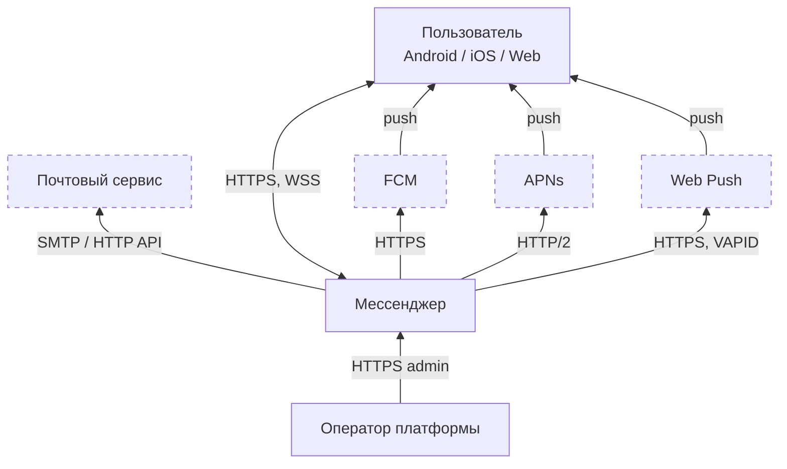
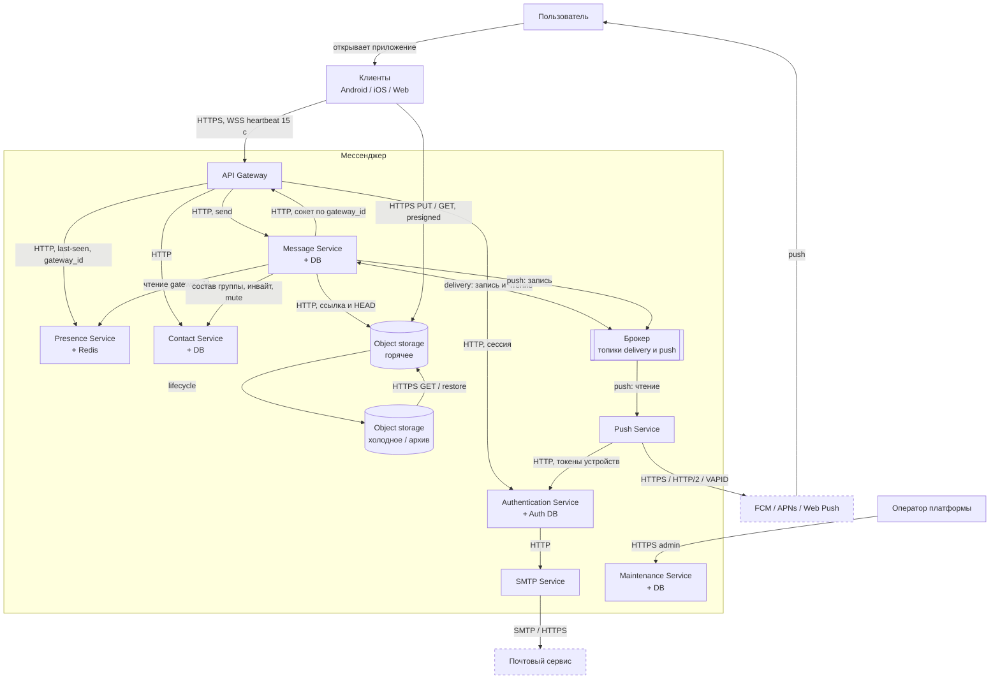
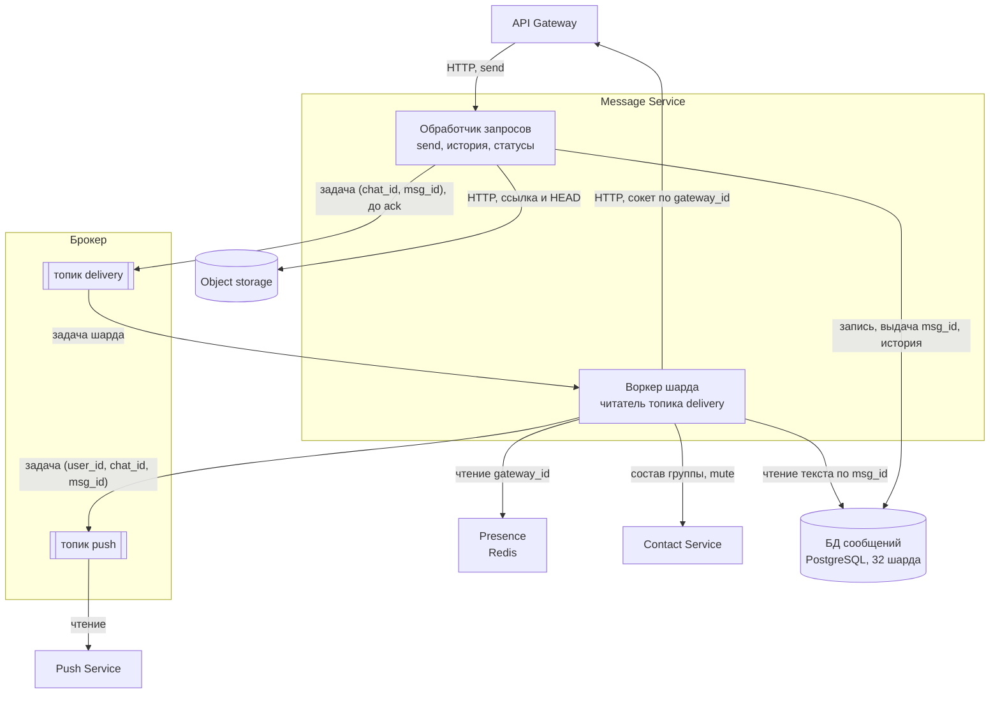
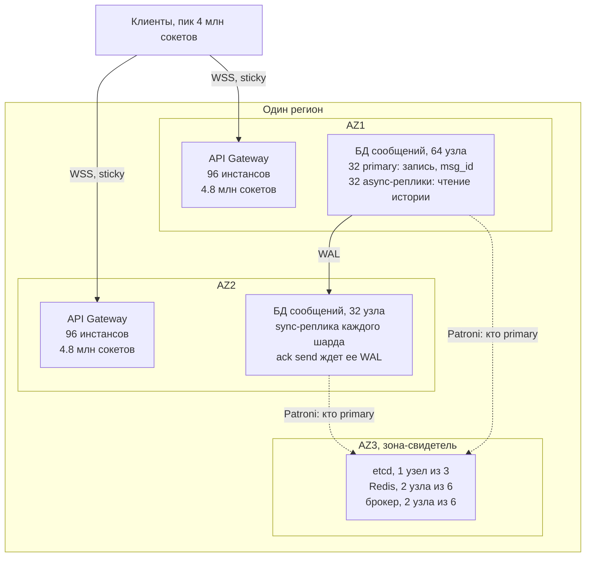
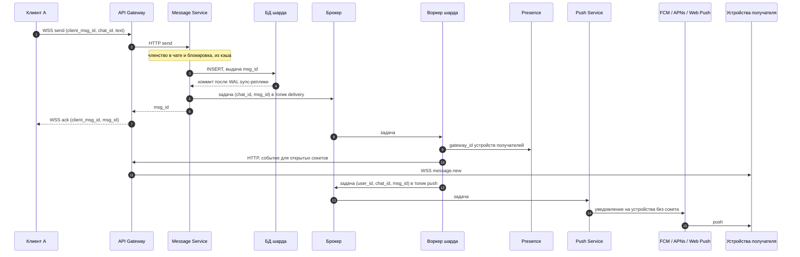
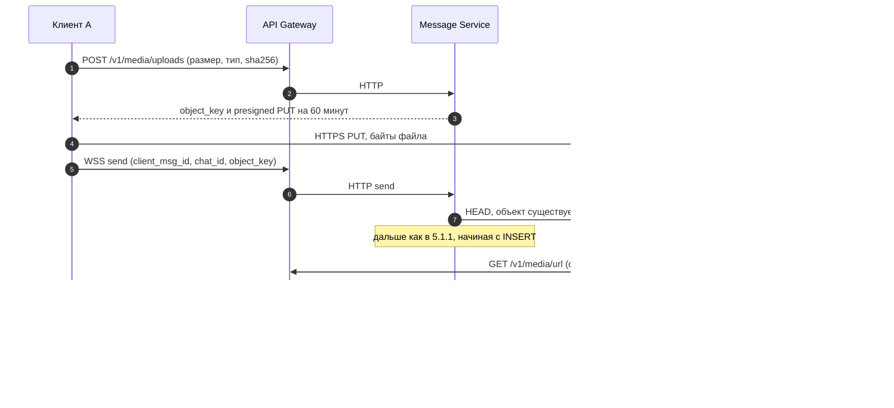
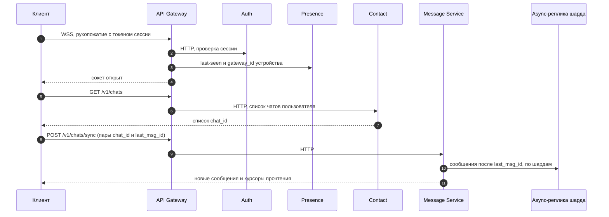
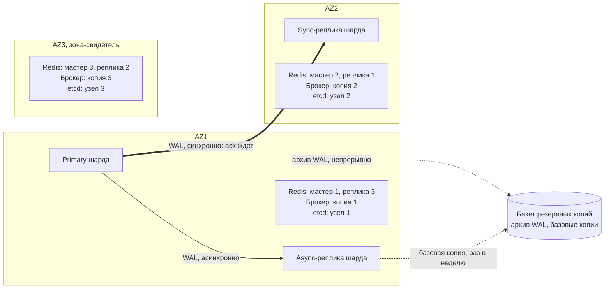

# ДЗ 6. Проектная работа - решение

> Условие: [../Задание.md](../Задание.md).  
> Схемы - в [diagrams/](diagrams/).

## Мессенджер с групповыми чатами

**Мессенджер** - сервис для обмена текстовыми сообщениями, картинками, фото- и видео-файлами между пользователями, через локальную сеть или интернет.  
> Далее по тексту будет принята следующая терминология:  
> **Сообщение** - любые данные, атомарно передаваемые между пользователями в поддерживаемых форматах, например, текстовое, видео, PNG и т.п.  
> **Диалог** - обмен информацией между двумя пользователями (с поддержкой истории и других сервисов). Введено для того чтобы как-то различать маршруты точка-точка и точка-многоточка (групповая рассылка).

Предполагается разработка приложений для мобильных ОС (Android, iOS) и web-страницы.

Система относительно большая, рассчитанная на средних размеров страну (регион), скорее всего несколько часовых поясов.  
Оценка масштаба (больше информации в разделе "сайзинг"):

| Показатель | Значение | Примечание |
| ---------- | -------- | ---------- |
| Зарегистрированных пользователей | 100_000_000 | |
| DAU | 20_000_000 | 20 % от зарегистрированных |
| MAU | 40_000_000 | Для мессенджеров типичное значение отношения DAU/MAU (его еще называют коэффициентом «липкости», stickiness ratio) обычно лежит в диапазоне 40-60% |
| Исходящих сообщений от пользователя в сутки | 15 | Текст, медиа |
| Всего исходящих сообщений в сутки | 15 * 20_000_000 = 300_000_000 | Текст, медиа |
| Доля медиа | 10%, средний объект 400 КБ | Фото/файлы |
| Пик исходящих сообщений | ×5 к среднему | Час пик будет размазан если часовых поясов несколько |
| Пик одновременных соединений | 4_000_000 | 20 % DAU, это примерно 4_000_000 / 1.2 ≈ 3_300_000 пользователей. Исходя из 1.2 устройства с активным сокетом (см. п. 3.1 A12) на пользователя |
| Средний RPS | 300_000_000 / 86_400 ≈ 3_500 (3_472) | |
| Пиковый RPS | 3_500 * 5 = 17_500 | х5 от среднего RPS |
| Объем медиа в сутки | 300_000_000 * 0.1 * 400 kB = 12 ТБ | 10% от всех сообщений, 400 кБ на файл |
| Объем медиа в год | 12 TB * 365 ≈ 4.5 (4.38) ПБ | Без учета дедупликации и уборки мусора |

## 1. Требования

### 1.1 Функциональные требования

#### Аутентификация и авторизация

| ID | Описание | Примечание |
| -- | -------- | ---------- |
| Au1 | Аутентификация пользователей | Должна поддерживаться аутентификация пользователей по email |
| Au2 | Сессии | Должна поддерживаться возможность работы с нескольких авторизированных устройств одновременно |
| Au3 | Доступ к группам | Доступ к групповым чатам должен осуществляться только по приглашению администратора группы |
| Au4 | Чтение групповых сообщений | Просмотр участников и сообщений группы должен быть доступен только для пользователей-участников группы |

#### Сообщения

| ID | Описание | Примечание |
| -- | -------- | ---------- |
| M1 | Отправка сообщений | Должна поддерживаться возможность отправки сообщений пользователям в списке контактов и группам |
| M2 | История сообщений | Должен поддерживаться просмотр ранее отправленных сообщений в диалоге и группе |
| M3 | Реакция на сообщения | Должна поддерживаться возможность реакции пользователя на сообщения других пользователей в чате |
| M4 | Редактирование текстовых сообщений | Должна поддерживаться возможность редактирования ранее отправленных пользователем текстовых сообщений |
| M5 | Удаление сообщений | Должна поддерживаться возможность удаления ранее отправленных пользователем сообщений |
| M6 | Статусы сообщений | Каждое сообщение должно иметь статус (отправлено, доставлено до сервера, доставлено пользователю (-ям), прочитано). Дополнительно см. п. 2.5.2 ADR |
| M7 | Ответ на сообщение | Должна поддерживаться возможность ответа на одно выбранное сообщение (reply) |
| M8 | Пересылка сообщения | Должна поддерживаться возможность пересылки выбранных сообщений из чата другим пользователям |

#### Сервисные функции

| ID | Описание | Примечание |
| -- | -------- | ---------- |
| S1 | Администрирование | Должна поддерживаться возможность настройки и обслуживания сервисов и баз данных мессенджера |
| S2 | Мониторинг | Должна поддерживаться возможность мониторинга технического состояния сервисов и баз данных мессенджера |
| S3 | PUSH-уведомления | Должна поддерживаться отправка PUSH-уведомлений пользователям о различных событиях |
| S4 | Доставка на устройства | Каждое устройство адресата получает сообщение ровно одним путем - в сокет, если он открыт, иначе push |
| S5 | Сервис присутствия пользователей | Отображение информации о текущем статусе пользователя |

#### Пользователи

| ID | Описание | Примечание |
| -- | -------- | ---------- |
| U1 | Добавление пользователей | Должна поддерживаться возможность добавления пользователей в список контактов |
| U2 | Поиск пользователей | Должна поддерживаться возможность поиска пользователей |
| U3 | Блокировка пользователей | Должна поддерживаться возможность блокировки пользователей |
| U4 | Mute | Должна поддерживаться возможность отключения уведомлений для заданных событий |

### 1.2 Нефункциональные требования

| ID | Описание | Примечание |
| -- | -------- | ---------- |
| nF1 | Гарантированная емкость send: ≥ 20_000 RPS | Закрываем пиковую RPS 17_500 |
| nF2 | Медиа: ~12 TB/сутки входящих объектов | |
| nF3 | Надежность 99.9 % | простой не более 8,76 часа в год |
| nF4 | Heartbeat каждые 15 с | Websocket ping, не HTTP |
| nF5 | Сервис присутствия устаревает через 120 с | |
| nF6 | Все серверные метки времени в UTC | UI - локальное время на  стороне пользователя |
| nF7 | Максимальный размер текстового сообщения 4096 символов | |
| nF8 | Максимальный размер группы 256 участников | |
| nF9 | Максимальный размер файла 100 MB | |
| nF10 | Максимальный размер книги контактов 5_000 | |
| nF11 | Максимальное количество устройств у пользователя 10 | Сокет WSS есть у каждого устройства с открытым приложением, остальные устройства без сокета получают push. Свой last_msg_id для групп устройство хранит само и с него догоняет историю (см. примечание). Курсор прочтения на сервере один на пару (user_id, chat_id), не на каждое из 10 устройств (см. п. 2.5.2 ADR). |
| nF12 | Срок хранения | Текст 1 год в первичной БД. Медиа 30 суток в горячем классе, дальше холодный до конца этого года. Дедупликация не входит. Стратегия резервирования БД описана в п. 6.3, расширенная стратегия - в backlog |

> Догон истории. Это автоматическая дозагрузка пропущенных сообщений приложением, пользователь ничего не делает.
>
> - Устройство хранит по каждому чату номер последнего полученного сообщения (last_msg_id); номера в чате идут подряд.
> - После подключения приложение отправляет POST /v1/chats/sync с парами (chat_id, last_msg_id), до 200 чатов. Сервер возвращает все сообщения с большим номером.
> - То же по одному чату (GET …/messages?after=N) приложение делает, когда видит пропуск в номерах или открывает чат.

### 1.3 Риски и ограничения

- одна страна (регион) не учтены риски местных ограничений, требований по локализации и "преземлению" трафика
- зависимость от FCM (пуш на Android, Google), APNs (Apple Push Notification service) или иных сервисов push
- большие объемы медиа
- компрометация серверов/баз данных и другие вопросы связанные с информационной безопасностью

### 1.4 Backlog

- защита данных (индивидуальная и групповая переписка) при передаче, обработке и хранении на устройствах пользователя или серверах, в т.ч. стратегии обновления ключей при истечении лимита времени или добавлении новых пользователей
- расширенная стратегии резервного копирования, в т.ч. с учетом версионирования
- аудио и видео звонки (индивидуальные и групповые)
- мультигруппы (объединение нескольких групп)
- "исчезающие" сообщения
- боты
- второй регион: копии БД и файлов вне основного региона (см. п. 6.3)
- пересмотр архитектуры через год на базе реально полученных метрик из раздела 8

## 2. Концептуальная архитектура

### 2.1 Context view


```mermaid
flowchart BT
  user["Пользователь<br/>Android / iOS / Web"]
  ops["Оператор платформы"]
  msg["Мессенджер"]
  mail["Почтовый сервис"]
  fcm["FCM"]
  apns["APNs"]
  wpush["Web Push"]

  ops -->|"HTTPS admin"| msg
  msg <-->|"HTTPS, WSS"| user
  msg -->|"SMTP / HTTP API"| mail
  msg -->|"HTTPS"| fcm
  msg -->|"HTTP/2"| apns
  msg -->|"HTTPS, VAPID"| wpush
  fcm -->|"push"| user
  apns -->|"push"| user
  wpush -->|"push"| user

  classDef external stroke-dasharray: 5 5
  class mail,fcm,apns,wpush external
```

| Связь | Протокол | Данные | Примечание |
| ----- | -------- | ------ | ---------- |
| Пользователь → Мессенджер | HTTPS | Логин, REST: профиль, контакты, поиск, инвайты, загрузка медиа (ссылка на файл) | Запросы с ответом и идемпотентностью; TLS обязателен. Сессии с нескольких устройств - обычные HTTP-запросы с токеном. При загрузке медиа клиент получает presigned URL и кладет объект в бакет сам |
| Пользователь ↔ Мессенджер | WSS (WebSocket поверх TLS) | Сообщения, статусы, реакции, presence, WS ping каждые 15 с | Долгий канал для push-in-app и heartbeat. Не HTTP-polling: иначе получатся ≈ 267 000 RPS на 4_000_000 сокетов WSS в пике онлайн (4_000_000 / 15 c) |
| Оператор → Мессенджер | HTTPS (отдельный ingress) | Админка и мониторинг | Тот же TLS, другая точка входа и IAM, чтобы админка не торчала на пользовательском API |
| Мессенджер → Почтовый сервис | SMTP или HTTPS API | Письма подтверждения email / восстановления | Вход по email. SMTP (свой MTA); HTTPS. |
| Мессенджер → FCM | HTTPS (REST JSON) | Офлайн-push для Android | FCM HTTP v1: POST https://fcm.googleapis.com/.../messages:send, OAuth. Версия HTTP не фиксирована, достаточно обычного HTTPS |
| Мессенджер → APNs | HTTP/2 (+ TLS 1.2+) | Офлайн-push для iOS | Контракт Apple: только HTTP/2, streams, POST /3/device/{token}. HTTP/1.1 не принимают. Это тоже TLS :443, но версия протокола обязательна |
| Мессенджер → Web Push | HTTPS + VAPID | Офлайн-push в браузер | RFC 8030/8292: POST на endpoint браузера, идентификация сервера ключами VAPID. Без живого WSS вкладка сама не узнает о сообщении |
| FCM / APNs / Web Push → устройство | протокол вендора | Системное уведомление | Последняя миля вне nF3 и вне нашего SLA. На устройстве это не «наш» HTTPS |

> Бакет - это контейнер в object storage (S3-совместимое хранилище) с горячим и холодным классом. Внутри него объекты: один файл - один ключ. «Положить в бакет» значит записать байты туда, а не в PostgreSQL и не через процесс Message.  
> IAM (Identity and Access Management) - управление учетными записями и правами. В тексте: у операторов свои учетки и роли, отдельные от пользовательских.  
> MTA (Mail Transfer Agent) - почтовый сервер, пересылающий письма по SMTP (Postfix, Exim). «Свой MTA» - собственный сервер вместо API провайдера.  
> VAPID (Voluntary Application Server Identification, RFC 8292) - пара ключей для Web Push. Сервер подписывает запрос приватным ключом, push-служба браузера проверяет подпись публичным, полученным при подписке. Так push по подписке может прислать только наш сервер.

### 2.2 C4

#### 2.2.1 Структурная схема (C4)


```mermaid
flowchart TB
  user["Пользователь"]
  ops["Оператор платформы"]
  clients["Клиенты<br/>Android / iOS / Web"]

  subgraph sys["Мессенджер"]
    gw["API Gateway"]
    auth["Authentication Service<br/>+ Auth DB"]
    presence["Presence Service<br/>+ Redis"]
    contact["Contact Service<br/>+ DB"]
    msgSvc["Message Service<br/>+ DB"]
    obj[("Object storage<br/>горячее")]
    cold[("Object storage<br/>холодное / архив")]
    broker[["Брокер<br/>топики delivery и push"]]
    push["Push Service"]
    smtp["SMTP Service"]
    maint["Maintenance Service<br/>+ DB"]
  end

  mail["Почтовый сервис"]
  vendors["FCM / APNs / Web Push"]

  user -->|"открывает приложение"| clients
  clients -->|"HTTPS, WSS heartbeat 15 с"| gw
  ops -->|"HTTPS admin"| maint

  gw -->|"HTTP, сессия"| auth
  gw -->|"HTTP"| contact
  gw -->|"HTTP, send"| msgSvc
  gw -->|"HTTP, last-seen, gateway_id"| presence

  msgSvc -->|"HTTP, сокет по gateway_id"| gw
  msgSvc -->|"чтение gateway_id"| presence
  msgSvc -->|"состав группы, инвайт, mute"| contact
  msgSvc -->|"HTTP, ссылка и HEAD"| obj
  clients -->|"HTTPS PUT / GET, presigned"| obj
  obj -->|"lifecycle"| cold
  cold -->|"HTTPS GET / restore"| obj
  msgSvc <-->|"delivery: запись и чтение"| broker
  msgSvc -->|"push: запись"| broker
  broker -->|"push: чтение"| push
  push -->|"HTTP, токены устройств"| auth

  auth -->|"HTTP"| smtp
  smtp -->|"SMTP / HTTPS"| mail
  push -->|"HTTPS / HTTP/2 / VAPID"| vendors
  vendors -->|"push"| user

  classDef external stroke-dasharray: 5 5
  class mail,vendors external
```

> Базы данных на C4 отдельными сущностями не нарисованы из соображений читаемости, диаграмма становится тяжело читаемой. Для информации о БД см. раздел 4.  
> Внутренняя структура Message service вынесена отдельной диаграммой чтобы не "перегружать" C4 (см. п. 2.3.4).

| Связь | Подпись на схеме | Протокол целиком |
| ----- | ---------------- | ---------------- |
| Клиенты → Gateway | HTTPS+WSS | HTTPS + WSS; WS ping 15 с только до Gateway |
| Оператор → Maintenance | HTTPS | HTTPS, отдельный вход в систему |
| Gateway → Auth / Contact / Message | HTTP | внутренний HTTP. В Message это send - только прием сообщений от отправителя и запросы истории, не рассылка |
| Gateway → Presence | HTTP | last-seen и gateway_id, не каждый ping. Пишется на рукопожатии и не чаще раза в 60 с |
| Message → Gateway | HTTP | воркер внутри Message Service пишет в инстанс из gateway_id. Это не клиентский WSS |
| Message → Presence | чтение | gateway_id получателя |
| Message → Contact | HTTP | состав группы, инвайт, mute |
| Message → object storage | ссылка и HEAD | HTTPS. Message выдает presigned URL на PUT и GET и проверяет объект через HEAD. Байты через Message не проходят |
| Клиенты → object storage | PUT, GET | HTTPS по presigned URL. PUT не больше 100 МБ (nF9), ссылка временная (см. примечание ниже) |
| горячее → холодное | lifecycle | перенос из горячего хранилища в холодное выполняется через 30 суток по правилу lifecycle. Message Service файлы не перекладывает |
| холодное → горячее | GET | HTTPS GET / restore |
| Message ↔ брокер | delivery | протокол брокера. Message публикует задачу `(chat_id, msg_id)` до ack отправителю, воркер шарда ее читает (см. п. 2.5.5 ADR) |
| Message → брокер | push: запись | протокол брокера. Воркер шарда публикует задачу `(user_id, chat_id, msg_id)` для каждого получателя, у которого есть устройство без открытого WSS или для которого Redis не отдал gateway_id. Получателю, отключившему уведомления этого чата (mute), задача не публикуется |
| брокер → Push | push: чтение | протокол брокера. Push Service читает задачи сам, прямого вызова из Message нет |
| Push → Auth | HTTP, токены устройств | внутренний HTTP. Push-токен лежит в записи сессии устройства, Push Service его кэширует |
| Auth → SMTP | HTTP | внутренний адаптер |
| SMTP → почта | SMTP | SMTP или HTTPS API провайдера |
| Push → вендоры | HTTPS | FCM: HTTPS REST; APNs: HTTP/2; Web Push: HTTPS + VAPID |
| Вендоры → пользователь | push | протокол вендора |

> **Уточнение по "временной ссылке"**  
> Предлагается такой вариант:  
> - PUT - 60 минут, чтобы файл 100 МБ успел загрузиться даже с медленного канала;  
> - GET - 15 минут, новую ссылку клиент берет, когда снова открывает файл (ссылка - доступ к объекту, кто ее скопировал, тот файл прочитает).

### 2.3 Описание компонентов

#### 2.3.1 API Gateway

Единая точка входа для всех клиентских запросов. Принимает клиентский HTTPS и WSS, проверяет сессию через **Authentication Service**, маршрутизирует в сервисы. Долгие сокеты и heartbeat (каждые 15 с) заканчиваются здесь. Админский HTTPS идет в Maintenance отдельно.

#### 2.3.2 Authentication Service + Auth DB

Сервис аутентификации пользователей со своей отдельной базой данных. Поддерживает до 10 сессий на каждого пользователя. Вход по email, письма через **SMTP Service**.

#### 2.3.3 Presence Service + Redis

Сервис присутствия хранит online/offline устройств в Redis по факту WSS heartbeat с Gateway. В том же ключе, что last-seen, лежит gateway_id инстанса, на котором открыт сокет. Нет ping 120 с - статус устаревает. Сам сервис на устройства ничего не рассылает.  
Пользователь считается "онлайн", если существует хотя бы один ключ его устройств. Для маршрутизации воркер Message Service (см. п. 2.3.4) читает все подключенные устройства получателя, то есть список gateway_id.

#### 2.3.4 Message Service + DB + Object storage + Холодное хранилище

Сервис принимает, хранит и отвечает за рассылку сообщений (диалог и группа ≤256): история, статусы, реакции, edit/delete/reply/пересылка. Текст и метаданные - в своей БД. На файл до 100 МБ выдает presigned URL: медиа клиент кладет в object storage сам, Message проверяет объект через HEAD.  
Воркер отправляет событие во все живые сокеты получателей и в остальные живые сокеты отправителя; push своему отправителю не шлется.  
Получателю, отключившему уведомления чата (mute, U4), воркер задачу в топик push не ставит: событие в открытый сокет такой получатель получает, push - нет. Флаг mute воркер читает из Contact Service вместе с составом группы. Взаимодействие обработчика запросов и воркера шарда осуществляется через брокера.


```mermaid
flowchart TB
  gw["API Gateway"]
  presence["Presence<br/>Redis"]
  contact["Contact Service"]
  push["Push Service"]
  obj[("Object storage")]
  db[("БД сообщений<br/>PostgreSQL, 32 шарда")]

  subgraph message["Message Service"]
    api["Обработчик запросов<br/>send, история, статусы"]
    worker["Воркер шарда<br/>читатель топика delivery"]
  end

  subgraph broker["Брокер"]
    tDel[["топик delivery"]]
    tPush[["топик push"]]
  end

  gw -->|"HTTP, send"| api
  api -->|"запись, выдача msg_id, история"| db
  api -->|"задача (chat_id, msg_id), до ack"| tDel
  tDel -->|"задача шарда"| worker
  worker -->|"чтение текста по msg_id"| db
  worker -->|"HTTP, сокет по gateway_id"| gw
  worker -->|"чтение gateway_id"| presence
  worker -->|"состав группы, mute"| contact
  worker -->|"задача (user_id, chat_id, msg_id)"| tPush
  tPush -->|"чтение"| push
  api -->|"HTTP, ссылка и HEAD"| obj
```

> Воркер шарда - часть Message Service, а не отдельный сервис: фоновый читатель топика delivery в том же процессе, что и обработчик запросов (см. п. 3.5). Напрямую обработчик воркер не вызывает, они связаны через брокер: обработчик кладет задачу в топик, воркер ее читает и рассылает событие. Воркер запускается и останавливается вместе с процессом Message Service. Партиции топика между живыми узлами распределяет брокер, при отказе узла его партиции переходят к оставшимся.

#### 2.3.5 Contact Service + DB

Каталог пользователей, книга контактов каждого пользователя (до 5000 записей, nF10), блокировки, поиск; метаданные групп и данные об участниках групп, инвайты только от админа группы.  
Здесь же хранится mute (U4): для диалога - бит в поле flags записи контакта (см. п. 3.3), для группы - флаг в строке участника группы `(chat_id, user_id)`. Проверяет его воркер шарда Message Service (см. п. 2.3.4).

#### 2.3.6 Push Service

Сервис взаимодействия со службами Apple и Google для отправки PUSH-уведомлений. Также поддерживает отправку уведомлений для web.  
Задачи читает из топика push брокера. Одну задачу `(user_id, chat_id, msg_id)` разворачивает в уведомления на устройства пользователя без открытого WSS. Push-токены устройств берет из записи сессии в Authentication Service и кэширует.  
Mute (U4) здесь не проверяется: получателю, отключившему уведомления чата, воркер шарда задачу в топик push не ставит (см. п. 2.3.4), до Push Service такие задачи не доходят.

#### 2.3.7 Maintenance Service + DB

Сервис поддержки функций администрирования и мониторинга. Админ-API и аудит; метрики - отдельный контур.

#### 2.3.8 SMTP Service

Внутренний адаптер для взаимодействия с почтовыми серверами.

#### 2.3.9 Брокер

Журнал задач с двумя топиками. В топик "delivery" Message Service кладет одну задачу на сообщение, ее читает воркер шарда. В топик "push" воркер кладет задачу на получателя, ее читает Push Service. Сообщения и история в брокере не хранятся: задача содержит только идентификаторы.

### 2.4 Обоснование архитектурного стиля

Стиль: клиент-сервер за API Gateway плюс несколько независимо масштабируемых сервисов (не модульный монолит и не «микросервисы на каждый метод»).  
Нагрузка неоднородна, один процесс не масштабирует ее одинаково:

| Сервис | Требования/ограничения | Как масштабируем |
| ------ | ---------------------- | ---------------- |
| Gateway | до ~4 млн WSS (20% от DAU), ping 15 с | горизонтально, sticky-сессии |
| Message | ≥ 20_000 RPS send + рассылка в группы ≤256 | шарды по chat_id |
| Object storage | ~12 ТБ/сутки | отдельный бакет, горячее/холодное |
| Presence | last-seen, не каждый ping | Redis, запись реже keepalive |
| Push | офлайн, вендоры | свой пул воркеров |

Монолит с общей БД на этом профиле смешает 4 млн сокетов, 4.5 ПБ медиафайлов и историю сообщений в одном сервисе. Система из 15-20 сервисов при 20_000 RPS send не окупается: лишние связи/протоколы обмена, сложнее.

### 2.5 ADR (Architecture Decision Record)

#### 2.5.1 Realtime-канал: WebSocket от пользователя до API Gateway

- **Контекст:** пиковая нагрузка составляет около 4_000_000 (20% от DAU, 20_000_000 * 0.2 = 4_000_000) одновременно открытых соединений. Heartbeat - каждые 15 с (nF4). Статус присутствия устаревает через 120 с (nF5). Канал нужен для входящих сообщений, статусов, реакций и presence.

| Вариант | Оценка |
| --- | --- |
| HTTP long-polling | 4_000_000 / 15 с ≈ 267_000 (266 667) запросов/с только на keepalive, каждый со своим разбором HTTP. На пике это больше нагрузки, чем send (nF1 = 20_000 RPS) |
| SSE (Server-Sent Events) | Удобен для сервер-клиент, но отдельный канал все равно нужен для send и ping |
| Прямой TCP/собственный протокол | Меньше накладных расходов, но свой клиент, балансировка и TLS на трех платформах |
| WSS до Gateway | Один долгий сокет на устройство: ping, входящие события и исходящий send идут в нем. HTTP остается для логина, профиля, контактов и выдачи URL ссылок на медиа |

- **Решение:** клиент держит WSS на API Gateway. Балансировщик привязывает соединение к инстансу (sticky). Ping 15 с заканчивается на Gateway, а в Presence, Message и БД не пишется. Входящие события Gateway получает от Message и пишет в уже открытый сокет.
- **Следствия:** Gateway масштабируется числом сокетов, не RPS send.

#### 2.5.2 Одна запись сообщения на чат (курсор), файл - в object storage

- **Контекст:** 300_000_000 исходящих сообщений в сутки, пик send 17_500 RPS, потолок группы 256 (nF8), файл до 100 МБ (nF9), медиа ≈ 12 ТБ/сутки и ≈ 4.38 ПБ/год. История читается с любого из ≤ 10 устройств.

| Вариант | Оценка |
| --- | --- |
| Копия сообщения на каждого получателя | Запись раздувается в число участников. При средней группе 32 участника и доле групповых 20 % это около ×7 к записи (0.8 × 1 + 0.2 × 32 = 7.2) |
| Файл в той же БД, что и текст | 12 ТБ/сутки и объекты по 100 МБ попадают в WAL, реплики и бэкапы БД сообщений |
| Одна строка на `chat_id` + объект в бакете | Текст и метаданные пишутся один раз. Клиент кладет файл в object storage по presigned PUT, в строке остаются ключ, размер и хеш. Шард выбирается по `hash(chat_id)`, поэтому история одного чата не размазана по узлам |

- **Решение:** Message хранит сообщение один раз в шарде чата. Клиент кладет и забирает файл по presigned URL, байты через Message не проходят. Перед записью строки Message проверяет объект через HEAD. Горячий бакет - 30 суток (nF12), дальше lifecycle уносит объект в холодный класс; Message этот перенос не делает. Прочтение диалога хранится на сообщении (доставлено / прочитано). Прочтение группы - курсор `(user_id, chat_id, last_read_msg_id)`, без строки на каждого участника и каждое сообщение.
- **Следствия:** диск БД сообщений считается от 300 млн строк в сутки, а не от fan-out. Емкость шарда упирается в горячие чаты: всплеск одного чата до 256 живых получателей остается на одном шарде, средний fan-out им не является. Потолок 256 ограничивает одиночную рассылку. Удаление и правка - обновление одной строки и, для файла, отдельная политика объекта.

> **Курсор** - это способ хранить «прочитано» в группе одной отметкой на человека, а не отдельным статусом у каждого сообщения.  
> В диалоге получатель один, поэтому флаги «доставлено» и «прочитано» лежат прямо на строке сообщения. В группе участников до 256, и та же схема дала бы строку на каждую пару «участник × сообщение».  
> Курсор - одна строка на пару (chat_id, user_id) с одним числом last_read_msg_id: «этот человек дочитал чат до этого сообщения». msg_id в чате растет по порядку, поэтому все с номером не больше курсора считается прочитанным.  
> Группа из 32 человек и 1 000 сообщений:
>
> | Как хранить | Сколько строк |
> | ----------- | ------------- |
> | Статус на каждого участника и каждое сообщение | 32 × 1_000 = 32_000 |
> | Курсор | 32 |
>
> Новое сообщение новых строк не добавляет. Когда человек дочитывает, обновляется одно число в его курсоре.

> **Fan-out** - это размножение (веерная рассылка) одного события на многих получателей.

**Таким образом статус сообщения:**

- Диалог: отправлено, доставлено до сервера, доставлено собеседнику, прочитано.  
«Доставлено до сервера» - ack после записи на primary и WAL sync-реплики;  
«доставлено» и «прочитано» лежат на строке сообщения.  
- Группа: на строке только «доставлено до сервера».  
«Прочитано» - курсор (user_id, chat_id, last_read_msg_id).  
Статуса «доставлено этому участнику» у группы нет: на 256 человек это строка на каждого получателя.

#### 2.5.3 Presence: редкий last-seen в Redis

- **Контекст:** 267_000 ping/с при 4 млн сокетов. Сервис присутствия показывает online/offline и не рассылает события сам. Данные старше 120 с устаревают.

| Вариант | Оценка |
| --- | --- |
| Писать каждый ping в Presence | 267_000 записей/с, из них почти все не меняют статус |
| Хранить presence в БД сообщений | Короткоживущие ключи с TTL 120 с смешиваются с историей, которую храним год |
| Redis, запись не чаще раза в 60 с | Gateway не пересылает в Redis каждый ping: по ping он только отмечает у себя в памяти, что сокет жив, а last-seen устройства записывает в Redis раз в 60 с - одна запись на четыре ping. Ключ на устройство, TTL 120 с: одна пропущенная запись еще не переводит пользователя в offline |

- **Решение:** Redis хранит статус устройств, которые сейчас на связи. Предположим, что 256 байт - верхняя оценка на ключ (см. таблицу ниже), тогда объем данных - около 1 ГБ на 4 млн ключей (4_000_000 * 256 = 1_024_000_000 байт). Таким образом кластер берется ради резервирования, а не ради объема: шесть узлов в трех зонах, по мастеру и по реплике на зону, реплика стоит не в зоне своего мастера. При потере любой зоны два мастера из трех остаются и выбирают замену третьему. Офлайн-доставка в этот контур не входит: ее делает Push Service.
- **Следствия:**  
  - отказ одного узла или зоны закрывает реплика, работа не прерывается;
  - отказ Redis целиком не блокирует send и историю, но гасит не только индикатор: в том же ключе лежит `gateway_id`, по которому воркер находит сокет, поэтому события в открытые сокеты не доходят. Все устройства получателей получают push, открытое приложение по push дочитывает историю. Поток push при этом растет до 187_200/с (см. п. 3.2). Исключение - чат с mute: задача в push по нему не ставится (п. 2.3.4), поэтому открытое приложение дочитает его сообщения только при открытии чата или переподключении;
  - после отказа Gateway ключи доживают до TTL и гаснут сами. Если воркер не дозвался до Gateway из-за устаревшего ключа, получателю отправляется push (п. 5.2).

Примерная структура ключа:  

| Часть | Пример | Байт |
| ----- | ------ | ---- |
| Ключ | presence:{user_id}:{device_id} | 30-40 |
| Значение | gateway_id и время last-seen | 16-24 |
| Служебное Redis | запись в словаре, заголовки, запись TTL, округление аллокатора | 100-130 |
| **Итого:** | | 150-200 |

#### 2.5.4 БД сообщений: PostgreSQL с шардированием по chat_id

- **Контекст:** 300_000_000 сообщений в сутки, с гарантированной емкостью send (nF1) - 52_000 записей/с (20_000 вставок и 32_000 обновлений статуса диалога: 20_000 × 0.8 (доля диалогов) × 2 для статусов «доставлено» и «прочитано»), 109.5 ТБ за год хранения (см. п. 3.3), пик чтения истории 60_000 RPS (см. п. 3.1 A10). Один узел такой объем не обрабатывает, данные в любом варианте делятся по узлам. Выбор БД определяют не объем и не RPS, а гарантии, на которые опираются остальные решения:
  1. `msg_id` растет строго по порядку внутри чата. На этом стоит курсор прочтения (`last_read_msg_id`) и загрузка истории устройством;
  2. повтор send с тем же `client_msg_id` не создает вторую строку (уникальность `(chat_id, sender_id, client_msg_id)`);
  3. ack «доставлено до сервера» означает, что сообщение записано на двух узлах, пока у шарда жива хотя бы одна реплика; пока функционируют обе зоны с данными - в двух зонах (AZ1 и AZ2). Шард, оставшийся без реплик, подтверждает прием с одной копией: синхронный режим нестрогий, чтобы потеря зоны не останавливала send (п. 4.2).

>  Настройка Patroni:  
> - Строгий режим: primary не подтверждает запись без синхронной реплики. Если реплик нет, прием останавливается.
> - Нестрогий: пока реплика есть, ack ее ждет. Если она пропала, синхронной назначается другая, а если реплик не осталось, primary принимает записи один.
>
> Выбран нестрогий, чтобы потеря зоны не останавливала send. Цена: в этом окне у подтвержденного сообщения одна копия, второй отказ может потерять до минуты данных (п. 6.1).

  Плюс к этому: правка, удаление, реакции и статусы диалога меняют уже записанную строку, а история читается страницами по `(chat_id, msg_id)`.

| Вариант | Оценка |
| --- | --- |
| Один кластер PostgreSQL без шардирования | 52_000 записей/с и 109.5 ТБ на одном primary: выше бюджета узла (A9) в 26 раз, восстановление реплики такого размера занимает сутки |
| Широкая колонка (Cassandra / ScyllaDB), ключ партиции `chat_id` | Сильные стороны: запись и объем масштабируются добавлением узлов, перебалансировка встроена, страница истории - чтение одной партиции, срок хранения закрывает TTL. Слабые - как раз три гарантии, перечисленные выше в контексте. Транзакции нет, поэтому порядковый `msg_id` чата и уникальность `client_msg_id` требуют LWT (Paxos, несколько обменов между узлами на каждую запись) либо отказа от порядкового номера в пользу времени, и тогда курсор зависит от часов узлов. Удаление оставляет tombstone, чат с частыми удалениями читается медленнее. Отдельный движок рядом с PostgreSQL у Auth и Contact |
| Распределенный SQL (CockroachDB / YDB) | Транзакции и уникальность есть, шардирование и перебалансировка автоматические. Но ему нужны три полноценные зоны с данными. Опыта эксплуатации меньше, чем у PostgreSQL |
| PostgreSQL, 32 независимых кластера, `hash(chat_id) % 32` | Все три гарантии дает один узел штатными средствами: счетчик чата и INSERT в одной транзакции, уникальный индекс, синхронная реплика в другой зоне. Правка и статусы - обычный UPDATE. На шард приходится ≈ 1_600 записей/с и ≈ 3.4 ТБ - спокойный режим для одного primary. Цена: шардирование ручное - маршрутизация в Message Service, перенос данных при росте, 96 узлов в эксплуатации; частые UPDATE требуют настройки autovacuum |

> «Широкая колонка» (wide-column store) - это класс распределенных БД, к которому относятся Cassandra, ScyllaDB, HBase и Bigtable.

- **Решение:** сообщения хранятся в PostgreSQL, 32 независимых кластера (primary, sync-реплика в другой зоне, async-реплика для чтения), шард выбирается по `hash(chat_id) % 32`. Запрос «история чата» и запись в чат всегда попадают на один шард, запросов между шардами нет: список чатов и состав групп держит Contact DB. Широкая колонка выиграла бы по записи и по простоте роста, но три гарантии пришлось бы собирать в приложении. При потолке группы 256 (nF8) и ≈ 1_600 записей/с на шард ее главное преимущество здесь не используется.
- **Следствия:**
  - Message Service хранит карту шардов и сам маршрутизирует запрос по `chat_id`;
  - рост - это 64 шарда и перенос половины диапазона хеша каждого шарда (раздел 4.2), операция плановая и ручная;
  - 32_000 UPDATE/с статусов оставляют старые версии строк: нужен autovacuum под эту нагрузку, а длинный прогон (см. п. 9.1 LT1) проверяет, что таблица не раздувается;
  - бюджет A9 (2_000 записей/с на primary) - допущение, его подтверждает или опровергает тестирование (см. п. 9.1 LT2);
  - решение пересматривается, если запись уходит за 64_000/с, количество участников группы поднимается выше 256 или третья зона становится полноценной: тогда широкая колонка и распределенный SQL оцениваются заново (backlog, «пересмотр архитектуры через год»).

#### 2.5.5 Доставка: публикация задачи до ack, не менее одного раза

- **Контекст:** прием сообщения - это две записи в разные системы: строка в БД шарда и задача доставки в брокере. Общей транзакции у них нет. Если Message Service падает между ними, сообщение записано, но никому не разослано. Бюджет записи шарда уже занят: 52_000 записей/с при потолке 64_000 на 32 шардах (см. п. 3.2). Повтор send с тем же `client_msg_id` и порядковый `msg_id` чата в проекте уже есть (см. п. 2.5.4).

| Вариант | Оценка |
| --- | --- |
| Ack сразу после INSERT, публикация после | Самый короткий ack. При падении между шагами отправитель видит «доставлено до сервера», а получатели не узнают о сообщении до следующего открытия чата |
| Transactional outbox: строка задачи в той же транзакции, что и INSERT | Гарантия полная. Цена - еще одна вставка и одно удаление на каждое сообщение: +20_000 вставок/с и столько же удалений на primary. Вместе с 52_000 это выше потолка 64_000, число шардов пришлось бы пересчитывать |
| CDC: задачи читаются из WAL логической репликацией | Гарантия полная, записей в БД не добавляет. Цена - отдельный компонент и 32 слота репликации; отставший слот удерживает WAL на диске primary |
| Публикация до ack + догон на клиенте | Записей в БД не добавляет, новых компонентов нет. Гарантию дает повтор клиента, а не сервер, поэтому остается редкий случай без повтора (см. следствия) |

- **Решение:** порядок приема - INSERT и коммит, публикация задачи `(chat_id, msg_id)` в топик delivery, затем ack отправителю. Если Message Service упал до публикации, отправитель не получил ack и повторяет send с тем же `client_msg_id`: Message находит уже записанную строку, публикует задачу заново и отдает ack. Доставка становится «не менее одного раза»: клиент отбрасывает событие с уже известным `msg_id`, для push ставится ключ схлопывания `chat_id:msg_id`. Воркер подтверждает задачу брокеру только после того, как разослал событие в сокеты и поставил задачи в топик push.
- **Следствия:**
  - остаточный случай: сервис упал до публикации, а отправитель не повторил (закрыл приложение). Сообщение записано, но не разослано. Получатель дочитывает его при следующем событии этого чата (видит пропуск в `msg_id`), при reconnect или открытии чата (догон с `last_msg_id`). Push в этом случае не приходит;
  - брокер стоит на пути ack. Публикация выполняется с таймаутом 200 мс; если брокер не ответил, ack все равно уходит: ообщение уже записано в БД шарда (п. 2.5.4), доставка в этот момент держится на догоне. Такие случаи считает метрика O13;
  - задача несет только идентификаторы, текст воркер читает из БД шарда. Потеря брокера не ведет к потере сообщений.

### 2.6 Пользователи и внешние интеграции

#### Пользователи мессенджера

| Актор | Маршрут | Зачем |
| ----- | ------- | ----- |
| Пользователь | Android / iOS / Web → API Gateway (HTTPS, WSS) | Сообщения, история, контакты, группы, presence, медиа. До 10 устройств. Администратор - дополнительно инвайты (приглашения в группу) |
| Оператор платформы | HTTPS на отдельный ingress → Maintenance | Конфиг, пользователи, аудит. Метрики |

Пользователь не ходит в Presence и Redis «как в сервисы»: приложение открывает Gateway; WSS ping 15 с заканчивается на Gateway; в Presence уходят last-seen и gateway_id. Файл клиент кладет и читает по presigned URL напрямую в object storage. В Message уходят только ссылка, ключ, размер и хеш.

#### Внешние системы

| Система | Кто вызывает | Протокол | Зачем | Риск |
| ------- | ------------ | -------- | ----- | ---- |
| Почтовый сервис | SMTP Service (из Auth) | SMTP или HTTPS API | Письма A1: регистрация, восстановление | недоставка письма ≠ падение чата |
| FCM | Push Service | HTTPS REST | Офлайн-push Android (S3) | вне нашего SLA |
| APNs | Push Service | HTTP/2 | Офлайн-push iOS (S3) | обязателен HTTP/2 |
| Web Push | Push Service | HTTPS + VAPID | Офлайн-push браузера (S3) | вкладка закрыта, свернут браузер или ноутбук уснул (нет WSS) |

## 3. Сайзинг

Доминируют не 3_500 (3_472) RPS send, а три вещи:

- fan-out получателей
- исходящий трафик медиа
- год хранения объектов

Ниже send доведен до предельного значения nF1 (20_000 RPS). Регион один, зон доступности три. В двух (AZ1 и AZ2) развернуты сервисы и БД, каждая вмещает весь пик сокетов. Третья (AZ3) - зона-свидетель: пользовательский трафик и БД сообщений в нее не попадают, в ней только голоса кворума и по паре узлов Redis и брокера. Потеря любой одной зоны не снижает пиковую емкость сокетов и чтение истории, а прием send возобновляется автоматически (см. п. 4.2).

> **Зона доступности** - отдельная площадка дата-центра со своим питанием и сетью. Сервисы развернуты в двух зонах, чтобы отказ одной не останавливал всю систему.  
> **Зона-свидетель** нужна для автоматического переключения. Переключение требует большинства голосов, а при двух зонах оставшаяся не может отличить «соседняя зона вышла из строя» от «оборвалась связь между зонами». Третий голос вне этих двух зон решает спор и не дает появиться двум primary.

### 3.1 Допущения

Исходные цифры (DAU, 15 сообщений, ×5, 10 % медиа, 400 КБ, 12 ТБ/сутки) - из введения.

| ID | Допущение |
| --- | --- |
| A1 | Пик одновременных соединений (сокетов WSS) = 20 % DAU = 4_000_000. Несколько часовых поясов уже учтены множителем ×5 к среднему send |
| A2 | Каждое устройство с открытым приложением держит WSS; в пике на online-пользователя приходится 1.2 таких устройства (A12). Фоновое устройство получает push |
| A3 | 80 % сообщений - диалог, 20 % - группа |
| A4 | Средний размер группы G = 32. Потолок nF8 = 256 - предел одной рассылки, не среднее |
| A5 | В пике живой сокет есть у 25 % адресатов |
| A6 | В БД на сообщение приходится 1 КБ: строка, индексы, служебные поля. Средний текст много меньше лимита 4096 символов |
| A7 | Время хранения записи текста - 1 год в первичной БД. Медиа: 30 суток горячие, остаток года - холодные. Дедупликация и сборка мусора не заложены |
| A8 | На один медиаобъект в среднем 4.4 скачивания: диалог ×1.5, группа - половина из 32 участников |
| A9 | Шард сообщений в расчете держит 2_000 записей/с и 5_000 чтений/с на primary. Движок БД выбирается в разделе 4, бюджет тот же |
| A10 | Чтение истории: среднее ≈ 8_000 RPS, пик (открытие приложения) = 60_000 RPS. Пик - около 15 чтений/с на 1_000 сокетов |
| A11 | Средний размер книги контактов: 150 записей |
| A12 | 1.2 активных устройства (с активным WSS) в среднем на online-пользователя |
| A13 | У пользователя в среднем 1.3 устройства с push-токеном - всего, включая те, на которых сейчас открыт WSS |

Исходя из того, что: 80 % - диалоги, 20 % группы (32 участника в среднем) см. A3 и A4, коэффициент получателей на одно отправленное сообщение:

```text  
A_fan = 0.8 × 1 + 0.2 × 32 = 7.2
```

### 3.2 RPS

**Вход send** (уже посчитан во введении):

```text
RPS_avg  = 300_000_000 / 86_400 ≈ 3_500 (3_472)
RPS_peak = 3_500 × 5 = 17_500   # как во введении: от округленного среднего
RPS_cap  = 20_000               # nF1, запас ≈ 14 % к пику 17_500
```

**Соединения и ping** - нагрузка Gateway:

```text
C_peak   = 0.2 × 20_000_000 = 4_000_000
Ping_RPS = 4_000_000 / 15 ≈ 267_000
Presence = 4_000_000 / 60 ≈ 66_700 записей/с в Redis
```

**Получатели** Одно сообщение порождает `A_fan` адресатов (см. п. 3.1). В пике расчетного send:

```text
R = RPS × A_fan  # адресатов/с, A_fan = 7.2 (см. п. 3.1 A13)
WSS = R × 0.25 × 1.2 + RPS × 0.2 = R × 0.3 + RPS_send × 0.2  # получатели с сокетом × 1.2 устройства, плюс копии на другие устройства отправителя (у него в среднем 1.2 − 1 = 0.2 «других» сокета)
nF1 = RPS_cap × 7.2 (A_fan, см. п. 3.1) × 0.3 + RPS_cap × 0.2
Push = R × (1.3 - 0.25 × 1.2) = R × 1.0   # push считается как остаток от всех устройств адресата (A13 минус устройства с сокетом)

R_peak = 17_500 × 7.2 = 126_000 адресатов/с
WSS_peak = 126_000 × 0.3 + 17_500 × 0.2 = 37_800 + 3_500 = 41_300 WSS/с  # в открытые сокеты
WSS_nF1 = 144_000 × 0.3 + 20_000 × 0.2 = 47_200 WSS/с
Push_peak = 126_000 × 1 = 126_000 push/с
Push_nF1 = 144_000 × 1 = 144_000 push/с
```

> Push стоит в очереди и не удлиняет прием send: вендоры вне nF3. При этом стоит оговорить, что для push приведена оценка сверху: получателям, отключившим уведомления чата (mute, U4), задачи не создаются (см. п. 2.3.4), их доля в расчет не заложена.

**Push при отказе Redis presence.** Воркер не знает, у кого открыт сокет, и ставит задачу в push каждому адресату. Число задач в топике не меняется: оно и так считалось как одна на адресата. Растет число уведомлений, потому что push уходит на все устройства, а не только на устройства без сокета:

```text
Push_peak = 126_000 × 1.3 = 163_800 push/с   # коэффициент 1.3 из A13
Push_nF1  = 144_000 × 1.3 = 187_200 push/с   # против 144_000 в штатном режиме, +30 %
```

Пулу push-воркеров нужно до ~280 узлов вместо ~215; пока он расширяется, задачи ждут в топике (AL5). При отказе брокера поток push не растет, а пропадает: задачи не создаются (см. п. 2.5.5).

**Брокер** - два топика (см. п. 2.3.9), с ограничением nF1:

```text
delivery = 20_000 задач/с                  # одна на сообщение, ключ партиции chat_id
push     = 144_000 задач/с                 # до одной на адресата, ключ партиции user_id
поток    = 164_000 × 200 Б ≈ 33 МБ/с       # 200 Б - верхняя оценка задачи: идентификаторы и служебные поля
хранение = 144_000 × 200 Б × 3_600 с ≈ 104 ГБ в час   # час задач push на пиковом потоке
диск     = 104 ГБ × 3 копии ≈ 310 ГБ
```

Push старше часа не доставляется: задача устаревает вместе с хранением топика.

**Запись в БД сообщений** - одна строка на сообщение плюс статусы диалога, без строки на каждого участника группы:

```text
W_msg    = 20_000 вставок/с
W_status = 20_000 × 0.8 × 2 = 32_000 обновлений статуса диалога/с
W_sum    = 52_000 записей/с
```

Курсоры прочтения групп сидят на чтении истории, а не на fan-out.

**Чтение:** пик 60_000 RPS истории, среднее ≈ 8_000 RPS. Логин, контакты и поиск на этом фоне малы: десятки-сотни RPS. Поиск по 100 млн профилей вынесен отдельно и в бюджет send не входит.

**Шарды:**

```text
N_shards = ceil(52_000 / 2_000) = 26  →  берем 32
```

На шард приходится ≈ 1_600 записей/с и, на пике чтения, 60_000 / 32 ≈ 1_900 RPS. Чтение закрывают реплики. 26 шардов упираются в потолок A9 (2_000 записей/с на primary). 32 - ближайшая степень двойки: потолок около 64_000 записей/с, выше суммы 52_000.

### 3.3 Хранилище

**Текст и метаданные, 1 год, с индексами:**

```text
300_000_000 × 1 КБ = 300 ГБ/сутки
300 × 365 = 109.5 ТБ логически
109.5 × 3 реплики ≈ 329 ТБ диска на кластер
```

На шард 109.5 ТБ / 32 ≈ 3.42 ТБ. С WAL и запасом - диск **6 ТБ** на узел (итого с учетом реплик 96 дисков).

**Медиа, без дедупликации:**

```text
сутки     = 12 ТБ
год       = 12 × 365 = 4_380 ТБ ≈ 4.38 ПБ
горячее   = 30 × 12 = 360 ТБ               # Первые 30 суток объект лежит в дорогом быстром хранилище
холодное  = 4_380 - 360 = 4_020 ТБ         # Дальше политика бакета сама переносит его в более дешевый архив
```

Репликацию объектов дает класс хранения бакета, в диск БД она не входит.

**Прочие контуры** (к году сообщений не прибавляются):

| Данные | Оценка | Куда |
| --- | --- | --- |
| Учетки, 100_000_000 × ~1 КБ | ≈ 100 ГБ | Auth DB, 1 primary + 2 реплики |
| Сессии, до 10 устройств | порядка 100 ГБ | Auth DB |
| Книги контактов, в среднем ~150 (A11) из лимита 5_000 | порядка 2 ТБ с репликами (см. примечание ниже) | Contact DB |
| Presence, 4 млн ключей × ~256 Б | ≈ 1 ГБ | Redis; шесть узлов нужны, чтобы пережить потерю зоны |

> Пояснение о размере БД под книги контактов  
> 100_000_000 пользователей × 150 (A11) контактов = 15_000_000_000 записей  
> 15_000_000_000 записей × 45 Б × 3 реплики ≈ 2.0 ТБ  
> 45 Байт - структура записи в книге контактов, примерно:
>
> | Поле | Зачем | Байт |
> | ---- | ----- | ---- |
> | user_id | чей это контакт, int64 | 8 |
> | contact_id | кого добавили, int64 | 8 |
> | flags | блокировка, mute, избранное, int32 | 4 |
> | created_at | когда добавили, int64 | 8 |
> | индекс (user_id, contact_id) | доля ключа и заголовка btree | 17 |
> | **Итого** | | 45 |
>
> Имя, аватар и статус «в сети» в эти 45 байт не входят: имя лежит в профиле, присутствие - в Redis.

### 3.4 Bandwidth

Медиа, 400 КБ на объект, 10 % сообщений:

```text
B_in_avg  = 12 ТБ / 86_400 ≈ 139 МБ/с ≈ 1.1 Гбит/с
B_in_peak = 17_500 × 0.1 × 400 КБ = 700 МБ/с ≈ 5.6 Гбит/с
m_down    = 0.8 (A3) × 1.5 + 0.2 (A3) × 32 × 0.5 = 4.4 (A8)            # сколько раз один файл скачивают, в группах файл открывает половина
B_out_avg = 139 × 4.4 ≈ 610 МБ/с ≈ 4.9 Гбит/с
B_out_peak ≈ 700 × 4.4 = 3_080 МБ/с ≈ 24.6 Гбит/с
```

За месяц ≈ 610 МБ/с × 86_400 × 30 ≈ **1_600 ТБ** исходящего трафика.

Рядом с этим служебный трафик маленький: ping 267_000/с (nF4) по короткому кадру - порядка 100 Мбит/с, репликация БД сообщений ≈ 52_000 зап/с × 1 КБ ≈ 52 МБ/с (см. п. 3.2). Канал наружу задает медиа, не сокеты.

### 3.5 Ресурсы

Ориентир на API Gateway - 50_000 спокойных сокетов (ping раз в 15 с, редкие кадры сообщений). Память на сокет порядка десятков килобайт: 50_000 × 32 КБ ≈ 1.6 ГБ, поэтому 8 ГБ на инстанс достаточны.

Чтобы пик в 4 млн сокетов пережил потерю одной зоны, с запасом 20 %:

```text
N_az = ceil(4_000_000 × 1.2 / 50_000) = 96
N_gw = 96 × 2 зоны = 192
```

| Компонент | Узлы | Профиль | Зачем столько |
| --- | --- | --- | --- |
| API Gateway | 192 (96 × 2 зоны) | 4 vCPU, 8 ГБ | всего 9.6 млн. сокетов или 4.8 млн сокетов на зону |
| Message Services (без БД) | 32 (16 × 2 зоны) | 4 vCPU, 8 ГБ | в среднем узел на шард, любой узел обслуживает любой шард (см. п. 6.1): прием 20_000 RPS и 47_200 WSS/с в Gateway |
| БД сообщений | 96 = 32 шарда × (1 primary + 2 replica) | 8 vCPU, 32 ГБ, 6 ТБ NVMe | 52_000 записей/с, 109.5 ТБ логически, чтение с реплик |
| etcd | 3 (по одному на зону) | 2 vCPU, 4 ГБ | голоса кворума для переключения всех кластеров PostgreSQL: 32 шарда сообщений, Auth, Contact |
| Redis presence | 6 (2 × 3 зоны) | 2 vCPU, 8 ГБ | 66_700 записей/с, датасет ≈ 1 ГБ. По мастеру на зону, реплика в другой зоне |
| Брокер, топики delivery и push | 6 (2 × 3 зоны) | 4 vCPU, 8 ГБ, 200 ГБ диска | Три копии задачи, по одной на зону, запись подтверждают две. 164_000 задач/с, ≈ 33 МБ/с: delivery 20_000 (одна на сообщение) и push до 144_000 (одна на адресата). Час хранения ≈ 310 ГБ с копиями при 1.2 ТБ диска. Воркер работает на узлах Message |
| Push workers | 64 постоянно, до ~215 в пике | 2 vCPU, 4 ГБ | пик ≈ 144_000 push/с, очередь сглаживает возникающие пики. При отказе Redis presence возрастает до 187_200 push/с и ~280 узлов (см. п. 3.2) |
| Auth, Contact, SMTP, Maintenance | ≈ 12 | 4 vCPU, 8 ГБ | RPS далеко ниже send; Contact DB - отдельная тройка реплик внутри этой оценки |
| Object storage | бакет | 360 ТБ hot + 4_020 ТБ cold | PUT пик 1_750 объектов/с, GET пик по множителю 4.4 |

> NVMe - Non-Volatile Memory Express, накопитель на флеш-памяти, подключенный по PCI Express (быстрый локальный SSD)

> etcd - это небольшая распределенная база «ключ-значение», которая хранит одни и те же данные на нескольких узлах и гарантирует, что все узлы видят их одинаково. Ее используют не для данных приложения, а для служебных фактов, о которых кластер обязан договориться: кто сейчас главный, какая конфигурация действует. Самый известный пример - Kubernetes хранит в etcd все свое состояние.   
> Как он работает:
> - Узлов обычно три или пять. Запись считается принятой, только когда ее подтвердило большинство (два из трех).
> - Отсюда главное свойство: если узел или группа узлов остались в меньшинстве, они не могут ничего записать. Двух противоречащих «истин» возникнуть не может.
> - Объем данных небольшой - килобайты или мегабайты, поэтому узлы маленькие.
>
> В etcd для каждого кластера PostgreSQL лежит одна запись: «primary сейчас - такой-то узел». Работает это так:
> 1. Patroni - управляющий процесс на каждом узле БД - на primary регулярно продлевает эту запись, как аренду.
> 2. Если primary отказал, аренда истекает. Patroni на sync-реплике записывает в etcd себя и становится primary.
> 3. Записать себя можно только при большинстве голосов etcd. Поэтому узел, отрезанный от остальных, стать primary не может.
>
> Узлы etcd стоят в каждой из трех зон. При потере любой зоны остаются два узла из трех - большинство есть, переключение работает. С двумя зонами так не получилось бы: потеря зоны с двумя узлами etcd оставляла бы один голос из трех.

Итого виртуальных ядер примерно: Gateway 768, БД сообщений 768, остальной прикладной слой около 350.  
Диск - **576 ТБ NVMe** у БД сообщений (96 × 6 ТБ). Медиа в эту сумму не входит.

### 3.6 Стоимость

Порядок величины без скидок/налогов. Единицы условные, чтобы была видна доля в общей стоимости, а не прайс.

| Статья | Расчет | $/мес |
| --- | --- | --- |
| Gateway, 192 × 4 vCPU / 8 ГБ | 192 × 60 | 11_500 |
| Прочий прикладной слой, 32 Message + ≈12 служебных | 44 × 60 | 2_600 |
| Push, база 64 × 2 vCPU | 64 × 30 | 1_900 |
| Redis, 6 × 2 vCPU / 8 ГБ (датасет около 1 ГБ) | 6 × 40 | 250 |
| etcd, 3 × 2 vCPU / 4 ГБ | 3 × 40 | 120 |
| Брокер, 6 × 4 vCPU / 8 ГБ + 200 ГБ диска | 6 × 60 + 6 × 16 | 450 |
| ВМ БД, 96 × 8 vCPU / 32 ГБ | 96 × 180 | 17_300 |
| NVMe 6 ТБ, 96 дисков (32 × 3 реплики) | 96 × 480 | 46_100 |
| Объекты, горячие 360 ТБ × $0.023/ГБ | 360_000 × 0.023 | 8_300 |
| Объекты, холодные 4_020 ТБ × $0.004/ГБ | 4_020_000 × 0.004 | 16_100 |
| Исходящий трафик, 1_600 ТБ × $0.02/ГБ | 1_600_000 × 0.02 | 32_000 |
| **Итого** | | **≈ 136_600** |

Диск брокера посчитан по той же цене, что NVMe БД: $80 за ТБ в месяц.

Около 136_600 × 12 ≈ **$1 640 000 в год**, то есть меньше цента на одного DAU в месяц. Самые дорогие позиции - диски БД сообщений и выдача медиа наружу.

## 4. Хранение данных

Движки выбраны под бюджет раздела 3: 32 шарда сообщений (primary и две реплики), Auth и Contact отдельными тройками, presence в Redis.

### 4.1 Выбор БД

| Контур | Движок | Почему этот |
| --- | --- | --- |
| Сообщения | PostgreSQL, 32 независимых кластера | Одна строка на сообщение, UPDATE правки и удаления, уникальность повторной отправки. На шард ≈ 1_600 записей/с и ≈ 1_900 чтений/с при бюджете (A9) 2_000 / 5_000 |
| Учет и сессии | PostgreSQL, 1 primary + 2 реплики | ≈ 100 ГБ учеток и порядка 100 ГБ сессий. Запись редкая относительно send |
| Контакты, группы, список чатов | PostgreSQL, 1 primary + 2 реплики | Порядка 2 ТБ с репликами, десятки-сотни RPS. Два индекса покрывают оба запроса |
| Поиск пользователей | Тот же Contact/Auth, индекс по префиксу имени | 100 млн профилей, десятки-сотни RPS, вне бюджета send. Отдельный поисковый кластер не заводим |
| Presence | Redis | TTL 120 с, датасет ≈ 1 ГБ. Отказ гасит индикатор и переводит доставку на push, send и историю не трогает |
| Файлы | S3-совместимый бакет | Объект не попадает в WAL БД. Горячий класс 30 суток, дальше lifecycle |
| Аудит | PostgreSQL у Maintenance | Малый объем, тот же тип, что у Auth |

Один общий PostgreSQL на все сообщения не берем: 52_000 записей/с и 109.5 ТБ логически выходят за узел, который в A9 держит 2_000 записей/с.

Файл в ту же БД не кладем: 12 ТБ/сутки и объекты до 100 МБ раздувают WAL и реплики. В строке сообщения остаются ключ, размер и хеш. Дедупликация по хешу в 4.38 ПБ не входит (A7).

Реакция, правка и удаление - UPDATE той же строки на шарде чата. Даже если реакция есть у каждого десятого сообщения на пороге nF1, это +2_000 UPDATE/с к уже посчитанным 52_000. Потолок 32 шардов, 64_000 записей/с, заново не выбирается.

### 4.2 Шардирование

Ключ сообщения:

```text
shard = hash(chat_id) % 32
```

История одного чата лежит на одном primary. Ключ user_id размазал бы группу по шардам и вернул бы веерную рассылку записи, от которой отказались в ADR. 32 - степень двойки (см. раздел 3): следующий шаг, при необходимости, - 64 шарда и перенос половины диапазона хеша, а не переразбиение произвольных 26.

На шарде чата:

| Таблица | Ключ | Зачем |
| ------- | ---- | ----- |
| messages | (chat_id, msg_id) | Текст, ключ объекта, reply, флаги правки и удаления. В диалоге здесь же «доставлено» и «прочитано» |
| group_read_cursors | (chat_id, user_id) | Курсор (last_read_msg_id), без строки на каждого участника и каждое сообщение |
| Уникальность отправки | (chat_id, sender_id, client_msg_id) | Повтор send с тем же id возвращает уже записанный msg_id |

msg_id выдает primary в той же транзакции, что и INSERT,  из одной строки-счетчика этого чата, поэтому send одного чата идут по очереди. Порядок в чате - порядок этих коммитов. Таким образом очередь одного чата шард не забивает: в группе не больше 256 человек, и они не делают 2 000 send/с.

Список чатов пользователя, список контактов и состав группы в эти шарды не входят. Их держит Contact DB без своего шардирования:

| Запрос | Индекс |
| ------ | ------ |
| Мои контакты, мои чаты, блок | (user_id, …) |
| Участники группы для рассылки | (chat_id, user_id) |

chat_id диалога один на пару пользователей, chat_id группы выдает Contact при создании. Клиент берет список чатов из Contact, а страницу истории - с одного шарда по уже известному chat_id.

Внутри шарда таблица messages партицируется по месяцу. 300 ГБ/сутки на кластер - это ≈ 9.4 ГБ/сутки на шард и ≈ 280 ГБ за месяц.  
На шард приходится около 280 ГБ в месяц. Удалить такой объем через DELETE значит переписать сотни миллионов строк, раздуть таблицу и долго гонять vacuum. DETACH PARTITION убирает целый месяц одной операцией над метаданными: данные остаются в "отсоединенной" таблице, их можно удалить отдельно, остальные 11 месяцев не трогаются. Т.е. по истечению года можно чистить таблицу по одному месяцу.

Узлы шарда развернуты в двух зонах, третья зона дает голос для переключения:

| Узел | Зона | Роль |
| ---- | ---- | ---- |
| Primary | AZ1 | Запись, выдача msg_id |
| Sync-реплика | AZ2 | Подтверждение send ждет ее WAL |
| Async-реплика | AZ1 | Чтение истории, primary не грузим |
| etcd | AZ1, AZ2, AZ3 | По узлу на зону, общий для всех шардов. Хранит, кто сейчас primary и кто sync-реплика |

Переключением управляет Patroni на каждом узле БД: роль primary держит тот, кто удерживает запись в etcd, а записать ее можно только при большинстве голосов etcd. Синхронный режим нестрогий: если sync-реплика пропала, Patroni назначает синхронной другую живую реплику, а если реплик не осталось, primary продолжает прием один. В Patroni включен `failsafe_mode`: если etcd недоступен, primary сохраняет роль, пока видит по API Patroni все узлы своего кластера. Автоматического переключения в это время нет.

| Что отказало | Что происходит | Потеря сообщений с ack |
| ------------ | -------------- | ---------------------- |
| Sync-реплика или вся AZ2 | Ack шарда стоит десятки секунд, пока Patroni не назначит синхронной реплику в AZ1. Дальше прием идет; подтвержденное сообщение лежит на двух узлах одной зоны | Нет |
| Primary или вся AZ1 | etcd в AZ2 и AZ3 сохраняет большинство. Patroni промоутит sync-реплику в AZ2, около минуты прием шарда стоит. Новый primary работает без реплик и подтверждает прием с одной копией, пока AZ1 не вернется или в AZ2 не налита новая реплика | Нет: промоутится только sync-реплика |
| AZ3 | etcd в AZ1 и AZ2 сохраняет большинство, роли не меняются | Нет |
| etcd без кворума (живо меньше двух узлов из трех) | Primary удерживают роль в режиме failsafe, прием и чтение идут. Переключение не работает: отказ любого узла кластера в это окно останавливает прием его шарда до возврата etcd | Нет |
| Связь между AZ1 и AZ2 | AZ1 с primary видит etcd в AZ3 и остается primary; синхронной становится реплика в AZ1. AZ2 большинства не набирает и себя не промоутит | Нет |

«Десятки секунд» и «около минуты» - целевые значения, их замеряют CH1-CH3 (см. п. 9.2). Пока одна из зон с данными недоступна, подтвержденное сообщение лежит в одной зоне: после потери AZ2 - на двух узлах AZ1, после потери AZ1 - на одном узле AZ2. Второй отказ в это окно может его потерять; при потере единственного узла шард восстанавливается из архива WAL, теряются сообщения последней минуты (п. 6.3). Окно видно по метрике O14 и держит открытым алерт AL2. Auth DB и Contact DB устроены так же и используют тот же etcd.

Пик чтения шарда ≈ 1_900 RPS при бюджете 5_000. После потери одной зоны оставшийся узел это чтение обеспечивает. Потерянный ack клиент повторяет тем же client_msg_id.


```mermaid
flowchart TB
  subgraph region["Один регион"]
    subgraph az1["AZ1"]
      gw1["API Gateway<br/>96 инстансов<br/>4.8 млн сокетов"]
      db1["БД сообщений, 64 узла<br/>32 primary: запись, msg_id<br/>32 async-реплики: чтение истории"]
    end

    subgraph az2["AZ2"]
      gw2["API Gateway<br/>96 инстансов<br/>4.8 млн сокетов"]
      db2["БД сообщений, 32 узла<br/>sync-реплика каждого шарда<br/>ack send ждет ее WAL"]
    end

    subgraph az3["AZ3, зона-свидетель"]
      wit["etcd, 1 узел из 3<br/>Redis, 2 узла из 6<br/>брокер, 2 узла из 6"]
    end
  end

  user["Клиенты, пик 4 млн сокетов"]

  user -->|"WSS, sticky"| gw1
  user -->|"WSS, sticky"| gw2
  db1 -->|"WAL"| db2
  db1 -.->|"Patroni: кто primary"| wit
  db2 -.->|"Patroni: кто primary"| wit
```

> Сплошная стрелка - поток данных, пунктирная - голосование за роль primary. Остальные узлы etcd, Redis и брокера стоят в AZ1 и AZ2 и на схеме не показаны.

### 4.3 Кэширование

| Данные | Где | Ключ и сброс |
| ------ | --- | ------------ |
| Страница истории старше хвоста | Память процесса Message | (chat_id, before_msg_id). Страница не меняется, сбрасывать нечего |
| Хвост чата | Память процесса Message | (chat_id, latest). Узел дописывает хвост на своем INSERT; запись живет не дольше 2 с |
| Состав группы, блок и mute | Память Message на пути send и у воркера | Contact рассылает сброс всем узлам Message при инвайте, исключении, блоке и смене mute; запись живет не дольше 60 с |
| Сессия | Состояние сокета на Gateway | Проверка в Auth один раз, на рукопожатии WSS. Ping в БД не ходит |
| Presence | Redis | Ключ устройства, TTL 120 с, запись не чаще раза в 60 с |
| Байты файла | Нигде в сервисах | Клиент кладет и читает бакет по presigned URL. Повторные 4.4 скачивания уже входят в трафик раздела 3 |

Хвост (последние сообщения чата) и состав группы нужны, чтобы 20_000 send/с и пик открытия приложения не ограничивались возможностями обработки в Contact и в primary. Узел Message - 8 ГБ, страница истории - десятки килобайт; в памяти набор чатов, открытых сейчас, а не год архива. Промах кэша читает async-реплику шарда.

Кэш лежит в памяти 32 узлов, а обслужить чат может любой из них, поэтому сброс на одном узле остальные не видят. Согласованность держится на трех правилах:

- **закрепление чата.** Запросы с одним `chat_id` (send, страница истории) Gateway направляет на один узел Message: хеш `chat_id` по списку живых узлов. INSERT и чтение хвоста чата попадают в один процесс. Закрепление - оптимизация, а не гарантия: при отказе узла его чаты уходят на соседние узлы с пустым кэшем;
- **срок жизни хвоста 2 с.** Он ограничивает расхождение там, где закрепление не действует: Gateway секунды видят разный список узлов, воркер шарда работает на другом узле, реплика отстала в момент промаха. Устаревший хвост отдается не дольше 2 с; пропущенное сообщение устройство получает событием в сокет, по push или по пропуску в `msg_id` (п. 2.5.5);
- **состав группы, блок и mute - рассылка сброса.** Contact Service после коммита вызывает сброс `chat_id` на всех узлах Message: 32 вызова на изменение, изменения состава редки рядом с send. Срок жизни 60 с страхует пропущенный вызов. Исключенный или заблокированный пользователь в худшем случае проходит проверку еще 60 с, в норме - доли секунды. Mute сбрасывается так же: после его включения push по чату может приходить еще до 60 с.

## 5. Взаимодействие

Три правила, на которых построены все сценарии:

- клиент общается только с API Gateway и, по presigned URL, с object storage. Во внутренние сервисы он не ходит;
- прием send - короткая синхронная цепочка: Gateway, Message, БД шарда, брокер. Она заканчивается отправкой ack отправителю;
- рассылка получателям асинхронная: ее делает воркер шарда по задаче из брокера. Медленный получатель или вендор push прием не задерживает.

### 5.1 Схема взаимодействия сервисов

#### 5.1.1 Отправка и доставка сообщения


```mermaid
sequenceDiagram
  autonumber
  participant A as Клиент A
  participant GW as API Gateway
  participant M as Message Service
  participant DB as БД шарда
  participant BR as Брокер
  participant W as Воркер шарда
  participant P as Presence
  participant PS as Push Service
  participant V as FCM / APNs / Web Push
  participant B as Устройства получателя

  A->>GW: WSS send (client_msg_id, chat_id, text)
  GW->>M: HTTP send
  Note over M: членство в чате и блокировка, из кэша
  M->>DB: INSERT, выдача msg_id
  DB-->>M: коммит после WAL sync-реплики
  M->>BR: задача (chat_id, msg_id) в топик delivery
  M-->>GW: msg_id
  GW-->>A: WSS ack (client_msg_id, msg_id)
  BR->>W: задача
  W->>P: gateway_id устройств получателей
  W->>GW: HTTP, событие для открытых сокетов
  GW->>B: WSS message.new
  W->>BR: задача (user_id, chat_id, msg_id) в топик push
  BR->>PS: задача
  PS->>V: уведомление на устройства без сокета
  V->>B: push
```

Шаги 1-7 - синхронный путь, на него действует порог p99 ack < 0,5 с (O2). Шаги 8-15 идут после ack. Состав группы воркер берет из кэша, при промахе - из Contact Service. Текст сообщения воркер читает из кэша хвоста чата, при промахе - из БД шарда. Событие уходит во все открытые сокеты получателей и в остальные сокеты отправителя.

В диалоге устройство получателя отвечает кадром `delivered`, а при открытии чата - кадром `read`. Message обновляет строку сообщения и тем же путем, через воркер, отправляет событие отправителю. В группе кадра `delivered` нет, `read` обновляет курсор (см. п. 2.5.2).

#### 5.1.2 Отправка файла


```mermaid
sequenceDiagram
  autonumber
  participant A as Клиент A
  participant GW as API Gateway
  participant M as Message Service
  participant S as Object storage
  participant B as Клиент B

  A->>GW: POST /v1/media/uploads (размер, тип, sha256)
  GW->>M: HTTP
  M-->>A: object_key и presigned PUT на 60 минут
  A->>S: HTTPS PUT, байты файла
  A->>GW: WSS send (client_msg_id, chat_id, object_key)
  GW->>M: HTTP send
  M->>S: HEAD, объект существует, размер совпадает
  Note over M: дальше как в 5.1.1, начиная с INSERT
  B->>GW: GET /v1/media/url (object_key)
  GW->>M: HTTP, проверка членства в чате
  M-->>B: presigned GET на 15 минут
  B->>S: HTTPS GET, байты файла
```

Файл не передается ни через Gateway, ни через Message. В событии `message.new` получатель видит только ключ объекта, размер и тип. Ссылку на скачивание он запрашивает, когда открывает файл.

#### 5.1.3 Подключение устройства и догон истории


```mermaid
sequenceDiagram
  autonumber
  participant A as Клиент
  participant GW as API Gateway
  participant AU as Auth
  participant P as Presence
  participant C as Contact
  participant M as Message Service
  participant R as Async-реплика шарда

  A->>GW: WSS, рукопожатие с токеном сессии
  GW->>AU: HTTP, проверка сессии
  GW->>P: last-seen и gateway_id устройства
  GW-->>A: сокет открыт
  A->>GW: GET /v1/chats
  GW->>C: HTTP, список чатов пользователя
  C-->>A: список chat_id
  A->>GW: POST /v1/chats/sync (пары chat_id и last_msg_id)
  GW->>M: HTTP
  M->>R: сообщения после last_msg_id, по шардам
  M-->>A: новые сообщения и курсоры прочтения
```

Сессия проверяется один раз, на рукопожатии. Устройство хранит `last_msg_id` каждого чата и после подключения одним запросом забирает все, что пропустило. Message раскладывает пары по шардам, отвечает из кэша хвоста чата, если запись свежая (п. 4.3), иначе читает async-реплику. Эти чтения входят в бюджет истории (допущение A10 п. 3.1). Тот же догон по одному чату клиент делает, когда видит пропуск в `msg_id` (см. п. 2.5.5).

### 5.2 Выбор протоколов

| Связь | Протокол | Почему | Что отклонено |
| ----- | -------- | ------ | ------------- |
| Клиент → Gateway, запросы | HTTPS, REST + JSON | Редкие операции «запрос-ответ»: вход, профиль, контакты, история, ссылки на медиа. Повторяются и кэшируются стандартными средствами | - |
| Клиент ↔ Gateway, события | WSS, кадры JSON | Один долгий канал на устройство для send, событий и ping (см. п. 2.5.1) | Long-polling, SSE, свой протокол поверх TCP |
| Клиент → object storage | HTTPS PUT / GET по presigned URL | Байты идут мимо сервисов | Прокси через Message: пик выдачи 24.6 Гбит/с (п. 3.4) прошел бы через прикладной слой |
| Gateway → сервисы, воркер → Gateway | HTTP/2 + JSON, постоянные соединения | Тот же стек, что у внешнего API. Один запрос воркера несет событие сразу для всех сокетов группы на этом инстансе Gateway | gRPC: строгая схема и меньший кадр, но при 20_000 send/с и 47_200 событий/с узкое место - БД и сокеты, а не сериализация. Пересматривается для пути воркер → Gateway, если замеры покажут обратное |
| Message → воркер, воркер → Push | Брокер, два топика | Буфер между приемом и рассылкой, повтор при падении читателя (см. п. 2.5.5) | Прямой HTTP: до 144_000 вызовов/с, и медленный вендор тормозил бы воркер |
| Сервисы → PostgreSQL | Протокол PostgreSQL, пул соединений | Штатный, транзакции | - |
| Gateway, воркер → Redis | Протокол Redis | Штатный | - |
| Push → вендоры | HTTPS (FCM), HTTP/2 (APNs), HTTPS + VAPID (Web Push) | Задан вендором (п. 2.1) | - |

Таймауты и повторы. Значения исходные, уточняются на нагрузочных тестах:

| Вызов | Таймаут | Что при отказе |
| ----- | ------- | -------------- |
| Клиент ждет ack на send | 5 с | Повтор с тем же `client_msg_id`, пауза растет от 1 с до 30 с |
| Message → брокер, публикация | 200 мс | Ack уходит без задачи, случай считает O13 (см. п. 2.5.5) |
| Воркер → Gateway | 1 с | Сокет считается закрытым, получателю ставится задача в push |
| Клиент переоткрывает WSS | - | Пауза растет от 1 с до 60 с со случайным разбросом, чтобы потеря зоны не дала одновременного рукопожатия 2 млн сокетов |

### 5.3 Ключевые API (3-5 контрактов)

Общее для всех контрактов:

- REST живет под префиксом `/v1`, токен сессии передается в заголовке `Authorization: Bearer`. В WSS токен проверяется на рукопожатии;
- идентификаторы - 64-битные числа, в JSON передаются строкой;
- время - UTC в формате ISO 8601 (nF6);
- ошибка REST: код HTTP и тело `{"error": {"code": "...", "message": "..."}}`.

#### 5.3.1 WSS: отправка сообщения

Кадр клиента:

```json
{
  "type": "send",
  "client_msg_id": "0f8b6c1e-5d2a-4b7e-9a51-3c1d2e4f5a6b",
  "chat_id": "8412",
  "text": "Привет",
  "reply_to": null,
  "media": null
}
```

Ответ сервера:

```json
{
  "type": "ack",
  "client_msg_id": "0f8b6c1e-5d2a-4b7e-9a51-3c1d2e4f5a6b",
  "chat_id": "8412",
  "msg_id": "1057",
  "created_at": "2026-10-05T09:12:44Z"
}
```

| Поле | Правило |
| ---- | ------- |
| `client_msg_id` | UUID, создает клиент. Повтор с тем же значением возвращает тот же `msg_id`, второй строки нет |
| `text` | До 4096 символов (nF7). Может быть пустым, если задано `media` |
| `reply_to` | `msg_id` сообщения из того же чата или `null` (M7) |
| `media` | `null` или `{"object_key": "...", "size": 412345, "content_type": "image/jpeg"}` после загрузки по п. 5.3.4 |
| `msg_id` | Порядковый номер в чате, выдает primary шарда |

Вместо `ack` может прийти `{"type": "error", "client_msg_id": "...", "code": "..."}`:

| Код | Когда | Повторять |
| --- | ----- | --------- |
| `not_member` | Отправитель не участник чата | Нет |
| `blocked` | Получатель диалога заблокировал отправителя (U3) | Нет |
| `text_too_long` | Текст длиннее 4096 символов | Нет |
| `media_not_found` | Объекта нет в бакете или размер не совпал | Нет |
| `rate_limited` | Превышен лимит отправки | Да, после паузы |
| `unavailable` | Шард не принял запись | Да, с тем же `client_msg_id` |

#### 5.3.2 WSS: события сервера и отметки клиента

Новое сообщение, приходит во все открытые сокеты получателей и в остальные сокеты отправителя:

```json
{
  "type": "message.new",
  "chat_id": "8412",
  "msg_id": "1057",
  "sender_id": "77",
  "text": "Привет",
  "reply_to": null,
  "media": null,
  "created_at": "2026-10-05T09:12:44Z"
}
```

Правила клиента: событие с уже известным `msg_id` отбрасывается; если `msg_id` больше ожидаемого следующего, клиент дочитывает пропуск запросом истории (п. 5.3.3).

Отметки клиента и ответные события:

| Кадр клиента | Когда | Событие другим устройствам |
| ------------ | ----- | -------------------------- |
| `{"type": "delivered", "chat_id": "8412", "msg_id": "1057"}` | Только в диалоге, первое устройство получателя приняло сообщение | `message.delivered` с теми же полями - отправителю |
| `{"type": "read", "chat_id": "8412", "last_read_msg_id": "1057"}` | Пользователь дочитал чат до этого сообщения | `chat.read` с полями `chat_id`, `user_id`, `last_read_msg_id` - участникам чата и остальным устройствам читателя |

Правка, удаление и реакция приходят в той же оболочке: `message.edited`, `message.deleted`, `message.reaction` с `chat_id` и `msg_id`.

#### 5.3.3 REST: история чата

```text
GET /v1/chats/{chat_id}/messages?before=1057&limit=50
GET /v1/chats/{chat_id}/messages?after=1057&limit=50
```

| Параметр | Правило |
| -------- | ------- |
| `before` | Страница старше указанного `msg_id`, для прокрутки вверх |
| `after` | Сообщения новее указанного `msg_id`, для догона |
| `limit` | По умолчанию 50, не больше 100 |

Ответ `200`:

```json
{
  "chat_id": "8412",
  "messages": [
    {
      "msg_id": "1056",
      "sender_id": "91",
      "text": "Добрый день",
      "reply_to": null,
      "media": null,
      "created_at": "2026-10-05T09:12:01Z",
      "edited_at": null,
      "deleted": false,
      "status": "read",
      "reactions": [{"emoji": "👍", "count": 2}]
    }
  ],
  "has_more": true
}
```

Поле `status` есть только в диалоге: `sent`, `delivered` или `read`. В группе прочтение отдается курсорами. Ошибки: `403 not_member`, `404 chat_not_found`. Чтение идет с async-реплики шарда, страница старше хвоста кэшируется (п. 4.3).

Догон сразу по многим чатам после подключения:

```text
POST /v1/chats/sync
{"chats": [{"chat_id": "8412", "last_msg_id": "1057"}, {"chat_id": "9020", "last_msg_id": "44"}]}
```

Ответ содержит по каждому чату с новыми сообщениями тот же объект, что и история, плюс `last_read_msg_id` пользователя. В одном запросе не больше 200 чатов.

#### 5.3.4 REST: загрузка и скачивание файла

```text
POST /v1/media/uploads
{"chat_id": "8412", "size": 412345, "content_type": "image/jpeg", "sha256": "9f2c…"}
```

Ответ `201`:

```json
{
  "object_key": "m/8412/9f2c41d07a",
  "upload_url": "https://storage.example/…",
  "expires_in": 3600
}
```

Клиент кладет файл запросом `PUT` на `upload_url` и передает `object_key` в кадре `send`. Ошибки: `413 file_too_large` - больше 100 МБ (nF9), `403 not_member`.

```text
GET /v1/media/url?object_key=m/8412/9f2c41d07a
```

Ответ `200`: `{"download_url": "https://storage.example/…", "expires_in": 900}`. Ссылку получает только участник чата, которому принадлежит объект; `chat_id` зашит в ключ.

#### 5.3.5 REST: приглашение в группу

```text
POST /v1/groups/{chat_id}/invites
{"user_id": "91"}
```

Ответ `201`:

```json
{
  "invite_id": "5530",
  "chat_id": "8412",
  "user_id": "91",
  "status": "pending",
  "expires_at": "2026-10-12T09:12:44Z"
}
```

| Код | Когда |
| --- | ----- |
| `403 not_admin` | Приглашает не администратор группы (требование Au3 п. 1.1) |
| `403 blocked` | Приглашаемый заблокировал приглашающего (U3) |
| `409 already_member` | Пользователь уже в группе |
| `422 group_full` | В группе 256 участников (nF8) |

риглашенный отвечает `POST /v1/invites/{invite_id}/accept` или `/decline`. После `accept` Contact Service добавляет участника и рассылает сброс кэша состава группы всем узлам Message (п. 4.3).

## 6. Надежность

Требование nF3 - 99.9 %, то есть не больше 8.76 часа простоя в год. Простоем считается время, когда send не подтверждается (метрика O3). Раздел показывает, что отказ узла или зоны укладывается в минуты, и отдельно называет случаи, которые в этот бюджет не укладываются.

> **RTO** - за какое время сервис возвращается в работу после отказа.  
> **RPO** - за какой промежуток времени перед отказом данные могут быть потеряны; RPO = 0 значит, что подтвержденные данные не теряются.

### 6.1 RTO/RPO по сервисам

Значения целевые. Времена переключения БД замеряют эксперименты CH1-CH3, брокера и Redis - CH9, CH10 и CH5 (п. 9.2).

| Сервис | RTO, отказ узла | RTO, отказ зоны | RPO | Чем обеспечено |
| ------ | --------------- | --------------- | --- | -------------- |
| API Gateway | ≤ 30 с | ≤ 2 мин | данных нет | Клиент переоткрывает WSS на другом инстансе. Каждая из двух зон вмещает весь пик: 96 × 50_000 = 4.8 млн сокетов. При потере зоны переподключение растянуто случайной паузой (п. 5.2) |
| Message Service | ≤ 30 с | ≤ 1 мин | данных нет | Узлы без состояния: карта шардов общая, кэш наполняется заново. 16 узлов в AZ1 и 16 в AZ2, обслужить чат может любой живой узел. Запросы одного чата Gateway направляет на один узел по хешу `chat_id`, при отказе узла - на следующий живой (п. 4.3) |
| БД сообщений, шард | sync-реплика: ≤ 1 мин; primary: ≤ 2 мин | AZ2: ≤ 1 мин; AZ1: ≤ 2 мин | 0 | Patroni и etcd, синхронная реплика в другой зоне (п. 4.2) |
| Auth DB, Contact DB | как у шарда | как у шарда | 0 | Та же схема и тот же etcd |
| Redis presence | ≤ 30 с | ≤ 30 с | до 60 с отметок присутствия | Реплика мастера стоит в другой зоне. Потерянные отметки восстанавливает следующая запись last-seen, не позже чем через 60 с |
| Брокер | ≤ 30 с | ≤ 30 с | 0 для принятых задач | Три копии задачи по одной на зону, запись подтверждают две |
| Push Service | ≤ 1 мин | ≤ 1 мин | данных нет | Воркеры без состояния в двух зонах. Задачи ждут в топике push до часа |
| Auth, Contact, SMTP (сервисы) | ≤ 1 мин | ≤ 1 мин | данных нет | Узлы без состояния в двух зонах |
| etcd | 0 | 0 | 0 | Три узла в трех зонах, работает при любых двух. Потеря кворума - общий отказ для всех 34 кластеров, сценарий 11 (п. 6.3): прием продолжается в режиме failsafe |
| Object storage | по SLA провайдера | по SLA провайдера | по SLA провайдера | Копии объекта хранит класс бакета в нескольких зонах региона |
| Maintenance, метрики | ≤ 1 ч | ≤ 1 ч | до 5 мин метрик | Не на пути пользователя, на nF3 не влияет |

Три уточнения к таблице:

- **RPO = 0 у БД - для одиночного отказа.** Пока одна из зон с данными недоступна, подтвержденное сообщение лежит в одной зоне, а после потери AZ1 - на одном узле: ack в это окно второй копией не обеспечен. Второй отказ может потерять сообщения, RPO становится ≤ 1 мин - интервал архива WAL (п. 4.2, п. 6.3).
- **После потери зоны 16 узлов Message несут нагрузку 32.** На узел это ≈ 1_250 send/с и ≈ 3_750 чтений истории/с вместо 625 и 1_900. Это допущение проверяет прогон LT1 с удвоенной нагрузкой на узел. Если узел ее не держит, число узлов удваивается до 64, это около +1_900 $/мес.
- **Искажение данных или ошибка оператора** переключением не лечится: реплика повторит ошибку. Здесь нужна резервная копия, RTO - до 8 часов на шард, RPO ≤ 1 мин (п. 6.3).

Проверка бюджета: потеря зоны с primary останавливает прием примерно на 2 минуты. Даже десять таких событий в год - это 20 минут из разрешенных 525.

### 6.2 Схема репликации

| Данные | Копий | Как копируются | Где лежат |
| ------ | ----- | -------------- | --------- |
| Сообщения, шард | 3 + резервная копия | Потоковая репликация WAL: одна реплика синхронная, вторая асинхронная | Primary и async-реплика в AZ1, sync-реплика в AZ2. Архив WAL и базовые копии - в бакете |
| Учетные записи, сессии, контакты, группы | 3 + резервная копия | Так же, как шард | Так же, как шард |
| Присутствие (Redis) | 2 | Асинхронная репликация мастер → реплика | Три мастера по одному на зону, реплика каждого - в другой зоне |
| Задачи доставки и push (брокер) | 3 | Запись подтверждают две копии из трех | По копии в каждой из трех зон |
| Файлы | задает класс хранения | Средствами object storage | Несколько зон региона, горячий и холодный класс |
| Роли узлов БД (etcd) | 3 | Запись подтверждает большинство | По узлу в каждой из трех зон |


```mermaid
flowchart LR
  subgraph az1["AZ1"]
    p["Primary шарда"]
    a["Async-реплика шарда"]
    x1["Redis: мастер 1, реплика 3<br/>Брокер: копия 1<br/>etcd: узел 1"]
  end

  subgraph az2["AZ2"]
    s["Sync-реплика шарда"]
    x2["Redis: мастер 2, реплика 1<br/>Брокер: копия 2<br/>etcd: узел 2"]
  end

  subgraph az3["AZ3, зона-свидетель"]
    x3["Redis: мастер 3, реплика 2<br/>Брокер: копия 3<br/>etcd: узел 3"]
  end

  bkp[("Бакет резервных копий<br/>архив WAL, базовые копии")]

  p ==>|"WAL, синхронно: ack ждет"| s
  p -->|"WAL, асинхронно"| a
  p -.->|"архив WAL, непрерывно"| bkp
  a -.->|"базовая копия, раз в неделю"| bkp
```

> Двойная стрелка - синхронная репликация, от нее зависит ack. Сплошная - асинхронная. Пунктирная - резервное копирование. Схема показывает один шард; остальные 31, Auth DB и Contact DB устроены так же. Копии Redis, брокера и etcd перечислены в блоках, стрелки между ними не нарисованы.

### 6.3 План DR (Disaster Recovery)

#### Резервные копии

| Что | Как | Срок хранения |
| --- | --- | ------------- |
| Базовая копия каждого кластера PostgreSQL | Раз в неделю, снимается с async-реплики, primary не нагружает. В бакет, холодный класс | Две последние копии |
| Архив WAL | Непрерывно с primary, сегмент уходит в бакет не реже раза в минуту | 14 суток |
| Redis, брокер | Копии не снимаются: данные короткоживущие и восстанавливаются сами | - |
| Файлы | Отдельной копии нет, сохранность дает класс хранения бакета | - |

Объем и цена:

```text
базовые копии = 2 × 109.5 ТБ = 219 ТБ × $0.004/ГБ ≈ 880 $/мес
WAL в среднем = 52_000 × (3_472 / 20_000) ≈ 9_000 записей/с × 1 КБ ≈ 9 МБ/с ≈ 780 ГБ/сутки
WAL с запасом ×2 на служебные данные ≈ 1.6 ТБ/сутки × 14 суток ≈ 22 ТБ × $0.023/ГБ ≈ 500 $/мес
итого ≈ 1_400 $/мес                # около 1 % итога п. 3.6, в таблицу 3.6 не внесено
```

Восстановление шарда на момент времени: развернуть базовую копию и проиграть WAL до нужной минуты. Копия шарда - 3.4 ТБ, при 200 МБ/с это около 5 часов, с проигрыванием WAL - до 8 часов. Пока шард восстанавливается, недоступны чаты только этого шарда, 1/32 всех чатов.

> Расширенная стратегия (версионирование, копии медиа, копии в другом регионе) остается в backlog (п. 1.4).

#### Сценарии

| № | Сценарий | Как узнаем | Что происходит само | Что делает дежурный | RTO / RPO |
| - | -------- | ---------- | ------------------- | ------------------- | --------- |
| 1 | Отказ узла Gateway, Message или Push | Проверки балансировщика | Узел выводится из балансировки, клиенты переподключаются | Заменяет узел | ≤ 30 с - 1 мин / потерь нет |
| 2 | Отказ primary одного шарда | AL2: сменился primary | Patroni промоутит sync-реплику, async-реплика становится синхронной | Вводит новый узел как реплику | ≤ 2 мин / 0 |
| 3 | Потеря AZ2 | AL2: нет sync-реплики в другой зоне; AL3 | Синхронной становится реплика в AZ1. Сокеты AZ2 переоткрываются в AZ1. Redis и брокер работают на AZ1 и AZ3 | Следит за емкостью AZ1 (AL3), после возврата зоны восстанавливает реплики | ≤ 2 мин / 0 |
| 4 | Потеря AZ1 | AL2: сменились primary, кластеры без реплик; AL3 | Patroni промоутит sync-реплики всех кластеров в AZ2. Сокеты переоткрываются в AZ2 | Проверяет, что все 34 кластера переключились. До возврата AZ1 каждый кластер работает на одном узле и подтверждает прием с одной копией: плановые работы на БД запрещены. Если AZ1 не возвращается дольше часа, наливает в AZ2 новые реплики из базовой копии (3.4 ТБ на шард, несколько часов) | ≤ 2 мин / 0; до появления реплик второй отказ дает RPO ≤ 1 мин |
| 5 | Потеря AZ3 | AL2 (etcd: два узла из трех), проверки узлов Redis и брокера | Роли БД не меняются. Реплика заменяет мастер Redis из AZ3, брокер пишет две копии | Восстанавливает зону. До возврата AZ3 у etcd нет резерва: отказ еще одного узла etcd - это сценарий 11, потеря еще одной зоны останавливает прием | 0 / 0 |
| 6 | Обрыв связи между AZ1 и AZ2 | AL2: нет sync-реплики в другой зоне | Primary остаются в AZ1, синхронной становится реплика в AZ1. AZ2 себя не промоутит | Восстанавливает связь, проверяет, что реплики в AZ2 догнали WAL | ≤ 1 мин / 0 |
| 7 | Redis presence недоступен целиком | AL6 | Индикатор присутствия гаснет. События в сокеты не доходят, получатели получают push и догоняют историю. Поток push растет до 187_200/с, пул воркеров расширяется (п. 3.2). Send и история работают | Поднимает кластер заново, данные наполняются сами за 60 с. Следит за возрастом топика push (AL5) | ≤ 15 мин / восстанавливается само |
| 8 | Брокер недоступен целиком | AL5 | Ack уходит по таймауту публикации, сообщения сохраняются. Доставка держится на догоне (п. 2.5.5) | Поднимает кластер. Задачи, не опубликованные за время отказа, повторно не создаются | ≤ 15 мин / сообщения не теряются, push за время отказа не приходит |
| 9 | Порча данных шарда или ошибка оператора | Жалобы, проверки целостности | Ничего: реплики повторяют ошибку | Останавливает запись в шард, восстанавливает его из базовой копии и WAL на момент до ошибки | до 8 ч на шард / ≤ 1 мин |
| 10 | Потеря региона | Все алерты сразу | Ничего | План не покрывает, см. ниже | не определены |
| 11 | etcd потерял кворум (живо меньше двух узлов из трех) | AL2: `etcd_healthy_members` < 2 | Primary всех 34 кластеров удерживают роль в режиме failsafe, прием и чтение идут. Автоматического переключения нет | Возвращает кворум: поднимает узлы или разворачивает etcd заново - в нем только роли, Patroni записывает их сам. До возврата плановые работы на БД запрещены: отказ любого узла кластера остановит прием его шарда | send: 0 / 0; переключение недоступно до возврата кворума, цель ≤ 30 мин |

Сценарии 7-9 в минуты не укладываются. Сценарии 7 и 8 send не останавливают и в простой nF3 не входят. Сценарий 9 расходует почти весь годовой бюджет, но только для 1/32 чатов. Сценарий 11 send не останавливает, пока живы все узлы кластера; без `failsafe_mode` потеря кворума etcd перевела бы все 34 кластера в режим только для чтения.

#### Возврат зоны

1. Узлы БД вернувшейся зоны входят в кластеры репликами. Узел, который был primary, догоняет новый primary; если не может - заполняется заново с базовой копии (3.4 ТБ, несколько часов).
2. Когда реплики догнали WAL, Patroni возвращает синхронность реплике в другой зоне: подтвержденные сообщения снова хранятся в двух зонах.
3. Возврат primary в AZ1 - плановое переключение в часы минимальной нагрузки, по одному шарду. Прием шарда останавливается на секунды.
4. Gateway вернувшейся зоны принимает новые соединения. Открытые сокеты принудительно не переносятся: зона наполняется по мере переподключений.

#### Что план не покрывает

Регион один (п. 1.3). При потере региона целиком недоступны и сервисы, и бакет с резервными копиями и файлами.

#### Проверка плана

- CH2, CH3, CH10, CH11 и CH12 (п. 9.2) повторяются раз в квартал на стенде;
- раз в квартал один шард восстанавливается из резервной копии на отдельный узел, замеряется время. Копия, из которой ни разу не восстанавливались, копией не считается.

## 7. Безопасность

Раздел собирает меры, которые уже заложены в разделах 2-6. Сквозного шифрования в проекте нет (backlog, п. 1.4): сервер видит текст сообщений и файлы. Их защищают шифрование в канале и на хранении, проверка прав на каждой операции и ограниченный доступ к секретам.

### 7.1 Аутентификация/авторизация

- вход пользователей по email (Au1), адрес подтверждается письмом. Не больше 10 сессий на пользователя (Au2, nF11), одна сессия - одно устройство;
- токен сессии - случайная строка. Клиент передает ее в заголовке `Authorization: Bearer` и на рукопожатии WSS (п. 5.3). В Auth DB лежит только хеш токена;
- оператор платформы входит через отдельный ingress, со своими учетными записями и ролями. Пользовательский токен на админском входе не принимается, действия оператора пишутся в аудит (п. 2.3.7).

**Кто что проверяет:**

| Операция | Что проверяется | Где |
| -------- | --------------- | --- |
| Рукопожатие WSS и запросы REST | Токен сессии | Gateway через Auth. В WSS - один раз, на рукопожатии (п. 4.3) |
| Send | Отправитель - участник чата. В диалоге получатель не заблокировал отправителя (U3) | Message, из кэша состава группы и блока (п. 4.3) |
| История чата, `/v1/chats/sync` | Пользователь - участник чата (Au4) | Message |
| Ссылка на загрузку и скачивание файла | Пользователь - участник чата, `chat_id` которого зашит в ключ объекта (п. 5.3.4) | Message |
| Правка и удаление сообщения | Пользователь - автор сообщения (M4, M5) | Message |
| Приглашение в группу | Приглашающий - администратор группы (Au3), приглашаемый его не заблокировал, в группе меньше 256 участников (п. 5.3.5) | Contact |
| Админ-API | Учетная запись и роль оператора | Maintenance |

Идентификаторы не секретны: запрос с чужим `chat_id` или чужим ключом объекта отклоняется с ошибкой `not_member`.

**Отзыв доступа:**

- исключение из группы и блокировка. Contact рассылает сброс кэша узлам Message; в худшем случае пользователь проходит проверку еще 60 с (п. 4.3);
- выход с устройства или отзыв сессии. Auth удаляет запись сессии вместе с push-токеном и рассылает всем инстансам Gateway команду закрыть сокеты этой сессии - тем же способом, каким Contact сбрасывает кэш Message: 192 вызова на отзыв, отзывы редки. Без этой команды сокет существовал бы до разрыва, потому что сессия проверяется один раз, на рукопожатии;
- пропущенную команду страхует срок жизни сокета. Gateway закрывает сокет старше 24 часов, клиент открывает его заново и проходит проверку сессии. Это 4_000_000 / 86_400 ≈ 46 рукопожатий/с при пике соединений.

**Presigned URL.** Ссылка - это доступ к объекту: кто ее получил, тот файл прочитает (п. 2.2.1). Поэтому она действует на один ключ и один метод и живет недолго: GET - 15 минут, PUT - 60 минут. Выдается только участнику чата. Размер загруженного объекта Message сверяет через HEAD до записи сообщения. Сам бакет закрыт: без подписанной ссылки объект нельзя ни прочитать, ни найти перебором.

**Лимиты запросов.** Значения исходные, уточняются по статистике:

| Что ограничиваем | Лимит | Где считается | От чего защищает |
| ---------------- | ----- | ------------- | ---------------- |
| Попытки входа | 5 за 15 минут на адрес email | Auth | Подбор |
| Письма подтверждения и восстановления | 3 в час на адрес email | Auth | Рассылка писем на чужой адрес через наш сервис |
| Send | 60 сообщений в минуту на сокет, ответ `rate_limited` (п. 5.3.1) | Gateway, счетчик в состоянии сокета | Спам, перегрузка шарда одним клиентом |
| Поиск пользователей | 30 запросов в минуту на пользователя | Contact | Перебор каталога из 100 млн профилей |
| Приглашения в группу | 50 в сутки на администратора | Contact | Спам приглашениями |

Счетчик send лежит в памяти Gateway, остальные - в своем сервисе. Redis presence для лимитов не используется: его отказ не должен задевать send (п. 4.3).

### 7.2 Шифрование и управление секретами

**В канале:**

- внешние связи - TLS 1.2+: клиент ↔ Gateway (HTTPS, WSS), клиент ↔ бакет, оператор → Maintenance, Push Service → вендоры, SMTP Service → почтовый сервис (п. 2.1);
- сервисы развернуты в закрытой сети. Снаружи доступны только балансировщик Gateway, админский ingress и бакет;
- соединения с PostgreSQL, Redis, брокером и etcd идут по TLS с паролем или сертификатом;
- вызовы между сервисами - HTTP внутри закрытой сети (п. 5.2).Защита здесь держится на границе сети.

**На хранении:**

- диски всех узлов PostgreSQL зашифрованы: сообщения, учетные записи и сессии, контакты;
- бакет файлов зашифрован средствами хранилища, в горячем и в холодном классе;
- бакет резервных копий зашифрован так же: базовые копии и архив WAL (п. 6.3) содержат тот же текст сообщений, что и БД;
- брокер и Redis текста не содержат. В задачах брокера только идентификаторы (п. 2.3.9), в presence - устройство, `gateway_id` и время;
- ключи шифрования дисков и бакетов хранит служба управления ключами провайдера.

**Секреты.** Лежат в менеджере секретов, а не в образах и не в репозитории. Процесс получает секрет при старте. Доступ выдается по учетной записи сервиса: Push Service не может прочитать пароли БД, Message Service - ключи вендоров.

| Секрет | Кто использует | Смена |
| ------ | -------------- | ----- |
| Сервисный аккаунт FCM, ключ APNs | Push Service | Раз в год и при компрометации |
| Приватный ключ VAPID | Push Service | Только при компрометации: после смены ключа браузеры подписываются на Web Push заново |
| Пароли PostgreSQL, Redis, брокера, etcd | Сервис - владелец данных, Patroni | Раз в 90 суток |
| Ключ доступа к бакету, которым подписываются presigned URL | Message Service | Раз в 90 суток. Старый ключ действует еще час, чтобы выданные ссылки (до 60 минут) дожили свой срок |
| Ключ API почтового провайдера | SMTP Service | Раз в 90 суток |
| Сертификаты TLS внешних входов | Балансировщик Gateway, админский ingress | Автоматически, до истечения срока |

**Логи и метрики.** Текст сообщений, токены сессий, push-токены и presigned URL в логи и метрики не пишутся. В логах остаются идентификаторы: `user_id`, `chat_id`, `msg_id`, `client_msg_id`.

## 8. Observability

Метрики снимает отдельный контур. В БД сообщений и в Redis presence они не пишутся. Maintenance Service открывает дашборды с админского входа и пользовательский трафик не принимает.

### 8.1 Ключевые метрики (10-15)

Пороги - из разделов 1 и 3. Требования на задержку ack нет. p99 ниже - операционный порог: ack уходит после WAL sync-реплики в другой зоне (раздел 4.2).

| ID | Метрика | Где снимаем | Порог |
| --- | --- | --- | --- |
| O1 | `send_accepted_rps` | Message, сумма по шардам | Среднее ≈ 3_500, пик 17_500, потолок nF1 = 20_000 |
| O2 | `send_ack_seconds`, p99 | Gateway: от кадра send до ack клиенту | p99 < 0,5 с. Ack ждет WAL sync-реплики (в норме в AZ2) и публикацию задачи в delivery (таймаут 200 мс) |
| O3 | `send_error_ratio` | Gateway | Доля send без ack: отказ шарда, таймаут sync, обрыв сокета до ответа. Отсюда считается простой для nF3 |
| O4 | `send_dedup_ratio` | Message | Доля send, которым вернули уже записанный `client_msg_id`. Рост - клиенты повторяют потерянный ack |
| O5 | `wss_open` | Gateway, по зоне | Пик системы 4_000_000. Зона вмещает 96 × 50_000 = 4_800_000 |
| O6 | `wss_stale_ratio` | Gateway | Доля сокетов без ping дольше 30 с, два интервала nF4. В Presence и в БД ping не пишется |
| O7 | `presence_writes_rps` | Redis | Last-seen. Бюджет 4_000_000 / 60 ≈ 66_700/с. Ноль при живых сокетах - presence остановился: гаснет индикатор и пропадает маршрутизация событий в сокеты |
| O8 | `msg_primary_writes_rps` | primary шарда | Вставки и статусы диалога. На шард ≈ 1_600, потолок A9 = 2_000, сумма 52_000 |
| O9 | `replica_lag_seconds` | sync в AZ2 и async в AZ1, по шарду | Лаг sync держит ack. Лаг async портит чтение истории, запись идет |
| O10 | `history_read_rps` | async-реплика шарда | Пик 60_000 на кластер, ≈ 1_900 на шард, бюджет чтений 5_000 |
| O11 | `wss_deliver_rps`, `push_enqueue_rps` | доставка Message в сокеты Gateway и очередь Push | На пороге nF1: 47_200 WSS/с и 144_000 push/с |
| O12 | `media_in_megabytes_per_s`, `hot_bucket_terabytes` | бакет | Вход 139 МБ/с средний, 700 МБ/с пик. Горячий класс 30 суток и 360 ТБ, дальше lifecycle |
| O13 | `delivery_queue_age_seconds`, `delivery_publish_failed_ratio` | брокер, топик delivery; Message | Возраст задачи доставки в норме < 1 с. Доля send, где публикация не уложилась в 200 мс и ack ушел без задачи, в норме 0 (см. п. 2.5.5 ADR) |

### 8.2 Алерты (5-7)

> вендоры вне SLA

| ID | Условие | Тяжесть | Куда смотреть |
| --- | --- | --- | --- |
| AL1 | `send_error_ratio` > 1 % пять минут | алерт | Прием не подтверждается. Сначала лаг sync (AL2), затем зона Gateway. 1 % - это 10× разрешенной доли простоя nF3 (0.1 %, 8.76 часа в год или 525.6 мин в год); пять минут отсекают одиночный всплеск |
| AL2 | `replica_lag_seconds` sync > 1 с на любом шарде две минуты | алерт | Ack ждет WAL sync-реплики. При ее отказе Patroni за десятки секунд назначает синхронной реплику в AZ1 (см. п. 4.2). Лаг дольше двух минут значит, что переназначение не произошло или отстают обе реплики: send этого шарда стоит, хотя primary жив |
| AL3 | сокеты одной зоны > 4_800_000, либо живых Gateway в зоне < 96 при сокетах этой зоны > 4_000_000 | алерт | Пик 4_000_000 переживает потерю зоны только при полном комплекте 96 инстансов |
| AL4 | `msg_primary_writes_rps` шарда > 2_000 десять минут | алерт | Потолок A9. Шард выбран по `hash(chat_id)`, горячий чат на другой шард не уезжает |
| AL5 | `delivery_queue_age_seconds` > 5 с две минуты, либо `delivery_publish_failed_ratio` > 1 % две минуты, либо `push_queue_age_seconds` > 60 с десять минут | алерт для delivery, предупреждение для push | Delivery: события не доходят до открытых сокетов, получатели видят сообщения только через догон; смотреть брокер и воркеры шардов. Push: офлайн-доставка стареет, топик сглаживает вендоров и прием send не удлиняет |
| AL6 | Redis presence недоступен, либо `presence_writes_rps` = 0 при `wss_open` > 1_000_000 | алерт | Индикатор погаснет по TTL 120 с (nF5), события перестают доходить до открытых сокетов, доставка переходит на push и догон. Send и история идут. Смотреть возраст топика push (AL5): поток вырастет до 187_200/с |
| AL7 | `hot_bucket_terabytes` > 360 или вход медиа за сутки > 12 ТБ | предупреждение | Lifecycle не перенес объекты в холодный класс, либо факт входа разошелся с сайзингом. |

## 9. Тестирование

Стенд проверяет один узел с максимальной загрузкой, а не весь прод (из экономических соображений): два шарда под управлением Patroni, etcd из трех узлов, два API Gateway, Redis, брокер (топики delivery и push) с заглушкой вендора и бакет. Узлы разнесены по трем зонам так же, как в проде.  
Генератор поддерживает WSS: ping раз в 15 с, send, чтение истории. Смесь из раздела 3: 80 % диалогов, 20 % групп по 32 участника, живой сокет у 25 % адресатов.

### 9.1 План нагрузочного тестирования

Шаг держим 30 минут. Расчетную точку после этого оставляем еще на два часа: статусы диалога - это UPDATE, раздувание строк и лаг реплики видны на длинном прогоне. Пороги те же, что в разделе 8.

| ID | Профиль | Успех |
| --- | --- | --- |
| LT1 | Расчетная точка одного шарда: 625 send/с, смесь 80/20, чтение истории 1_900 RPS с async-реплики | p99 `send_ack_seconds` < 0,5 с, `send_error_ratio` < 1 %, лаг sync < 1 с, `msg_primary_writes_rps` ≈ 1_600. `wss_deliver_rps` ≈ 1_500, `push_enqueue_rps` ≈ 4_500. Строк в `messages` столько, сколько уникальных `client_msg_id` |
| LT2 | Тот же шард до потолка A9: 2_000 записей/с, около 770 send/с | Те же пороги ack и лага. Если p99 или лаг выходят за порог раньше 2_000, бюджет A9 завышен и число шардов в разделе 3 пересчитывается |
| LT3 | Первый шард остается на 625 send/с. Дополнительный поток, все его чаты во втором шарде, до 2_000 записей/с | Первый шард не разгоняется. Запись сверх потолка второго шарда на первый не переезжает |
| LT4 | Одна группа из 256 участников, 50 send/с в один `chat_id` | Около 50 вставок/с, не 50 × 256. Доставка в сокеты и push растут с числом участников. 50 send/с для 256 человек выше человеческого темпа и до 2_000 записей/с шарда далеко |
| LT5 | 5 % send повторяют уже использованный `client_msg_id` | Повтор возвращает тот же `msg_id`, второй строки нет. `send_dedup_ratio` ≈ 5 % |
| LT6 | Один Gateway, 50_000 сокетов, ping 15 с, send редкий | Память процесса в пределах 8 ГБ. Ориентир сайзинга: 50_000 × 32 КБ ≈ 1,6 ГБ на сокеты. `presence_writes_rps` ≈ 50_000 / 60 ≈ 830. Запросов в БД сообщений от ping нет |
| LT7 | Чтение истории 1_900 RPS, затем 5_000 RPS с async-реплики, send как в LT1 | Primary остается около 1_600 записей/с. 5_000 RPS - бюджет чтений A9; прогон фиксирует, держится ли реплика на этом потолке |
| LT8 | Заглушка вендора принимает 100 push/с при постановке ≈ 4_500/с | `push_queue_age_seconds` растет. p99 ack send < 0,5 с |
| LT9 | 10 % сообщений с объектом 400 КБ, окно 10 минут | Клиент кладет объект в бакет по presigned PUT. В WAL шарда и в процессе Message самих файлов нет. В строке остаются ключ, размер и хеш |

Отдельно от RPS, на одной группе из 32 участников и 1_000 сообщений: в `group_read_cursors` 32 строки. Дочитывание обновляет `last_read_msg_id` и новых строк по числу сообщений не добавляет.

К nF1 переходим так: LT1 на одном шарде × 32 = 20_000 send/с. LT3 проверяет, что лишний поток горячего шарда сам на сосед не уходит. При случайных `chat_id` записи/с на двух шардах близки; сильный перекос значит, что 32 шарда не дадут ровные 625 send/с.

4_000_000 сокетов умножением LT6 на 192 не проверяются. На одну зону это 4_000_000 / 96 ≈ 42_000 на инстанс, ниже нормы LT6 (50_000). CH3 проверяет переезд сокетов с убитого Gateway на живой.

### 9.2 Chaos-эксперименты

Эксперименты идут поверх расчетной точки: LT1 на одном шарде и 50_000 сокетов на Gateway. На холостом ходу лаг WAL и очередь push не успевают вырасти.

Потеря зоны в разделе 3 сохраняет емкость сокетов и чтение истории. Прием send при потере AZ1 или AZ2 останавливается на время переключения и возобновляется сам (см. п. 4.2). Эксперименты замеряют это время и проверяют, что сообщения с ack не теряются.

| ID | Что ломаем | Что должно произойти |
| --- | --- | --- |
| CH1 | Sync-реплика одного шарда недоступна 10 минут | Ack этого шарда стоит, пока Patroni не назначит синхронной реплику в AZ1; цель - десятки секунд, AL2 не срабатывает. Дальше прием идет как в LT1. Второй шард остановки не замечает. Сообщения, по которым ack уже ушел, читаются. После возврата реплика догоняет WAL и снова становится синхронной |
| CH2 | Недоступна вся AZ2 | Primary в AZ1 живы, etcd в AZ1 и AZ3 сохраняет большинство. Ack стоит на обоих шардах, пока синхронной не станет реплика в AZ1, затем прием идет. Сокеты AZ2 переоткрываются на Gateway AZ1, историю отдает реплика в AZ1. Redis и брокер продолжают работу на узлах AZ1 и AZ3. Время, пока прием стоит, - замер для RTO в разделе 6 |
| CH3 | Недоступна AZ1: primary, async-реплики и Gateway зоны | etcd в AZ2 и AZ3 сохраняет большинство, Patroni сам промоутит sync-реплику; цель - около минуты, это замер для RTO в разделе 6. Каждый `client_msg_id` с уже выданным ack читается с нового primary. Send без ack клиент повторяет тем же id и получает одну строку. Оставшийся Gateway принимает сокеты в норме LT6, 50_000 на инстанс. На стенде промоутится два шарда; одновременный промоушен всех 32 - отдельный прогон, его стенд из двух шардов не заменяет |
| CH4 | Процесс Gateway убивается | Клиенты открывают WSS на Gateway другой зоны. Повтор send с тем же `client_msg_id` вторую строку не создает. Ключи presence погаснут по TTL 120 с, если новый Gateway их не обновил |
| CH5 | Redis presence недоступен | Ack и чтение истории остаются как в LT1. Индикатор гаснет не позже 120 с (nF5). `wss_deliver_rps` падает до нуля, `push_enqueue_rps` остается ≈ 4_500, а число уведомлений вендору растет на 30 %: push уходит на все устройства. Получатели с открытым приложением дочитывают историю по push. Срабатывает AL6, AL1 молчит. После возврата Redis ключи наполняются за 60 с, доставка в сокеты возобновляется |
| CH6 | Заглушка вендора перестает отвечать | Очередь стареет, срабатывает AL5. p99 ack остается в пороге LT1 |
| CH7 | Async-реплика одного шарда недоступна, send как в LT1, чтение 1_900 RPS | История читается с оставшегося узла шарда. `msg_primary_writes_rps` около 1_600, p99 ack < 0,5 с |
| CH8 | Процесс Message убивается после коммита INSERT, до публикации в delivery | Отправитель ack не получил и повторяет send тем же `client_msg_id`: строка одна, задача опубликована, получатель видит сообщение один раз. Отдельный прогон без повтора: получатель дочитывает сообщение при следующем событии чата или при reconnect, push не приходит - принятый риск п. 2.5.5 |
| CH9 | Брокер недоступен 10 минут | Публикация упирается в таймаут 200 мс, ack уходит, p99 ack остается < 0,5 с. `delivery_publish_failed_ratio` растет, срабатывает AL5, AL1 молчит. Сообщения читаются из истории, получатели догоняют с `last_msg_id`. После возврата брокера доставка в сокеты и push возобновляется |
| CH10 | Недоступна AZ3, зона-свидетель | Роли primary не меняются, ack и история как в LT1: etcd в AZ1 и AZ2 сохраняет большинство. Мастер Redis из AZ3 заменяется его репликой, брокер пишет две копии из трех. AL1 и AL2 молчат |
| CH11 | Обрыв связи между AZ1 и AZ2, обе зоны видят AZ3 | Primary остаются в AZ1, синхронной становится реплика в AZ1. Реплики в AZ2 себя не промоутят: двух primary у одного шарда нет. После восстановления связи реплики в AZ2 догоняют WAL |

После CH1 и CH4, когда обе копии шарда восстановлены, сверяется один инвариант. Сообщение с ack есть и на primary, и на sync-реплике. Сообщение без ack либо отсутствует, либо находится по `client_msg_id`, и повтор возвращает тот же `msg_id`. Для CH3 тот же инвариант читается уже с sync-реплики.
